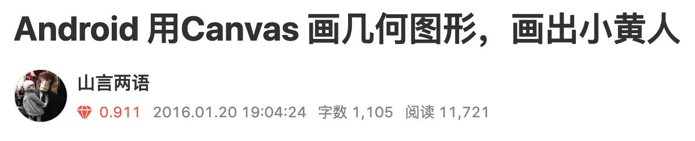
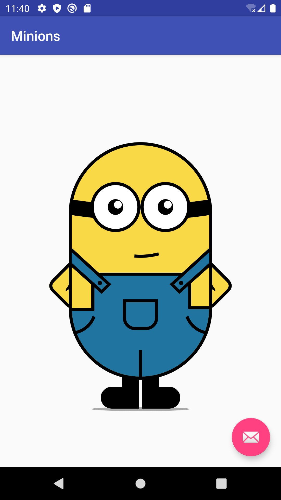
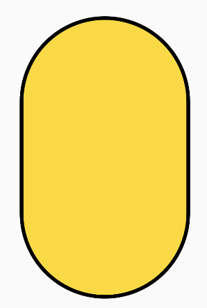
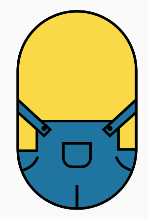
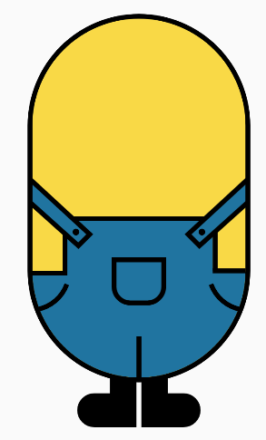
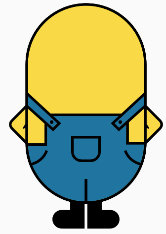
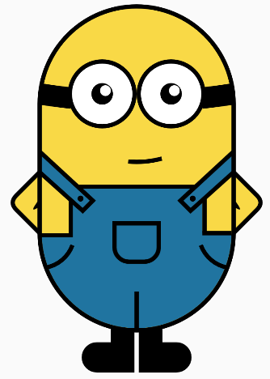
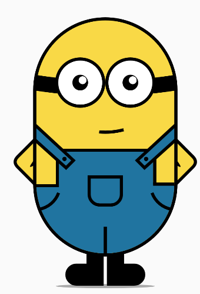
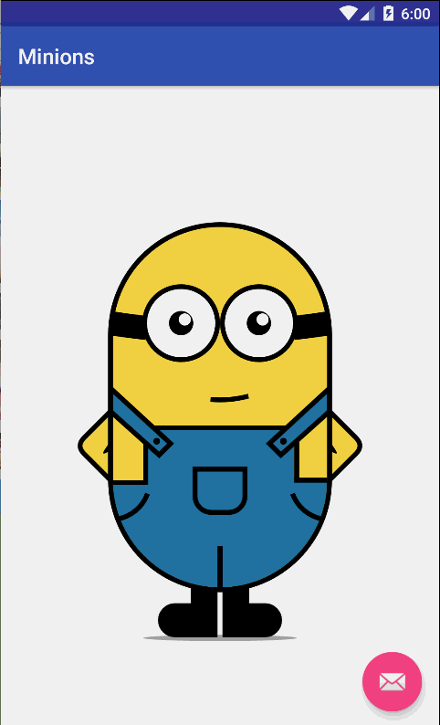

> 学习往往是枯燥的，如果能用一个有趣 Demo 来学习和练习技术，那对知识的掌握就会更牢固。我之前在学习 Canvas 绘制 API 的时候就是这样做的。

## 旧文截图镇楼



效果图



我觉得这个绘制小黄人的自定义 View 就很有意思，也为我后来工作中的自定义 View 实现打下了良好的基础。虽然这是 4 年半以前写的文章，但是大部分关注我们的同学应该没看过，今天咱们一起来拷古翻新一下代码（程序员的事，怎么能叫炒冷饭呢，这明明是温故而知新）。以后有机会还会分享项目实用自定义 View，敬请关注。

## 实现步骤

其实很简单
1. 首先找到一张小黄人的图
2. 然后调用 `canvas.drawBitmap()` 后画到画布上
   好吧，一点都不好笑  - -。
***
正文

## 准备工作

自定义`MinionView extends View`，定义以下成员变量，备用（可以先不看，后面的代码看到莫名其妙出来的变量再上来看下）

```java
private float bodyWidth;
private float bodyHeight;
private static final float BODY_SCALE = 0.6f; // 身体主干占整个view的比重
private static final float BODY_WIDTH_HEIGHT_SCALE = 0.6f; // 身体的比例设定为 w:h = 3:5

private float mStrokeWidth = 4; // 描边宽度
private float offset; // 计算时，部分需要 考虑描边偏移
private float radius; // 身体上下半圆的半径
private int colorClothes = Color.rgb(32, 116, 160); // 衣服的颜色
private int colorBody = Color.rgb(249, 217, 70); // 身体的颜色
private int colorStroke = Color.BLACK;
private RectF bodyRect = new RectF();
private float handsHeight;// 计算出吊带的高度时，可以用来做手的高度
private float footHeight; // 脚的高度，用来画脚部阴影时用
```

## 初始化参数
重写 `onSizeChanged` 方法，尺寸变化时初始化一下绘制的参数（会经常看到一些奇怪的数字，用做比例换算，别问我怎么来的，目测 + 一点点微调得来的- -。）
```java
private void initParams() {
    bodyWidth = Math.min(getWidth(), getHeight() * BODY_WIDTH_HEIGHT_SCALE) * BODY_SCALE;
    bodyHeight = Math.min(getWidth(), getHeight() * BODY_WIDTH_HEIGHT_SCALE) / BODY_WIDTH_HEIGHT_SCALE * BODY_SCALE;

    mStrokeWidth = Math.max(bodyWidth / 50, mStrokeWidth);
    offset = mStrokeWidth / 2;

    bodyRect.left = (getWidth() - bodyWidth) / 2;
    bodyRect.top = (getHeight() - bodyHeight) / 2;
    bodyRect.right = bodyRect.left + bodyWidth;
    bodyRect.bottom = bodyRect.top + bodyHeight;

    radius = bodyWidth / 2;
    footHeight = radius * 0.4333f; 

    handsHeight =  (getHeight() + bodyHeight) / 2   + offset - radius * 1.65f;
}
```

绘制参数好了，接下来就是一步步绘制几何图形了

## 画身体


显然身体是一个矩形加上，上下半圆，这边只要用一个圆角矩形，然后圆角的弧度半径用身体宽度的一半就可以达到这个效果了。
把身体的矩形外存起来，后面经常要用到其相对位置进行对其它部位的定位，代码如下:

```java
protected void onDraw(Canvas canvas) {
    ...
    drawBody(canvas);       // 身体
    drawBodyStroke(canvas); // 最后画身体的描边，可以摭住一些过渡的棱角
}

private void drawBody(Canvas canvas) {
    mPaint.setColor(colorBody);
    mPaint.setStyle(Paint.Style.FILL);

    canvas.drawRoundRect(bodyRect, radius, radius, mPaint);
}

private void drawBodyStroke(Canvas canvas) {
    mPaint.setColor(colorStroke);
    mPaint.setStrokeWidth(mStrokeWidth);
    mPaint.setStyle(Paint.Style.STROKE);
    canvas.drawRoundRect(bodyRect, radius, radius, mPaint);
}
```

## 画衣服 



* 首先画 底下的半圆
```java
rect.left = (getWidth() - bodyWidth) / 2 + offset;
rect.top = (getHeight() + bodyHeight) / 2 - radius * 2 + offset;
rect.right = rect.left + bodyWidth - offset * 2;
rect.bottom = rect.top + radius * 2 - offset * 2;

mPaint.setColor(colorClothes);
mPaint.setStyle(Paint.Style.FILL);
mPaint.setStrokeWidth(mStrokeWidth);
canvas.drawArc(rect, 0, 180, true, mPaint);
```
* 再画半圆上方的矩形, w 表示矩形离左边身体的距离，h 矩形的高 
```java
int h = (int) (radius * 0.5);
int w = (int) (radius * 0.3);

rect.left += w;
rect.top = rect.top + radius - h;
rect.right -= w;
rect.bottom = rect.top + h;

canvas.drawRect(rect, mPaint);
```
* 上面的画完之后，要在衣服上面描一层黑色的边，用`canvas.drawLines`把线一条条画出来吧，这边要同时考虑画笔的描边宽度，否则会出现连接点有锯齿的感觉。（ 2020 注：这是当时最直接的想法，现在来看用 Path 来绘制，每个点用 rLineTo 去连接，代码会简单得多。）
```java
mPaint.setColor(colorStroke);
mPaint.setStyle(Paint.Style.FILL);
mPaint.setStrokeWidth(mStrokeWidth);
float[] pts = new float[20];// 5 条线

pts[0] = rect.left - w;
pts[1] = rect.top + h;
pts[2] = pts[0] + w;
pts[3] = pts[1];

pts[4] = pts[2];
pts[5] = pts[3] + offset;
pts[6] = pts[4];
pts[7] = pts[3] - h;

pts[8] = pts[6] - offset;
pts[9] = pts[7];
pts[10] = pts[8] + (radius - w) * 2;
pts[11] = pts[9];

pts[12] = pts[10];
pts[13] = pts[11] - offset;
pts[14] = pts[12];
pts[15] = pts[13] + h;

pts[16] = pts[14] - offset;
pts[17] = pts[15];
pts[18] = pts[16] + w;
pts[19] = pts[17];
canvas.drawLines(pts, mPaint);
```
* 画吊带 就是一个直角梯形，把梯形的四个顶点计算出来，使用`canvas.drawPath`将其画上去，然后纽扣用一个实心的小圆表示
```java
// 画左吊带
path.reset();
path.moveTo(rect.left - w - offset, handsHeight);
path.lineTo(rect.left + h / 4f, rect.top + h / 2f);
final float smallW = w / 2f * (float) Math.sin(Math.PI / 4);
path.lineTo(rect.left + h / 4f + smallW, rect.top + h / 2f - smallW);
final float smallW2 = w / (float) Math.sin(Math.PI / 4) / 2;
path.lineTo(rect.left - w - offset, handsHeight - smallW2);
canvas.drawPath(path, mPaint);

mPaint.setColor(colorStroke);
mPaint.setStrokeWidth(mStrokeWidth);
mPaint.setStyle(Paint.Style.STROKE);
canvas.drawPath(path, mPaint);
mPaint.setStyle(Paint.Style.FILL_AND_STROKE);
canvas.drawCircle(rect.left + h / 5f, rect.top + h / 4f, mStrokeWidth * 0.7f, mPaint);

// 画右吊带，代码差不多省略了，坐标对称
```

* 画中间的口袋 是一个下面两边是圆角的圆角矩形，但是貌似不能直接画这样的圆角矩形，所以我就用土办法，不就是一个多边形吗，用`canvas.drawPath`来画，在圆角的地方添加圆弧过渡`path.addArc`
```java
path.reset();
float radiusBigPocket = w / 2.0f;
path.moveTo(rect.left + 1.5f * w, rect.bottom - h / 4f);
path.lineTo(rect.right - 1.5f * w, rect.bottom - h / 4f);
path.lineTo(rect.right - 1.5f * w, rect.bottom + h / 4f);
path.addArc(rect.right - 1.5f * w - radiusBigPocket * 2, rect.bottom + h / 4f - radiusBigPocket,
        rect.right - 1.5f * w, rect.bottom + h / 4f + radiusBigPocket, 0, 90);
path.lineTo(rect.left + 1.5f * w + radiusBigPocket, rect.bottom + h / 4f + radiusBigPocket);

path.addArc(rect.left + 1.5f * w, rect.bottom + h / 4f - radiusBigPocket,
        rect.left + 1.5f * w + 2 * radiusBigPocket, rect.bottom + h / 4f + radiusBigPocket, 90, 90);
path.lineTo(rect.left + 1.5f * w, rect.bottom - h / 4f - offset);
canvas.drawPath(path, mPaint);    
```
* 左右两个小口袋也直接用一个小弧来解决掉 
```java
// 下边一竖，分开裤子
canvas.drawLine(bodyRect.left + bodyWidth / 2, bodyRect.bottom - h * 0.8f, bodyRect.left + bodyWidth / 2, bodyRect.bottom, mPaint);
// 左边的小口袋
float radiusSmallPocket = w * 1.2f;
canvas.drawArc(bodyRect.left - radiusSmallPocket, bodyRect.bottom - radius - radiusSmallPocket,
       bodyRect.left + radiusSmallPocket, bodyRect.bottom - radius + radiusSmallPocket, 80, -60, false, mPaint);
// 右边小口袋
canvas.drawArc(bodyRect.right - radiusSmallPocket, bodyRect.bottom - radius - radiusSmallPocket,
        bodyRect.right + radiusSmallPocket, bodyRect.bottom - radius + radiusSmallPocket, 100, 60, false, mPaint);
```

* 嗯，衣服画完了。

```java
protected void onDraw(Canvas canvas) {
    ...
    drawClothes(canvas);//衣服
}

private void drawClothes(Canvas canvas) {
    //就是上面那一堆代码按顺序合起来啦。。。。。
}
```

## 画脚


脚这部分比较简单，从身体的下方，一个竖直的矩形下来，再加上一个左边圆角的圆角矩形，还是通过画Path来实现。

```java
private void drawFeet(Canvas canvas) {
    mPaint.setStrokeWidth(mStrokeWidth);
    mPaint.setColor(colorStroke);
    mPaint.setStyle(Paint.Style.FILL_AND_STROKE);

    float radiusFoot = radius / 3 * 0.4f;
    float leftFootStartX = bodyRect.left + radius - offset * 2;
    float leftFootStartY = bodyRect.bottom - offset;
    float footWidthA = radius * 0.5f;//脚宽度大-到半圆结束
    float footWidthB = footWidthA / 3;//脚宽度-比较细的部分

    // 左脚
    path.reset();
    path.moveTo(leftFootStartX, leftFootStartY);
    path.lineTo(leftFootStartX, leftFootStartY + footHeight);
    path.lineTo(leftFootStartX - footWidthA + radiusFoot, leftFootStartY + footHeight);

    rect.left = leftFootStartX - footWidthA;
    rect.top = leftFootStartY + footHeight - radiusFoot * 2;
    rect.right = rect.left + radiusFoot * 2;
    rect.bottom = rect.top + radiusFoot * 2;
    path.addArc(rect, 90, 180);
    path.lineTo(rect.left + radiusFoot + footWidthB, rect.top);
    path.lineTo(rect.left + radiusFoot + footWidthB, leftFootStartY);
    path.lineTo(leftFootStartX, leftFootStartY);
    canvas.drawPath(path, mPaint);

		// 右脚与左脚实现一致，坐标对称，代码略
}
```

## 画手



手我用的是一个等腰直角三角形来实现，斜边就是吊带到裤子，从直角顶点作高到斜边，通过小直角三角形的直角边相等就可以算出顶点的坐标。这个时候还是有个圆角，刚开始我实现的时候是像上面那些通过` path.addArc`加上圆角，但是这边计算好之后和原来的衔接一直有问题，在调了半天之后，偶然发现`mPaint.setPathEffect(new CornerPathEffect(radiusHand));`这个方法，可以使path的拐角用圆角来过渡，一下子就简单到爆了，果然科学技术是第一生产力。
```java
private void drawHands(Canvas canvas) {
    ...       
    // 左手
    path.moveTo(bodyRect.left, handsHeight);
    path.lineTo(bodyRect.left - hypotenuse / 2, handsHeight + hypotenuse / 2);
    path.lineTo(bodyRect.left +offset, bodyRect.bottom - radius +offset);
    path.lineTo(bodyRect.left, handsHeight);
    canvas.drawPath(path, mPaint);

    mPaint.setStrokeWidth(mStrokeWidth);
    mPaint.setStyle(Paint.Style.STROKE);
    mPaint.setColor(colorStroke);
    canvas.drawPath(path, mPaint);

    // 右手略 ...
    // 手臂内侧拐点
    path.reset();
    mPaint.setStyle(Paint.Style.FILL);
    path.moveTo(bodyRect.left, handsHeight + hypotenuse / 2 - mStrokeWidth);
    path.lineTo(bodyRect.left - mStrokeWidth * 2, handsHeight + hypotenuse / 2 + mStrokeWidth * 2);
    path.lineTo(bodyRect.left, handsHeight + hypotenuse / 2 + mStrokeWidth);
    canvas.drawPath(path, mPaint);
    ...
 }
```
## 画眼睛,嘴巴



反正就是各种画圆，或者弧形，嘴巴部分偷懒也就一条小弧一笔带过了，哈哈 

```java
private void drawEyesMouth(Canvas canvas) {
    // 眼睛中心处于上半圆直径 往上的高度偏移
    float eyesOffset = radius * 0.1f;
    mPaint.setStrokeWidth(mStrokeWidth * 5);

    // 计算眼镜带弧行的半径 分两段，以便眼睛中间有隔开的效果
    float radiusGlassesRibbon = (float) (radius / Math.sin(Math.PI / 20));
    rect.left = bodyRect.left + radius - radiusGlassesRibbon;
    rect.top = bodyRect.top + radius - (float) (radius / Math.tan(Math.PI / 20)) - radiusGlassesRibbon - eyesOffset;
    rect.right = rect.left + radiusGlassesRibbon * 2;
    rect.bottom = rect.top + radiusGlassesRibbon * 2;
    canvas.drawArc(rect, 81, 3, false, mPaint);
    canvas.drawArc(rect, 99, -3, false, mPaint);

    // 眼睛半径
    float radiusEyes = radius / 3;
    mPaint.setColor(Color.WHITE);
    mPaint.setStrokeWidth(mStrokeWidth);
    mPaint.setStyle(Paint.Style.FILL);

    canvas.drawCircle(bodyRect.left + bodyWidth / 2 - radiusEyes - offset, bodyRect.top + radius - eyesOffset, radiusEyes, mPaint);
    canvas.drawCircle(bodyRect.left + bodyWidth / 2 + radiusEyes + offset, bodyRect.top + radius - eyesOffset, radiusEyes, mPaint);

    mPaint.setColor(colorStroke);
    mPaint.setStyle(Paint.Style.STROKE);
    canvas.drawCircle(bodyRect.left + bodyWidth / 2 - radiusEyes - offset, bodyRect.top + radius - eyesOffset, radiusEyes, mPaint);
    canvas.drawCircle(bodyRect.left + bodyWidth / 2 + radiusEyes + offset, bodyRect.top + radius - eyesOffset, radiusEyes, mPaint);

    final float radiusEyeballBlack = radiusEyes / 3;
    mPaint.setStyle(Paint.Style.FILL);
    canvas.drawCircle(bodyRect.left + bodyWidth / 2 - radiusEyes - offset, bodyRect.top + radius - eyesOffset, radiusEyeballBlack, mPaint);
    canvas.drawCircle(bodyRect.left + bodyWidth / 2 + radiusEyes + offset, bodyRect.top + radius - eyesOffset, radiusEyeballBlack, mPaint);

    mPaint.setColor(Color.WHITE);
    final float radiusEyeballWhite = radiusEyeballBlack / 2;
    canvas.drawCircle(bodyRect.left + bodyWidth / 2 - radiusEyes + radiusEyeballWhite - offset * 2,
            bodyRect.top + radius - radiusEyeballWhite + offset - eyesOffset,
            radiusEyeballWhite, mPaint);
    canvas.drawCircle(bodyRect.left + bodyWidth / 2 + radiusEyes + radiusEyeballWhite,
            bodyRect.top + radius - radiusEyeballWhite + offset - eyesOffset,
            radiusEyeballWhite, mPaint);

    // 画嘴巴，因为位置和眼睛有相对关系，所以写在一块
    mPaint.setColor(colorStroke);
    mPaint.setStyle(Paint.Style.STROKE);
    mPaint.setStrokeWidth(mStrokeWidth);
    float radiusMonth = radius;
    rect.left = bodyRect.left;
    rect.top = bodyRect.top - radiusMonth / 2.5f;
    rect.right = rect.left + radiusMonth * 2;
    rect.bottom = rect.top + radiusMonth * 2;
    canvas.drawArc(rect, 95, -20, false, mPaint);
}
```

## 脚下的阴影
这是最后一步了，直接画一个非常扁的椭圆放在脚下面就可以了



```java
private void drawFeetShadow(Canvas canvas) {
    mPaint.setColor(getResources().getColor(android.R.color.darker_gray));
    canvas.drawOval(bodyRect.left + bodyWidth * 0.15f,
            bodyRect.bottom - offset + footHeight,
            bodyRect.right - bodyWidth * 0.15f,
            bodyRect.bottom - offset + footHeight + mStrokeWidth * 1.3f, mPaint);
}
```

## 重写 onDraw 方法

按层级依次调用上述的各种方法，画完收工。

```java
@Override
protected void onDraw(Canvas canvas) {
    drawFeetShadow(canvas); // 脚下的阴影
    drawFeet(canvas);       // 脚
    drawHands(canvas);      // 手
    drawBody(canvas);       // 身体
    drawClothes(canvas);    // 衣服
    drawEyesMouth(canvas);  // 眼睛,嘴巴
    drawBodyStroke(canvas); // 最后画身体的描边，可以摭住一些过渡的棱角
}
```
## 少了点什么？

画完了，好像少了点什么。。。。。对了，头发。好吧，我画的是程序猿，哪来的头发 - -

***
>至此，正常画风的小黄人已经画完了，但是吧，好不容易画好，好像没啥意思，脑洞大开一下吧。
>电影中的小黄人中病毒后是会变成紫色的，那我们用代码画，换个颜色还不是分分钟，不但要紫色，还要各种颜色。

## 三行代码搞定脑洞

```java
public void randomBodyColor() {
    Random random = new Random();
    colorBody = Color.rgb(random.nextInt(255), random.nextInt(255), random.nextInt(255));
    invalidate();
}
```
然后效果就变成了这样。
     


>希望大家喜欢 ,上述有任何问题或者表述不清楚的，欢迎评论交流。
>完整源码 [github](https://github.com/samwangds/minions) 或查看原文