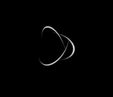
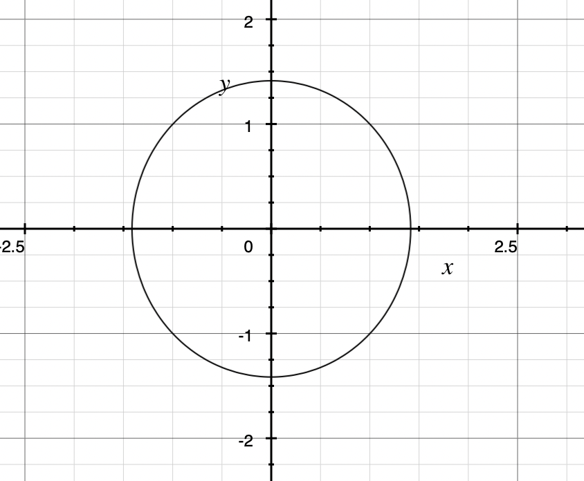
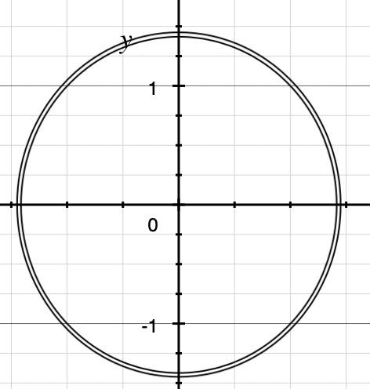
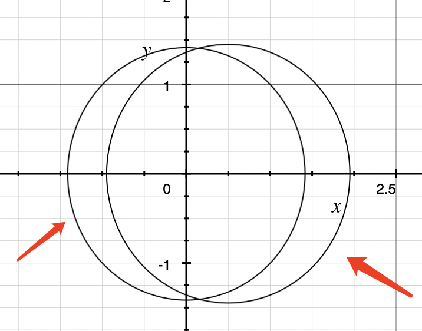
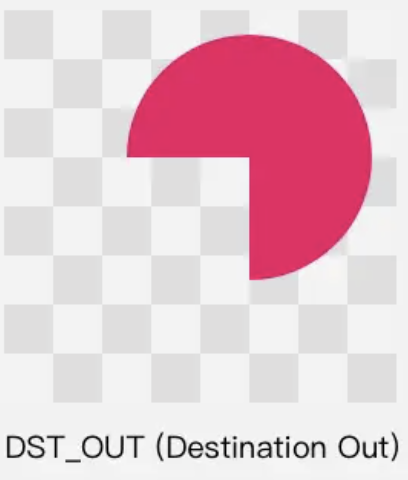
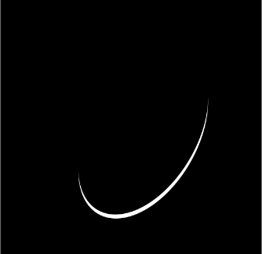
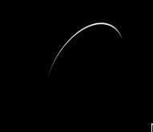
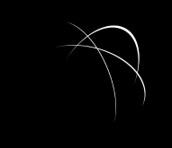
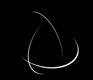

> 看到一个非常炫的加载效果，文章中大佬是通过 css 实现的，今天咱们来用 Android 的自定义 View 来实现一下
>
> https://juejin.cn/post/7001779766852321287

#### 这是理想中的效果


#### 这是现实的效果



不能说百分百还原吧，只能说精髓


## 开工

这个效果仔细看，就是有三个类似月牙形状的元素进行循环转动，我们只需要拆解出一个月牙来做效果即可，最后再将三个月牙组合起来就可以达到最终效果了

## 月牙

#### 先画一个圆



#### 再画个大一丢丢的



#### 再把这个大圆往右移一丢丢,裁切出来的左右两个都是月牙



#### 实现

老司机应该一眼就能看出来，只要在两次绘制圆中只要使用一个叠加模式就能达到裁剪出一个月牙的效果了。那么是什么模式呢，我去搜索一下~

当当当，就是它~ `PorterDuff.Mode.DST_OUT`



相关源码如下：

```kotlin
canvas.drawColor(Color.BLACK)

val layerId =
    canvas.saveLayer(0f, 0f, width.toFloat(), height.toFloat(), null, Canvas.ALL_SAVE_FLAG)
val halfW = width / 2f
val halfH = height / 2f
val radius = min(width, height) / 3f

paint.color = Color.WHITE
canvas.drawCircle(halfW, halfH, radius, paint)
paint.color = Color.BLACK
paint.xfermode = xfermode
canvas.drawCircle(halfW, halfH - 0.05f * radius, radius * 1.01f, paint)
canvas.restoreToCount(layerId)
paint.xfermode = null
```

#### 运行起来我们就得到了一弯浅浅的月牙


## 立体空间变化

我们可以看出效果图里的每一个月牙并不是那么方正，而是有一定的空间旋转，再加上绕着 Z 轴旋转。这里需要利用 Camera 与 Matrix 实现3D效果（相关知识可参考：https://www.jianshu.com/p/34e0fe5f9e31）

#### 我们先给它在 x 轴转 35 度 ，y 轴转 -45 度（参考开头文章的数据）

```kotlin
rotateMatrix.reset()
camera.save()
camera.rotateX(35F)
camera.rotateY(-45F)
camera.getMatrix(rotateMatrix)
camera.restore()
val halfW = width / 2f
val halfH = height / 2f

rotateMatrix.preTranslate(-halfW, -halfH)
rotateMatrix.postTranslate(halfW, halfH)
canvas.concat(rotateMatrix)
```

运行效果如下，从普通的月牙变成了帅气的剑气




## 动画

我们上面做了固定角度的 X, Y 轴的旋转，这个时候我们只要加上一个 Z 轴的调转动画，这个剑气就动起来了。

```kotlin
val anim = ValueAnimator.ofFloat(0f, -360f).apply {
    // Z 轴是逆时针，取负数，得到顺时针的旋转
    interpolator = null
    repeatCount = RotateAnimation.INFINITE
    duration = 1000

    addUpdateListener {
        invalidate()
    }
}
// 省略前面已写代码...
camera.rotateZ(anim.animatedValue as Float)

// 在合适的地方启动动画
view.anim.start()
```

运行效果：



## 举一反三

有了这一个完整的剑气旋转，只要再来两道，组成完整的剑气加载就可以了。

#### 将前面的代码抽象成一个方法

```KOTLIN
private fun drawSword(canvas: Canvas, rotateX: Float, rotateY: Float) {
    val layerId =
        canvas.saveLayer(0f, 0f, width.toFloat(), height.toFloat(), null, Canvas.ALL_SAVE_FLAG)
    rotateMatrix.reset()
    camera.save()
    camera.rotateX(rotateX)
    camera.rotateY(rotateY)
    camera.rotateZ(anim.animatedValue as Float)
    camera.getMatrix(rotateMatrix)
    camera.restore()

    val halfW = width / 2f
    val halfH = height / 2f

    rotateMatrix.preTranslate(-halfW, -halfH)
    rotateMatrix.postTranslate(halfW, halfH)
    canvas.concat(rotateMatrix)
    canvas.drawCircle(halfW, halfH, radius, paint)
    paint.xfermode = xfermode
    canvas.drawCircle(halfW, halfH - 0.05f * radius, radius * 1.01f, paint)
    canvas.restoreToCount(layerId)
    paint.xfermode = null
}
```

#### 绘制三道剑气

``` kotlin
verride fun onDraw(canvas: Canvas) {
   super.onDraw(canvas)
   canvas.drawColor(Color.BLACK)
   // 偏移角度来源开关文章
   drawSword(canvas,35f, -45f)
   drawSword(canvas,50f, 10f)
   drawSword(canvas,35f, 55f)
}
```

#### 跑起来看看



Emm... 这动画也太整齐划一了

#### 错开三道剑气

在 Z 轴旋转上，我们给每道剑气一个初始值的旋转值（360/3 = 120），这样它们就能均匀的错开了。

相关实现如下：

```kotlin
private fun drawSword(canvas: Canvas, rotateX: Float, rotateY: Float, startValue: Float) {
   //... 省略未改动代码
   camera.rotateZ(anim.animatedValue as Float + startValue)
   //... 省略未改动代码
}

override fun onDraw(canvas: Canvas) {
    super.onDraw(canvas)
    canvas.drawColor(Color.BLACK)
    drawSword(canvas,35f, -45f, 0f)
    drawSword(canvas,50f, 10f, 120f)
    drawSword(canvas,35f, 55f, 240f)
}
```

#### 最终效果



和我们开头预期的效果图一模一样

完整代码：https://github.com/samwangds/DemoFactory/blob/master/app/src/main/java/demo/com/sam/demofactory/view/SwordLoadingView.kt

## End 吹欺汀

值此中秋佳节，祝各位有知识又有头发~

