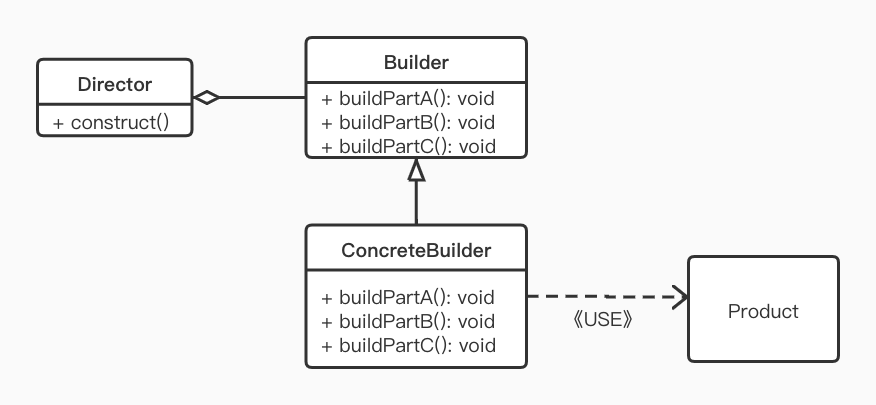

> Builder 模式是一步一步创建一个复杂对象的创建型模式，可以更精细 的控制对象的构造流程。该模式是为了将构建复杂对象的过程和它的部件解耦，使得构建过程和部件的表示隔离开来。

一个复杂的对象会有很多的组成部分，如汽车，有车轮、方向盘、发动机、还有各种小部件等，如何将这些部件装配成一辆汽车，这个装配过程很复杂，对于这种情况，为了在构建过程中隐藏实现细节，就可以使用 Builder 模式将部件和组装过程分离，使得构建过程和部件都可以自由扩展，两者之间的耦合也降到最底。

## 定义

将一个复杂对象的构建过程与表示分离，使得同样的构建过程可以创建出该对象的不同表示

## 使用场景

- 相同的方法，不同的执行顺序，产生不同的事件结果时
- 多个部件或零件，都可以装配到一个对象中，但是产生的运行结果又不相同时
- 产品类非常复杂，或产品顺中的调用顺序不同产生了不同的作用时
- 初化一个对象特别复杂，如参数多且很多参数具有默认值时

## UML



- Product:  产品类，产品的抽象类
- Builder:  抽象 Builder 类，规范产品的组建
- ConcreteBuilder: 具体的 Builder 类
- Director: 统一组装过程

## Demo

做为程序猿，在老家就等于是一个修电脑的，电脑的组装过程比较复杂，并且组装的顺序是不固定的。我们就把这个过程简化为构建主机，安装操作系统，连接显示器这 3 个部分，然后通过 Director 和具体的 Buidler 来构建计算机对象。

先写一个计算机类，即 Product 角色

```KOTLIN
abstract class Computer {
    var mainBoard: String? = null // 主板
    var display: String? = null // 显示器
    var OS: String? = null // 操作系统，null 时未安装操作系统

    //安装操作系统
    abstract fun installOS()
  
    override fun toString(): String {
        return "Computer info: (mainBoard=$mainBoard, display=$display, OS=$OS)"
    }
}

class MacBook : Computer() {
    override fun installOS() {
        OS = "macOS Big Sur 11.0.1"
    }
}
```

再写相关的 Builder 类

```kotlin
abstract class Builder {
    // 安装主板
    abstract fun setupMainBoard(mainBoard: String): Builder
    // 连接显示器
    abstract fun connectDisplay(display: String): Builder
    // 安装操作系统
    abstract fun installOS(): Builder
    // 创建一台装好的电脑
    abstract fun create(): Computer
}

class MacBookBuilder : Builder() {
    val computer = MacBook()

    override fun setupMainBoard(mainBoard: String): Builder {
        computer.mainBoard = mainBoard
        return this
    }

    override fun connectDisplay(display: String): Builder {
        computer.display = display
        return this
    }

    override fun installOS(): Builder {
        computer.installOS()
        return this
    }

    override fun create(): Computer {
        return computer
    }
}
```

接下来是我们不太熟悉的 Director 类，负责构造 Computer

```kotlin
class Director(val builder: Builder) {
    fun constructMackBook(mainBoard: String, display: String) {
        builder.setupMainBoard(mainBoard)
                .connectDisplay(display)
                .installOS()
    }
}
```

 最后就是测试代码和运行结果啦~

```kotlin
fun main() {
    val builder = MacBookBuilder()
    val director = Director(builder)
    // 来个 M1 + 4K 的 MackBook 一定很爽
    director.constructMackBook("苹果主板 M1 芯片版", "4K 显示器")
    // 最后打印一下组件好的电脑信息
    print(builder.create())
}

// ------ 运行结果 ------ 
Computer info: (mainBoard=苹果主板 M1 芯片版, display=4K 显示器, OS=macOS Big Sur 11.0.1)
```

在这个  Demo 中，通过具体的 MacBookBuilder 来构建 MacBook 对象，而 Director 封装了构建 复杂对象的过程，对外隐藏细节 。Builder 和 Director 一起将一个复杂对象的构建与它的表示分离，使得同样的构建 肥屁股退款可以创建不同的对象。

不过，在实际开发过程中，为了方便运用，Director、抽象的 Builder 经常会被省略，直接一个 Builder 清清爽爽：

```kotlin
MacBookBuilder().setupMainBoard(mainBoard)
        .connectDisplay(display)
        .installOS()
        .create()
```

## Android 源码中的应用

在 Android 源码中，最常用到的 Builder 模式就是 AlertDialog.Builder，可以使用该 Builder 来构建复杂的 AlertDialog 对象:

```kotlin
AlertDialog.Builder(context)
        .setIcon(R.drawable.video_edit_icon_compare_bg)
        .setTitle("Title")
        .setMessage("Message")
        .setPositiveButton("OK", dialogOnClickListener)
        .setNegativeButton("Cancel", dialogOnClickListener)
        .create()
        .show()
```

通过 Builder 对象来组装 Dialog 的各个部分，如 Title, Buttons, Message 等，将 Dialog 的构造和表示进行分离。

AlertDialog.Builder 同时扮演了前文提到的 Builder, ConcreteBuilder, Director 的角色，简化了 Builder 模式的设计。当模块比较稳定时可以精简，不必照搬 GOF 上的经典实现，更灵活的运用设计模式，这一点上 Android 的源码很值得我们去学习。

## Kotlin 的默认参数 

我们在说应用场景时，有这样一个场景：初化一个对象特别复杂，如参数多且很多参数具有默认值时。使用 Kotlin 的默认参数，能更方便的实现，少写很多代码。

```KOTLIN
// 带有默认参数的构造函数
class Computer (
    var mainBoard: String = "苹果主板", // 自家定制的主板
    var display: String? = "2K Retina",// 显示器 2K+
    var OS: String = "MacOS" // 自带 Mac
)

// 可以在构造函数里，传任意 0-N 个参数
fun main() {
    Computer(
            mainBoard = "Intel 主板", 
            OS = "Windows"
    )
}
```

## 小结

Builder 模式在 Android 开发中较为常用，通常作为配置类的构建 器将配置的构建和表示分离开来，同时也将配置从目标类中隔离开来，避免过多的 setter 方法。Builder 模式常见的实现开工是通过调用链实现，这样使得代码更简洁，易懂。

#### 优点

- 良好的封装，使客户端不必知道产品内部组成的细节 
- Builder 独立，容易扩展

#### 缺点

- 额外产生的类，在创建产品对象时额外消费内存