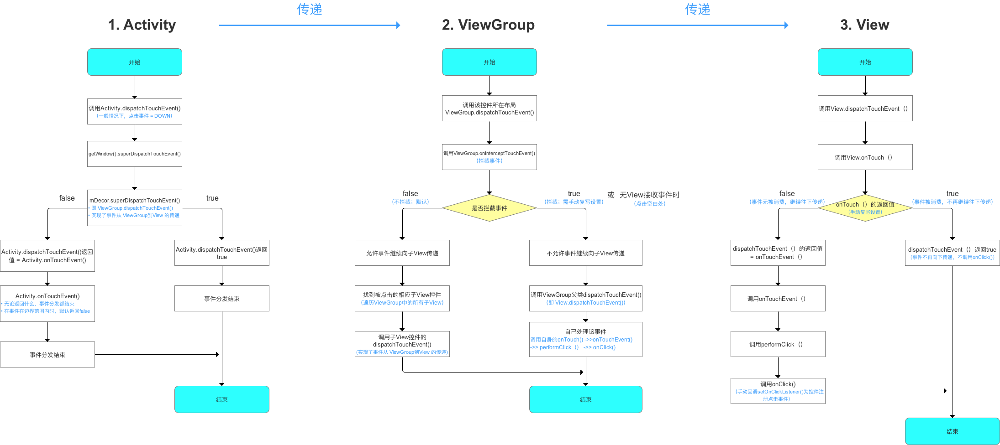

# 必问的事件分发，你答得上来吗

Android touch 事件的分发，是面试中最常被问到的问题之一。我们来看看 😎、😨 和 🤔️ 三位同学是怎么回答的吧

>😎 自认为无所不知，水平已达应用开发天花板，目前月薪 10k

**面试官**：讲讲 Android 的事件分发机制

😎：当用户手指触摸屏幕时，Android 都会将对应的事件包装成一个事件对象 MotionEvent 从 ViewTree 的顶部至上而下地分发传递。用户从手指接触屏幕至离开屏幕会产生一系列的事件，事件是以 down 开始，up 或 cancel 结束，中间无数个 move ; **一个事件的分发顺序是：Activity 到 ViewGroup 再到 View**

**面试官**：事件分发的过程用到哪些方法

😎：首先是 dispatchTouchEvent 执行事件分发的方法，整个事件分发的过程就是在递归这个方法；

然后就是 onTouchEvent 消费方法，View 响应事件、ScrollView 响应滚动事件就是在这里面实现

**面试官**：还有一个拦截方法呢？

😎：什么拦截方法，分发关拦截什么事？（糟糕背的答案忘了）

**面试官**：哦，没事，回去等通知吧。


---

>😨 业余时间经常打游戏、追剧、熬夜，目前月薪 15k

**面试官**：事件分发的过程用到哪些方法

😨：有 dispatchTouchEvent 、onTouchEvent 、 onInterceptTouchEvent ；ViewGroup 在调用 dispatchTouchEvent 进行事件分发时，会调用  `onInterceptTouchEvent` ，来判断是否能拦截这个事件。相应如果不想 ViewGroup 拦截事件，可以调用 `ViewGroup.requestDisallowInterceptTouchEvent` 方法，传 true 就是别拦给我传，false 你开心就拦吧；常用来解决一些嵌套 View 的事件冲突。

**面试官**：说一下这些方法的关系

😨：比如 ScrollView 用户手指点击下去时，Down 事件会被子 View 消费，这样如果紧接着用户手指直接抬起那这个子 View 就消费这个完整的事件序列，一般是点击事件；而如果接下去用户的手指进行滑动产生 Move事件，那就必须要由 ScrollView 来响应滚动事件了，为了能达到这个效果 ScrollView 在 dispatchTouchEvent( Move ) 时，调用 onInterceptTouchEvent 返回了 true 来实现拦截事件，不再向子 View 分发。

看一下伪代码
```
// 事件分发到某个具体的 ViewGroup，会直接调用 dispatchTouchEvent() 方法
public boolean dispatchTouchEvent(MotionEvent ev) {
    //代表是否消费事件
    boolean consume = false;

    if (onInterceptTouchEvent(ev)) {
    // 如果 onInterceptTouchEvent() 返回 true 则代表当前 View 拦截了事件
    // 则该事件则会交给当前View进行处理
    // 即调用 onTouchEvent() 方法去处理事件
      consume = onTouchEvent (ev) ;
    } else {
      // 如果 onInterceptTouchEvent() 返回 false 则代表当前 View 不拦截事件
      // 则该事件则会继续传递给它的子元素
      // 子元素的 dispatchTouchEvent() 就会被调用，重复上述过程
      // 直到事件被最终处理为止
      consume = child.dispatchTouchEvent(ev); //遍历处理
    }
    return consume;
   }
```

**面试官**：你这伪代码虽然通俗易懂，但是省略了太多逻辑了，子 View  在消费掉 Down 事件后，后续的事件都给会传递给它，你知道是怎么实现的吗

😨：具体怎么实现没关注

**面试官**：好的，回去等通知吧。


---

>🤔️ 坚持每天学习、不断的提升自己，目前月薪 30k

**面试官**：讲讲 Android 的事件分发机制

🤔️：说起来太费劲了，上神图，放大了认真看：



**面试官**：子 View  在消费掉 Down 事件后，后续的事件都给会传递给它，你知道是怎么实现的吗

🤔️：ViewGroup 里面用了一个成员变量 mFirstTouchTarget 来保存消费事件的子 View 信息，因为安卓是支持多指操作的，所以这个 mFirstTouchTarget 是一个 TouchTarget 的链表。在View 的 dispatchTouchEvent 可以分为三个阶段：判断是否需要拦截； 分发事件找到消费事件的子 View，更新到 mFirstTouchTarget；根据是否拦截和 mFirstTouchTarget 再次分发事件。

再细节我们就要到源码里看实现了，基于 API 28 ViewGroup：

1. 判断是否需要拦截

```
final boolean intercepted;
if (actionMasked == MotionEvent.ACTION_DOWN
     || mFirstTouchTarget != null) {
 // disallowIntercept 就是 requestDisallowInterceptTouchEvent 设置的
 // 根据 disallowIntercept 和 onInterceptTouchEvent 决定intercepted
 final boolean disallowIntercept = (mGroupFlags & FLAG_DISALLOW_INTERCEPT) != 0;
 if (!disallowIntercept) {
     intercepted = onInterceptTouchEvent(ev);
     ev.setAction(action); // restore action in case it was changed
 } else {
     intercepted = false;
 }
} else {
// 不是 Down 事件 并且之前的事件没有被子 View 捕获，就可以直接拦截
 intercepted = true;
}
```

2.  分发事件找到消费事件的子 View

```
if (!canceled && !intercepted) {
    if (actionMasked == MotionEvent.ACTION_DOWN || ...) {
           	// 只分发 Down 事件（省略的为多指或鼠标的情况）
        for (int i = childrenCount - 1; i >= 0; i--) {
        		...
            //调用 dispatchTransformedTouchEvent 方法将事件分发给子 View
            if (dispatchTransformedTouchEvent(ev, false, child, idBitsToAssign)) {
                ...
                // 如果事件被子 View 消费，更新 mFirstTouchTarget 
                newTouchTarget = addTouchTarget(child, idBitsToAssign);
                break;
            }
            ...
        }
    }
}
```
3. 根据拦截结果和 mFirstTouchTarget 再次分发事件。
```
if (mFirstTouchTarget == null) {
    // 没有子 View 消费事件，则传入 null 去分发，最终调用的是自身的 onTouchEvent 方法，进行处理 touch 事件
    handled = dispatchTransformedTouchEvent(ev, canceled, null,
            TouchTarget.ALL_POINTER_IDS);
} else {
    TouchTarget predecessor = null;
    TouchTarget target = mFirstTouchTarget;
    while (target != null) {
        final TouchTarget next = target.next;
        if (alreadyDispatchedToNewTouchTarget && target == newTouchTarget) {
            handled = true; //已经处理了的避免重复分发
        } else {
            //如果 intercepted 就取消 cancelChild，这便是拦截子 View 事件的原理
            final boolean cancelChild = resetCancelNextUpFlag(target.child)
                    || intercepted;
            if (dispatchTransformedTouchEvent(ev, cancelChild,
                    target.child, target.pointerIdBits)) {
                //内部会比较 pointerIdBits 和当前事件的 pointerIdBits，一致才会处理
                //这便是 Down 事件处理后后续事件都交给该 View 处理的原理
                handled = true;
            }
        }
        ...
    }
}
```
好了，终于说完了

**面试官**：太多了，能总结下吗？

🤔️：好吧，我们来复习一下：

* 判断是否需要拦截 —> 主要是根据 onInterceptTouchEvent 方法的返回值来决定是否拦截；
* 在 DOWN 事件中将 touch 事件分发给子 View —> 这一过程如果有子 View 捕获消费了 touch 事件，会对 mFirstTouchTarget 进行赋值；
* 最后一步，DOWN、MOVE、UP 事件都会根据 mFirstTouchTarget 是否为 null，决定是自己处理 touch 事件，还是再次分发给子 View。
* DOWN 事件是事件序列的起点；决定后续事件由谁来消费处理；
* mFirstTouchTarget 的作用：记录捕获消费 touch 事件的 View，是一个链表结构；
* CANCEL 事件的触发场景：当父视图先不拦截，然后在 MOVE 事件中重新拦截，此时子 View 会接收到一个 CANCEL 事件。
* 如果一个事件最后所有的 View 都不处理的话，最终回到 Activity 的 onTouchEvent 方法里面来。

**面试官**：可以，我们再来聊聊别的。

----

> 看完了这三位同学的面试表现，你有什么感想呢？欢迎关注 “Android 面试官” 在公众号后台留言讨论，另外今天留一些简单的思考题，如果答不出来的建议收藏文章多看几遍，或者在公众号后台回复“事件分发思考题”。
>
> * 如果一个事件序列的 ACTION_DOWN 事件被 ViewGroup 拦截，此时子 View 调用 requestDisallowInterceptTouchEvent 方法有没有用？
>* ACTION_DOWN 事件被子 View 消费了，那 ViewGroup 能拦截剩下的事件吗？如果拦截了剩下事件，当前这个事件 ViewGroup 能消费吗？子 View 还会收到事件吗？
> * 当 View Disable 时，会消费事件吗？
> 