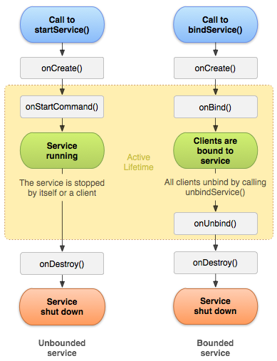

# Service 详解

>Service 是四大组件之一，后台运行的解决方案，适合那些不需要和用户交互还要长期运行的任务。
Service 的运行不依赖于任何用户界面，即使 app 被切到后台，Service 仍能够正常运行。当某个程序进程被杀掉时，所有依赖于该进程的 Service 也会停止

使用时必须在清单文件中声明服务如：
```
<manifest ... >
  ...
  <application ... >
      <service android:name=".ExampleService" />
      ...
  </application>
</manifest>
```

#### Service 与 Thread 的区别

* Thread 是 cpu 执行的最小单元，它是分配 cpu 的基本单位，用来执行异步操作
* Service 是安卓的一种机制，运行于主线程的 Service 是 Context 的子类，可以调用 Context 的所有方法。可以通过 startService, stopService, bindService, unbindService 来控制它，也可以在 Service 里注册 BroadcastReceiver 在其它地方发送广播来控制它。这些都是 Thread 做不到的

#### 生命周期


* onCreate()<br>
首次创建服务时，系统将调用此方法来执行一次性设置程序（在调用 onStartCommand(), onBind() 之前）。
* onStartCommand()<br>
当另一个组件（如 Activity）通过调用 startService() 请求启动服务时，系统将调用此方法。一旦执行此方法，服务即会启动并可在后台无限期运行。 如果您实现此方法，则在服务工作完成后，需要由您通过调用 stopSelf() 或 stopService() 来停止服务。（如果您只想提供绑定，则无需实现此方法。）
* onBind()<br>
当另一个组件想通过调用 bindService() 与服务绑定（例如执行 RPC(跨进程调用远程函数)）时，系统将调用此方法。在此方法的实现中，您必须通过返回 IBinder 提供一个接口，供客户端用来与服务进行通信。请务必实现此方法，但如果您并不希望允许绑定，则应返回 null。
* onDestroy()<br>
当服务不再使用且将被销毁时，系统将调用此方法。服务应该实现此方法来清理所有资源，如线程、注册的侦听器、接收器等。 这是服务接收的最后一个调用。
* 如果一个 Service 被 startService 方法多次启动，onCreate 方法只会调用一次，onStartCommand 方法可能会调用多次（对应 startService 调用的次数），即系统只会创建一 Service 的一个实例，所以只需要调用一次 stopService
* 被启动又被绑定的 Service,也必须调用(stopSelf 或 stopService)+(unbindService 或 Context 回收自动 unbind)才能停止服务(不分先后顺序)
* 系统资源不足，系统有可能直接结束服务

#### 启动方式
* startService 只是启动 Service，启动它的组件（如 Activity）和 Service 并没有关联，只有当 Service 调用 stopSelf 或者其他组件调用 stopService 服务才会终止。
* bindService 方法启动 Service，其他组件可以通过回调获取 Service 的代理对象和 Service 交互，而这两方也进行了绑定，当启动方销毁时，Service 也会自动进行 unBind 操作，当发现所有绑定都进行了 unBind 时才会销毁 Service。
* startService() 方法将立即返回，且 Android 系统调用服务的 onStartCommand() 方法并向其传递 Intent。（切勿直接调用 onStartCommand()）

#### 停止 Service

* 一旦请求使用 stopSelf() 或 stopService() 停止服务，系统就会尽快销毁服务。（Service.stopSelf 等同于 Context.stopService）
* 如果服务同时处理多个 onStartCommand() 请求，则您不应在处理完一个启动请求之后停止服务，因为您可能已经收到了新的启动请求（在第一个请求结束时停止服务会终止第二个请求）。为了避免这一问题，您可以使用 stopSelf(int) 确保服务停止请求始终基于最近的启动请求。也就说，在调用 stopSelf(int id) 时，传递与停止请求的 ID 对应的启动请求的 ID（传递给 onStartCommand() 的 startId） 。然后，如果在您能够调用 stopSelf(int) 之前服务收到了新的启动请求， ID 就不匹配，服务也就不会停止。
* 当服务被终止的时候，用户是无感知的。所以可用于不需要运行或终止提示的服务，如天气更新，日期同步，邮件同步等。

#### IntentService
> Service 的子类，它使用工作线程逐一处理所有启动请求。如果您不要求服务同时处理多个请求，这是最好的选择。 您只需实现 onHandleIntent() 方法即可，该方法会接收每个启动请求的 Intent，使您能够执行后台工作。

IntentService 特性：

* 创建默认的工作线程，用于在应用的主线程外执行传递给 onStartCommand() 的所有 Intent。
* 创建工作队列，用于将一个 Intent 逐一传递给 onHandleIntent() 实现，这样您就永远不必担心多线程问题。
* 在处理完所有启动请求后停止服务，因此您永远不必调用 stopSelf()。
* 提供 onBind() 的默认实现（返回 null）。
* 提供 onStartCommand() 的默认实现，可将 Intent 依次发送到工作队列和 onHandleIntent() 实现。
* 通过封装 Handler 和 Thread 实现异步任务

#### onStartCommand

onStartCommand() 方法必须返回整型数。整型数是一个值，用于描述系统应该如何在服务终止的情况下继续运行服务（如上所述，IntentService 的默认实现将为您处理这种情况，不过您可以对其进行修改）。从 onStartCommand() 返回的值必须是以下常量之一：

* START_NOT_STICKY
如果系统在 onStartCommand() 返回后终止服务，则除非有挂起 Intent 要传递，否则系统不会重建服务。这是最安全的选项，可以避免在不必要时以及应用能够轻松重启所有未完成的作业时运行服务。

* START_STICKY
如果系统在 onStartCommand() 返回后终止服务，则会重建服务并调用 onStartCommand()，但绝对不会重新传递最后一个 Intent。相反，除非有挂起 Intent 要启动服务（在这种情况下，将传递这些 Intent ），否则系统会通过空 Intent 调用 onStartCommand()。这适用于不执行命令、但无限期运行并等待作业的媒体播放器（或类似服务）。

* START_REDELIVER_INTENT
如果系统在 onStartCommand() 返回后终止服务，则会重建服务，并通过传递给服务的最后一个 Intent 调用 onStartCommand()。任何挂起 Intent 均依次传递。这适用于主动执行应该立即恢复的作业（例如下载文件）的服务。


#### bindService & unbindService
绑定服务允许应用组件通过调用 bindService() 与其绑定，以便创建长期连接.

如需与 Activity 和其他应用组件中的服务进行交互，或者需要通过进程间通信 (IPC) 向其他应用公开某些应用功能，则应创建绑定服务。

要创建绑定服务，必须实现 onBind() 回调方法以返回 IBinder，用于定义与服务通信的接口。然后，其他应用组件可以调用 bindService() 来检索该接口，并开始对服务调用方法。服务只用于与其绑定的应用组件，因此如果没有组件绑定到服务，则系统会销毁服务（您不必按通过 onStartCommand() 启动的服务那样来停止绑定服务）。

要创建绑定服务，首先必须定义指定客户端如何与服务通信的接口。 服务与客户端之间的这个接口必须是 IBinder 的实现，并且服务必须从 onBind() 回调方法返回它。一旦客户端通过 ServiceConnection.onServiceConnected()收到 IBinder，即可开始通过该接口与服务进行交互。

实现绑定服务时，最重要的环节是定义您的 onBind() 回调方法返回的 IBinder，用以提供客户端用来与服务进行交互的编程接口。 您可以通过三种方法定义接口：
* 扩展 Binder 类：
Service 仅供自有应用专用，且与客户端位于相同进程。不以这种方式创建接口的唯一原因是，您的服务被其他应用或不同的进程占用。
使用方法：
  * 在您的服务中，创建一个可满足下列任一要求的 Binder 实例：
    * 包含客户端可调用的公共方法
    * 返回当前 Service 实例，其中包含客户端可调用的公共方法
    * 或返回由服务承载的其他类的实例，其中包含客户端可调用的公共方法
  * 从 onBind() 回调方法返回此 Binder 实例。
  * 在客户端中，从 onServiceConnected() 回调方法接收 Binder，并使用提供的方法调用绑定服务。

示例：客户端可以调用 getServices 方法，获取 Service 的引用与其交互
```
public class LifecycleTestService extends Service {

    private TestThread mTestThread;
    private final IBinder mBinder = new MyBinder();

    public class MyBinder extends Binder{
        LifecycleTestService getServices(){
            return LifecycleTestService.this;
        }
    }

    @Nullable
    @Override
    public IBinder onBind(Intent intent) {
        return mBinder;
    }
```

* 使用 Messenger:
如需让接口跨不同的进程工作，则可使用 Messenger 为服务创建接口。服务可以这种方式定义对应于不同类型 Message 对象的 Handler。此 Handler 是 Messenger 的基础，后者随后可与客户端分享一个 IBinder，从而让客户端能利用 Message 对象向服务发送命令。此外，客户端还可定义自有 Messenger，以便服务回传消息。
这是执行进程间通信 (IPC) 的最简单方法，因为 Messenger 会在单一线程中创建包含所有请求的队列，这样您就不必对服务进行线程安全设计。

* 使用 AIDL:
AIDL（Android 接口定义语言）执行所有将对象分解成原语的工作，操作系统可以识别这些原语并将它们编组到各进程中，以执行 IPC。之前采用 Messenger 的方法实际上是以 AIDL 作为其底层结构。如上所述，Messenger 会在单一线程中创建包含所有客户端请求的队列，以便服务一次接收一个请求。不过，如果您想让服务同时处理多个请求，则可直接使用 AIDL。 在此情况下，您的服务必须具备多线程处理能力，并采用线程安全式设计。(多数应用“都不会”使用 AIDL 来创建绑定服务，因为它可能要求具备多线程处理能力，并可能导致实现的复杂性增加。因此，AIDL 并不适合大多数应用，本文也不会阐述如何将其用于您的服务。)

当客户端被销毁时，它将取消与服务的绑定，但您应该始终在完成与服务的交互时或您的 Activity 暂停时取消绑定，以便服务能够在未被占用时关闭。

#### 管理 bindService 的生命周期

同时使用 bindService 和 startService


#### 前台 Service
由于后台服务优先级相对比较低，当系统出现内存不足的情况下
前台服务被认为是用户主动意识到的一种服务，因此在内存不足时，系统也不会考虑将其终止。 前台服务必须为状态栏提供通知，这意味着除非服务停止或从前台删除，否则不能清除通知。
如：

- 应该将从服务播放音乐的音乐播放器设置为在前台运行，这是因为用户明确意识到其操作。 
- 状态栏中的通知可能表示正在播放的歌曲，并允许用户启动 Activity 来与音乐播放器进行交互。
- 天气应用

要请求让服务运行于前台，请调用 startForeground()。此方法取两个参数：唯一标识通知的整型数和状态栏的 Notification。例如：
```
Notification notification = new Notification(R.drawable.icon, getText(R.string.ticker_text),
        System.currentTimeMillis());
Intent notificationIntent = new Intent(this, ExampleActivity.class);
PendingIntent pendingIntent = PendingIntent.getActivity(this, 0, notificationIntent, 0);
notification.setLatestEventInfo(this, getText(R.string.notification_title),
        getText(R.string.notification_message), pendingIntent);
startForeground(ONGOING_NOTIFICATION_ID, notification);
```

要从前台删除服务，请调用 stopForeground()。此方法取一个布尔值，指示是否也删除状态栏通知。 此方法绝对不会停止服务。 但是，如果您在服务正在前台运行时将其停止，则通知也会被删除。

```
void stopForeground(boolean removeNotification)
```
#### 总结
今天整理和学习了 Service 的使用、生命周期、IntentService、前台后台服务等一些常用的知识点，也是面试中常问的基础点，学会的话点个赞吧~
