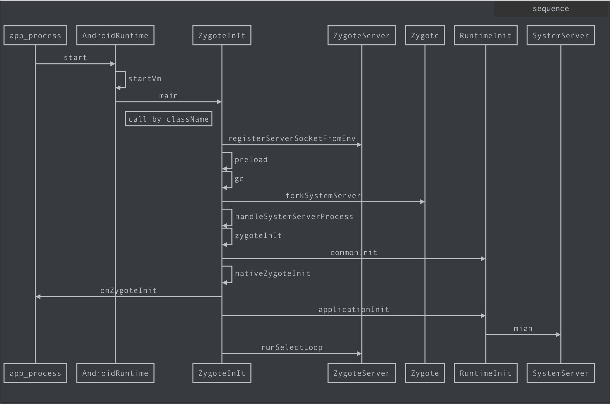

> 我们知道 Zygote 进程的两大作用就是：启动 SystemServer; 孵化应用进程，今天我们来看下它是如何工作的。

我们先来复习下，Zygote 启动后到 java 世界执行的代码：
```JAVA
//frameworks/base/core/java/com/android/internal/os/ZygoteInit.java
public static void main(String argv[]) {
     //....
     // 注册 socket
     zygoteServer.registerServerSocketFromEnv(socketName);
     // 预加载种类资源
     preload(bootTimingsTraceLog);
     // 去启动 systemServer
     Runnable r = forkSystemServer(abiList, socketName, zygoteServer);
     // loops forever in the zygote.
     caller = zygoteServer.runSelectLoop(abiList);
 }
```

## 启动 SystemServer

如果 app_process 的调用参数中带有"--start-system-server",那么此时会通过 forkSystemServer 来启动。我会稍后再看，先考虑一个问题：

Zygote 在前期主要担任启动系统服务的工作，后期则又担当“孵化进程”的重任，但是 Zygote 只在 init.rc 中被启动一次，它如何协调好这两项工作呢？通过 forkSystemserver 这个方法名，我们可以明显看出这是启动了一个新的进程来承载系统服务，而我们推断 app_process 所在进程会继续执行，从而转变为 Zygote 的“孵化器”守护进程。接下来我们来看是不是这样的。

#### forkSystemServer

```java
//frameworks/base/core/java/com/android/internal/os/ZygoteInit.java
private static Runnable forkSystemServer(String abiList, String socketName,
        ZygoteServer zygoteServer) {
  ZygoteConnection.Arguments parsedArgs = null;
  	// ...
  int pid;
  try {
      parsedArgs = new ZygoteConnection.Arguments(args);

      /* fork 承载 SystemServer 的新进程 */
      pid = Zygote.forkSystemServer(
              parsedArgs.uid, parsedArgs.gid,
              parsedArgs.gids,
              parsedArgs.runtimeFlags,
              null,
              parsedArgs.permittedCapabilities,
              parsedArgs.effectiveCapabilities);
  } catch (IllegalArgumentException ex) {
      throw new RuntimeException(ex);
  }

  /* For child process */
  if (pid == 0) {
      if (hasSecondZygote(abiList)) {
          waitForSecondaryZygote(socketName);
      }
      zygoteServer.closeServerSocket();
      // 启动各种支撑系统运行的 SystemServer
      return handleSystemServerProcess(parsedArgs);
  }

  return null;
  
}
```

还记得 Zygote 启动时，是使用 fork + execve 方式，而此处不同使用 fork + handle （即直接继承资源，未使用 execve 进行资源覆盖），简单表示如下：

```JAVA
pid_t pid = fork();
// 调用fork 启动子进程
// 会返回两次
if(pid == 0) { 
  // fork 出来的子进程
  handleSystemServerProcess(parsedArgs)
} else {
  // 父进程
}
```

接着来看，handleSystemServerProcess 方法里最后调用的是 ZygoteInit.zygoteInit 方法：

```JAVA
// ZygoteInit.java
public static final Runnable zygoteInit(int targetSdkVersion, String[] argv, ClassLoader classLoader) {
    // ...
    RuntimeInit.commonInit();
    ZygoteInit.nativeZygoteInit();
    return RuntimeInit.applicationInit(targetSdkVersion, argv, classLoader);
}
```

这个方法比较短，核心就上面三行，我们来介绍一下：

- commonInit：通用部分的初始化，包括设置默认的 uncaught exception handler； TimeZone，LogManager，AndroidConfig， HTTP User-Agent 等模块的初始化。

- nativeZygoteInit：本地初始化函数，也是 zygoteInit 中的重点

- applicationInit: 它是 SystemServer 的“起点”，而参数 argv 里会带有 startClass 和 startArgs。这两个变量是在 ZygoteInit.forkSystemServer 方法定义并传入的参数。实际上最终将调用 SystemServer的 main 方法

```JAVA
/** frameworks/base/services/java/com/android/server/SystemServer.java
 * The main entry point from zygote.
 */
public static void main(String[] args) {
    new SystemServer().run();
}
```

经过这个 zygoteInit 方法之后，程序现在有两个分支，其一是 nativeZygoteInit 主导的 native 系统服务启动；另一个则是 applicationInit 负责的 Java 层系统服务启动。继续深入：

#### native 系统服务启动

nativeZygoteInit 对应源码如下：

```C++
// frameworks/base/core/jni/AndroidRuntime.cpp
// 这个方法名刚好对应 com/android/internal/os/ZygoteInit.java 的 nativeZygoteInit
// 虽然不是绝对的，但是我们了解这种规则后，有利于我们快速找到想要的源码 
static void com_android_internal_os_ZygoteInit_nativeZygoteInit(JNIEnv* env, jobject clazz)
{
    gCurRuntime->onZygoteInit();
}
```

gCurRuntime 是一个全局的 AndroidRuntime 对象，它的实现在 App_main.cpp 中的 AppRuntime，onZygoteInit 方法自然也在 App_main 里了:

```C++
// frameworks/base/cmds/app_process/app_main.cpp
virtual void onZygoteInit()
{
    sp<ProcessState> proc = ProcessState::self();
    ALOGV("App process: starting thread pool.\n");
    proc->startThreadPool();
}
```

这段代码是 BInder 机制中的重要组成部分，其中 startTheardPool 将开启 Binder 线程池，以保证其它进程可以正确访问的 Zygote 所提供的服务。Zygote 通过 JNI 和回调的方式非常巧妙的把 Native 层和 Java 层、SystemServer 和 app process 关联起来了。

想了解更多关于 Binder 的信息，欢迎查阅我们的其它文章。

#### Java 层系统服务的启动

Java 层的系统服务较多，我们就从入口 main@SystemServer.java 开启“系统服务之旅”，前面我们知道，main 方法调用的是 SystemServer().run():

```java
// frameworks/base/services/java/com/android/server/SystemServer.java
private void run() {
    //...
    // The system server should never make non-oneway calls
    Binder.setWarnOnBlocking(true);
    SystemProperties.set("persist.sys.dalvik.vm.lib.2", VMRuntime.getRuntime().vmLibrary());

    // Mmmmmm... more memory!
    VMRuntime.getRuntime().clearGrowthLimit();
    // System Server 会一直运行，所以需要尽可能的有效复用堆内存
    VMRuntime.getRuntime().setTargetHeapUtilization(0.8f);
    // Increase the number of binder threads in system_server
    BinderInternal.setMaxThreads(sMaxBinderThreads);

    // Prepare the main looper thread (this thread).
    android.os.Process.setThreadPriority(
        android.os.Process.THREAD_PRIORITY_FOREGROUND);
    android.os.Process.setCanSelfBackground(false);
    // 主线程 Looper
    Looper.prepareMainLooper(); 
    // 加载本地服务
    System.loadLibrary("android_servers");

    // Initialize the system context.
    createSystemContext();

    // Create the system service manager.
    mSystemServiceManager = new SystemServiceManager(mSystemContext);
    mSystemServiceManager.setStartInfo(mRuntimeRestart,
            mRuntimeStartElapsedTime, mRuntimeStartUptime);
    LocalServices.addService(SystemServiceManager.class, mSystemServiceManager);
    // Prepare the thread pool for init tasks that can be parallelized
    SystemServerInitThreadPool.get();

    // Start services. (java 层）
    startBootstrapServices();
    startCoreServices();
    startOtherServices(); 

    // Loop forever. 直至关机
    Looper.loop();
    throw new RuntimeException("Main thread loop unexpectedly exited");
}
```

System Server 在启动前首先需要做很多初始化设置，包括将 VM 的版本记录到系统变量中，设置线程优先级，设置堆的使用率。

我们知道，Android 的系统服务也被分为两类，其中，Native 层通过 System.loadLibrary("android_servers") 加载，而 java 层又继续细分如下：

- startBootstrapServices()  “引导程序”服务，代表系统服务中最核心的部分，如 ActivityManagerService, Power Manager, Display Manger, PackageManger 等
- startCoreServices() 次核心，包括 LED 和背光管理器，电池电量管理器，应用程序使用情况（Usage Status）管理器等
- startOtherServices() 优先级较低，但是 Service 数最多，如  AccountManagerService, VibratorService, MountService, NetworkManagementService, WindowMangerService, AudioService 等。这些服务一起构建起 Android System Server 这座“参天大厦”，为其它进程、应用程序的正常运行奠定了基础。

最后，SystemServer 通过 Looper.loop() 进入死循环，并依托 onZygoteInit 中启动的 Binder 服务接受和处理外界的请求。

至此 Zygote 启动 SystemServer 部分的工作原理已经介绍完了。休息一下，我们接着来看 Zygote 又是怎么孵化应用进程的。

## 孵化应用进程

让我们回到本文最开始的地方。Zygote 启动后到 java 世界执行的代码：

```JAVA
// 去启动 systemServer
Runnable r = forkSystemServer(abiList, socketName, zygoteServer);
// 接着来看这个方法
caller = zygoteServer.runSelectLoop(abiList);
```

runSelectLoop 从方法名可以猜到，这应该是一个死循环，除非 Zygote 退出或出现异常才会跳出循环：

```java
// frameworks/base/core/java/com/android/internal/os/ZygoteServer.java
 Runnable runSelectLoop(String abiList) {
     ArrayList<FileDescriptor> fds = new ArrayList<FileDescriptor>();
     ArrayList<ZygoteConnection> peers = new ArrayList<ZygoteConnection>();

     fds.add(mServerSocket.getFileDescriptor());
     peers.add(null); //添加 null 是为了保持 fds 与 peers 一致性

     while (true) {
         StructPollfd[] pollFds = new StructPollfd[fds.size()];
         for (int i = 0; i < pollFds.length; ++i) {
             pollFds[i] = new StructPollfd();
             pollFds[i].fd = fds.get(i);
             pollFds[i].events = (short) POLLIN;
         }
         try {
             Os.poll(pollFds, -1);
         } catch (ErrnoException ex) {
             throw new RuntimeException("poll failed", ex);
         }
         for (int i = pollFds.length - 1; i >= 0; --i) {
             if ((pollFds[i].revents & POLLIN) == 0) {
                 continue;
             }

             if (i == 0) { // 有新的连接请求
                 ZygoteConnection newPeer = acceptCommandPeer(abiList);
                 peers.add(newPeer);
                 fds.add(newPeer.getFileDesciptor());
             } else {
                 try {
                     // 已建立的连接中，有客户端发过来的数据要处理
                     ZygoteConnection connection = peers.get(i);
                     final Runnable command = connection.processOneCommand(this);

                     if (mIsForkChild) {
                         // 子进程（为应用程序孵化出来的进程就 return 出去执行命令）
                         return command;
                     } else {
                         // 孵化完 Zygote 关闭连接，移除相应记录
                         if (connection.isClosedByPeer()) {
                             connection.closeSocket();
                             peers.remove(i);
                             fds.remove(i);
                         }
                     }
                 } 
             }
         }
     }
 }
```

我们看到 runSelectLoop 的主体的确是一个 while 死循环，它将作为 zygote 的守护体存在。

mServerSocket.getFileDescriptor() 获取到的是前面通过 registerServerSocketFromEnv 创建的 Server Socket 的文件描述符。把它没有回到 fds 中，这同时也说明了 zygote 中不止有一个文件描述符来与 zygotę 通讯，通过后面的 for 循环，找出当前可读的 fd 。

- i == 0 时

  fds 中，添加的第一个元素为 Zygote 的 Server Socket，所以此时表示有新的连接请求，这和网络连接中的 Socket 概念是一致的。

  我们通过 acceptCommandPeer 接受一个新的客户羰连接，产生一个新的 ZygoteConnection ，然后更新 peers 和 fds 这样值班表中对象的 index 就是一致。（这就是为啥前面 peers.add(null）)

- i > 0 时
  说明已经建立 Socket 连接中有来自客户端的数据需要处理，具体的工作就是 processOneCommand 。

```JAVA
// frameworks/base/core/java/com/android/internal/os/ZygoteConnection.java   
Runnable processOneCommand(ZygoteServer zygoteServer) {
     //...
     args = readArgumentList();
     descriptors = mSocket.getAncillaryFileDescriptors();
     parsedArgs = new Arguments(args);
		 // 客户端发过来的消息当然就是孵化进程了
     pid = Zygote.forkAndSpecialize(parsedArgs.uid, parsedArgs.gid, parsedArgs.gids,
             parsedArgs.runtimeFlags, rlimits, parsedArgs.mountExternal, parsedArgs.seInfo,
             parsedArgs.niceName, fdsToClose, fdsToIgnore, parsedArgs.startChildZygote,
             parsedArgs.instructionSet, parsedArgs.appDataDir);

     try {
         if (pid == 0) {
             // in child
             zygoteServer.setForkChild();
             zygoteServer.closeServerSocket();
             IoUtils.closeQuietly(serverPipeFd);
             serverPipeFd = null;

             return handleChildProc(parsedArgs, descriptors, childPipeFd,
                     parsedArgs.startChildZygote);
         } else {
             IoUtils.closeQuietly(childPipeFd);
             childPipeFd = null;
             handleParentProc(pid, descriptors, serverPipeFd);
             return null;
         }
     } finally {
         IoUtils.closeQuietly(childPipeFd);
         IoUtils.closeQuietly(serverPipeFd);
     }
 }
```

这边同样是典型的 使用 fork + handle 模式来处理 fork 进程。不用细看也知道做了两件事：

- 创建承载应用程序的新进程
  值得注意的是，这边没有直接用 fork 方法来启动新进程，而调用了 forkAndSpecialize 方法。 Specialize 意为 “专门化”，其实就是在 fork 的同时也把它转变为 Android 应用程序。<br>AMS 向 Zygote 发起创建进程请求时传入的参数，其中有最重要的参数之一是 className (android.app.ActivityThread), handleChildProc 会把这个类加载到内存中，然后执行它的 main 函数。换句话说，我们熟悉的 Android 应用程序的“主线程”就此启动了
- 父进程的扫尾工作
  handleParentProc 包括将子进程加入进程组，正确关闭文件，调用方返回结果值等

至此，我们也讲完了 Zygote 作为守护进程时，孵化 Android 应用程序进程的工作原理。

## 总结

下面我们来绘制一下 Zygote 和 SysterServer 启动的时序图，为整个



注：以下为 markdown 源码，可在支持相关语法的编辑器下直接查看、编辑时序图

```sequence
app_process -> AndroidRuntime: start
AndroidRuntime -> AndroidRuntime: startVm
AndroidRuntime -> ZygoteInIt: main
Note left of ZygoteInIt: call by className
ZygoteInIt -> ZygoteServer: registerServerSocketFromEnv
ZygoteInIt -> ZygoteInIt: preload
ZygoteInIt -> ZygoteInIt: gc
ZygoteInIt -> Zygote: forkSystemServer
ZygoteInIt -> ZygoteInIt: handleSystemServerProcess
ZygoteInIt -> ZygoteInIt: zygoteInIt
ZygoteInIt -> RuntimeInit:commonInit
ZygoteInIt -> ZygoteInIt: nativeZygoteInit
ZygoteInIt -> app_process:onZygoteInit
ZygoteInIt -> RuntimeInit: applicationInit
RuntimeInit -> SystemServer: mian
ZygoteInIt -> ZygoteServer:runSelectLoop
```

补充 app_process 会去启动虚拟机，相关的源码在如下文件，可自行查阅：

```C++
frameworks/base/cmds/app_process/app_main.cpp 的 main 方法
frameworks/base/core/jni/AndroidRuntime.cpp 的 start 方法
```

至此，我们关于 Zygote 的启动流程及工作原理已经全部讲解完了，相信如果在面试中，你遇到 zygote 的相关问题，你一定能游刃有余。

本文 Android 源码为  API 28

