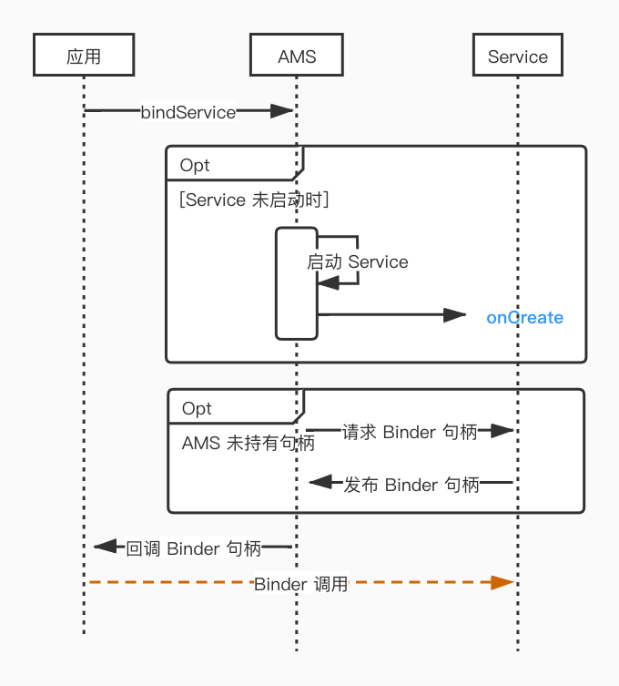
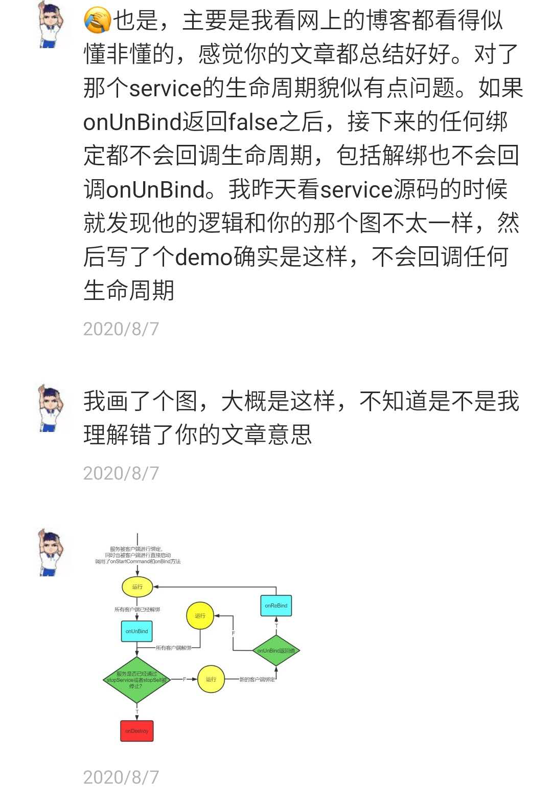
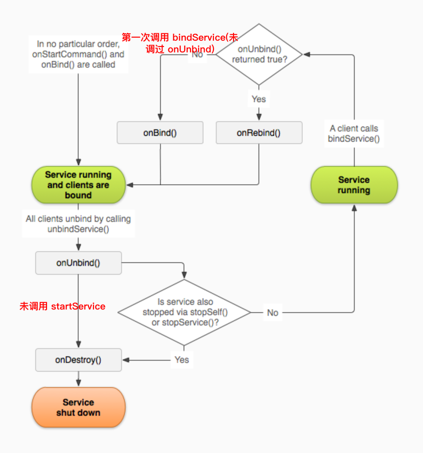
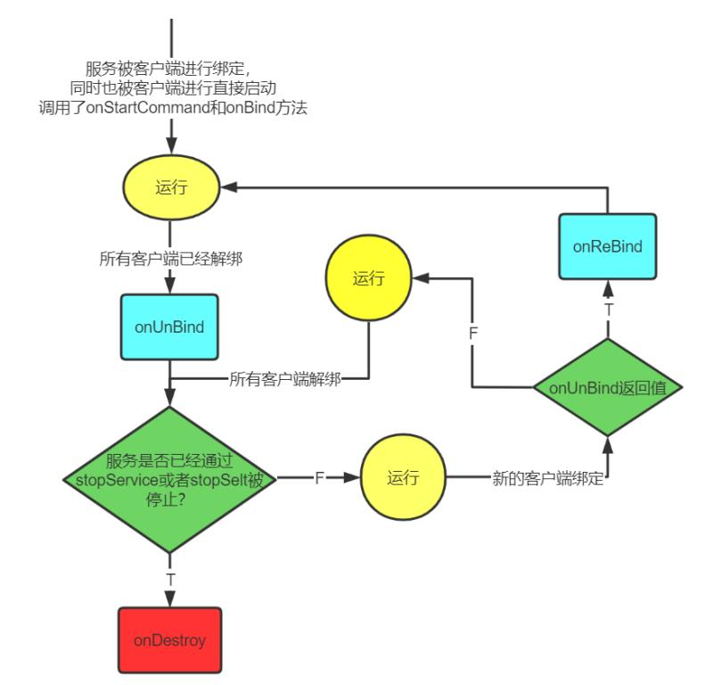

今天我们来讲 Service 的绑定原理，也是填一下我在上一篇 《Service 启动流程》挖下的坑。

关于 bindService 的用法，这里不展开说了，可以参考之前的文章 《Service 详解》

## bindService 的工作流程

来看一下整体的时序图：



1. 应用向 AMS 发起 bindService 调用
2. 若 Service 未启动执行 Service 的启动流程
3. 若 AMS 未持有 Service 的 Binder 句柄
   1. AMS 先向 Service 请求 Binder 句柄
   2. Service 收到请求后将自己的 Binder 句柄发布到 AMS
4. AMS 将把 Binder 句柄回调给应用
5. 拿到 Binder 句柄的应用就可以对 Service 发起 Binder 调用了

弄清楚了 bindService 的流程，接下来我们来看 bindService 流程中相关生命周期回调的原理

## ServiceConnection

本文的绝对主角，bindService 完整的方法如下：

```JAVA
public abstract boolean bindService(@RequiresPermission Intent service,
            @NonNull ServiceConnection conn, @BindServiceFlags int flags);
```

我们在绑定 Service 时需要传入一个非空的 ServiceConnection ，用来监听连接状态 

```JAVA
public interface ServiceConnection {
    // 连接时 AMS 最终也会通过这个 connection 来回调 Binder 句柄 (IBinder)
    void onServiceConnected(ComponentName name, IBinder service);
    void onServiceDisconnected(ComponentName name);
}
```

来跟一下 bindService 的代码调用吧：
```java
   Context.bindService(...)
-> ContextImpl.bindService(...)  
-> ContextImpl.bindServiceCommon(...)
  
private boolean bindServiceCommon(Intent service, ServiceConnection conn, ...) {
    // ServiceConnection 只是一个普通的接口无法进行 IPC
    IServiceConnection sd; // 所以需要封装这么一个 Binder 对象，传给 AMS
    sd = mPackageInfo.getServiceDispatcher(conn, ...);
    
    // 向 AMS 发起请求
    ActivityManager.getService().bindService(..., service, sd,...)
}  
```
接下来我们看下 IServiceConnection 和 ServiceConnection 的关系
```JAVA
// mPackageInfo.getServiceDispatcher : LoadApk.java
public final IServiceConnection getServiceDispatcher(ServiceConnection c,
            Context context,...) {
    ServiceDispatcher sd = null;
    // 拿到 context 的 ServiceDispatcher 缓存 
    ArrayMap<ServiceConnection, LoadedApk.ServiceDispatcher> map = mServices.get(context);
    if (map != null) {
        // 根据 ServiceConnection 取出缓存 
        // IServiceConnection 与 (context , ServiceConnection) 一一对应即
        // 同一个 context 的同一个 connection 才会对应相同的 IServiceConnection
        sd = map.get(c);
    }
    if (sd == null) {
        sd = new ServiceDispatcher(c, context, handler, flags);
        // 存入缓存 
        if (map == null) {
            map = new ArrayMap<>();
            mServices.put(context, map);
        }
        map.put(c, sd);
    }
    // 最终返回我们要的 IServiceConnection
    return sd.getIServiceConnection();
}

// sd.getIServiceConnection(); 这里的 IServiceConnection 是在 sd 的构造函数里初始化的
ServiceDispatcher(ServiceConnection conn,...) {
    mIServiceConnection = new InnerConnection(this);
    mConnection = conn; //持有 ServiceConnection 的引用
}
private static class InnerConnection extends IServiceConnection.Stub {
    final WeakReference<LoadedApk.ServiceDispatcher> mDispatcher;

    InnerConnection(LoadedApk.ServiceDispatcher sd) {
        mDispatcher = new WeakReference<LoadedApk.ServiceDispatcher>(sd);
    }

    public void connected(ComponentName name, IBinder service, boolean dead) {
        LoadedApk.ServiceDispatcher sd = mDispatcher.get();
        if (sd != null) { // AMS 调用最终传到这里
            sd.connected(name, service, dead);
        }
    }
}
```

sd.connected 里直接或间接调用了 ServiceDispatcher.doConnected:

```java
public void doConnected(ComponentName name, IBinder service, boolean dead) {
ServiceDispatcher.ConnectionInfo old;
ServiceDispatcher.ConnectionInfo info;
    // 根据 name 取出旧的 Service Binder 对象
    old = mActiveConnections.get(name);
    if (old != null && old.binder == service) {
        // Huh, already have this one.  Oh well!
        return;// 已有缓存且是同一个，直接 return 避免重复调用 onServiceConnected
    }
    if (service != null) {
        // A new service is being connected... set it all up.
        info = new ConnectionInfo();
        info.binder = service;
        // 监听 service 的死期，service 挂了之后，这边会收到回调，再调用 onServiceDisconnected 方法
        info.deathMonitor = new DeathMonitor(name, service);
        service.linkToDeath(info.deathMonitor, 0);
        mActiveConnections.put(name, info);
    } else {
        // The named service is being disconnected... clean up.
        mActiveConnections.remove(name);
    }

    if (old != null) {
        old.binder.unlinkToDeath(old.deathMonitor, 0);
    }

    // If there was an old service, it is now disconnected.
    if (old != null) {
        // 一般 Service 的 Binder 对象不会变，所以 old != null 
        // 而调用本方法一般传入的 IBinder service 为空，来触发 disconnected 回调
        mConnection.onServiceDisconnected(name);
    }
    // If there is a new viable service, it is now connected.
    if (service != null) {
        mConnection.onServiceConnected(name, service);
    }
}
```
以上，我们分析了 ServiceConnection 回调的原理，注意 onServiceDisconnected 仅会在  IBinder service  挂掉时才会回调，我们主动调用 unBind 是不会回调 onServiceDisconnected 的。

## AMS 的 bindService 处理
话不多说，直接看代码：
```java
   ContextImpl.bindServiceCommon(...)
-> ActivityManager.getService().bindService(...)
-> AMS.bindService(...)  
-> ActiveServices.bindServiceLocked(...) 

int bindServiceLocked(IApplicationThread caller,...) {

    if ((flags&Context.BIND_AUTO_CREATE) != 0) { 
        // 这个方法之前的文章已经说过了，会在需要时启动 Service
        bringUpServiceLocked(s,...)
    }
    ServiceRecord s = res.record;
    AppBindRecord b = s.retrieveAppBindingLocked(service, callerApp);
    if (s.app != null && b.intent.received) {
        // Service is already running, so we can immediately
        // publish the connection. （Service 已就绪，直接回调 onServiceConnected）
        c.conn.connected(s.name, b.intent.binder, false); 

        // If this is the first app connected back to this binding,
        // and the service had previously asked to be told when
        // rebound, then do so. （doRebind 的赋值时机后面会讲）
        if (b.intent.apps.size() == 1 && b.intent.doRebind) {
            // 回调 service.onRebind() 
            requestServiceBindingLocked(s, b.intent, callerFg, true);
        } 
        // 这边注意下 doRebind 如果为 false 或 apps.size > 1 就啥事都不干了
    } else if (!b.intent.requested) {
        // AMS 未请求 Binder 对象，则向 service 请求 Binder 对象
        requestServiceBindingLocked(s, b.intent, callerFg, false);
    }
}
```
## AMS 向 Service 请求 Binder 对象

直接来看上面提到的方法：

```JAVA
private final boolean requestServiceBindingLocked(ServiceRecord r, ..., boolean rebind) {
    if (r.app == null || r.app.thread == null) {
        // If service is not currently running, can't yet bind.
        return false;
    } 
    if ((!i.requested || rebind) && i.apps.size() > 0) {
        // 有应用 请求绑定或者重新绑定的情况，通过 Binder 调用调到 Service 的应用端 (再调到 onBind/onRebind)
        r.app.thread.scheduleBindService(r, rebind, ...);
        if (!rebind) {
            i.requested = true;
        }
        /** hasBound: Set when we still need to tell the service all clients are unbound. */
        // 这里可以知道只有向 scheduleBindService 后才需要在都解绑时回调 onUnbind
        i.hasBound = true; 
        i.doRebind = false;
    }
    return true;
}
```

 Service 的应用端接收到请求：

```java
// ActivityThread.java
private void handleBindService(BindServiceData data) {
    Service s = mServices.get(data.token);
    if (!data.rebind) {
        // 通过 Service 获取 Binder 对象并发布到 AMS
        IBinder binder = s.onBind(data.intent);
        ActivityManager.getService().publishService(
                data.token, data.intent, binder);
    } else {
        // onRebind 回调
        s.onRebind(data.intent);
    }
}
```

## Service 的 Binder 对象发布到 AMS 

```java
   ActivityManagerService.publishService()
-> ActiveServices.publishServiceLocked()

void publishServiceLocked(ServiceRecord r, Intent intent, IBinder service) {
    Intent.FilterComparison filter = new Intent.FilterComparison(intent);
    IntentBindRecord b = r.bindings.get(filter);
    if (b != null && !b.received) {
        b.binder = service;
        b.requested = true;// 标记请求过 Binder 对象
        b.received = true;// 标记已经收到 Binder 对象
        for (int conni=r.connections.size()-1; conni>=0; conni--) {
            ArrayList<ConnectionRecord> clist = r.connections.valueAt(conni);
            for (int i=0; i<clist.size(); i++) {
                ConnectionRecord c = clist.get(i);
                if (!filter.equals(c.binding.intent.intent)) {
                    continue;
                }
                // 找到 intent 所有匹配的 connection 记录
                // 再把 Service 的 Binder 分发给它们，这样应用端就能收到回调了
                c.conn.connected(r.name, service, false);
            }
        }
    }
}     
```

至此，我们一开始列出来的完整 bindService 流程，及代码细节已经梳理完成了。

##  unBindService

说完了绑定的流程，我们来补充一下解绑的流程：

```JAVA
// ActiveServices.java
boolean unbindServiceLocked(IServiceConnection connection) {
    IBinder binder = connection.asBinder();
    // 取出 IServiceConnection 对应的列表
    ArrayList<ConnectionRecord> clist = mServiceConnections.get(binder);
    while (clist.size() > 0) { // 遍历，移除
        ConnectionRecord r = clist.get(0);
        removeConnectionLocked(r, null, null); // 移除操作
        if (clist.size() > 0 && clist.get(0) == r) {
            // In case it didn't get removed above, do it now.
            Slog.wtf(TAG, "Connection " + r + " not removed for binder " + binder);
            clist.remove(0);
        }
    return true;
}    
  
void removeConnectionLocked(ConnectionRecord c,...){
    ...
    if (s.app != null && s.app.thread != null && b.intent.apps.size() == 0
       && b.intent.hasBound) {
        // 这里标记往后再全部解绑时就不需要调用 onUnbind 方法了
        b.intent.hasBound = false;
        // service 还在，其所在的进程也还在，没有任何进程通过这个 intent 绑定这个 service
        b.intent.doRebind = false; // 下次通过这个 intent 绑定时需要回调 onRebind
        // 通知 service 回调 onUnbind
        s.app.thread.scheduleUnbindService(s, b.intent.intent.getIntent());
    }
}
```

来看下 service 怎么回调 onUnBind：

```java
// ActivityThread.java   
public final void scheduleUnbindService(IBinder token, Intent intent) {
    BindServiceData s = new BindServiceData();
    s.token = token;
    s.intent = intent;
    // 往主线程发一条消息，去执行 unbind
    sendMessage(H.UNBIND_SERVICE, s);
}

private void handleUnbindService(BindServiceData data) {
    Service s = mServices.get(data.token);
    boolean doRebind = s.onUnbind(data.intent);
    if (doRebind) {
        // doRebind 是 true 才需要再次通知 AMS
        ActivityManager.getService().unbindFinished(doRebind);
    }
}

// ActiveServices.java
void unbindFinishedLocked(ServiceRecord r, Intent intent, boolean doRebind){
    Intent.FilterComparison filter = new Intent.FilterComparison(intent);
    IntentBindRecord b = r.bindings.get(filter);
    if (b.apps.size() > 0 && !inDestroying) {
         // Applications have already bound since the last
         // unbind, so just rebind right here.
         ...
    } else {    
         // Note to tell the service the next time there is
         // a new client.
         b.doRebind = true; // 下次用这个 intent 绑定 service 会收到 onRebind 回调
    }
}


```

好了，到这我们就把 unBind 的流程也讲完了，顺便还关注到了 onRebind 的回调条件 (doRebind = true) 是怎么赋值的

## 谷歌官方文档错误？

通过以上分析，我们可以得到一些结论：

1. onBind 的调用时机是同一 intent 第一次向 Service 请求 Binder 对象时，请求完会在 AMS 缓存 Binder 对象和请求状态
2. onRebind 需要在 onUnbind 返回 true 时，下次使用同一个 intent 发起绑定时才会回调 onRebind
3. bindService 之后，只有调用了 onBind / onRebind 才会在全部解绑时 回调 onUnbind

接下来我们一起来看一个小伙伴发来的私信 :



经过我们前面的分析，大家应该也知道了，这位小伙伴说的完全正确。

《Service 详解》中用到的图出自谷歌文档：https://developer.android.com/guide/components/bound-services#Lifecycle ,如果要强行打个补丁理解一下应该是这样的 (忽略掉红字强行条件与上上个流程节点的冲突 )：



我们还可以看看这位同学提供的图吧，真是一个有才的宝藏读者，觉得画得好的记得点个赞哦：




## 最后

相信看完这一篇文章，你对 bindService 的整体流程以及相关生命周期的调用都了如指掌了吧。

本文源码基于 Android - 28

