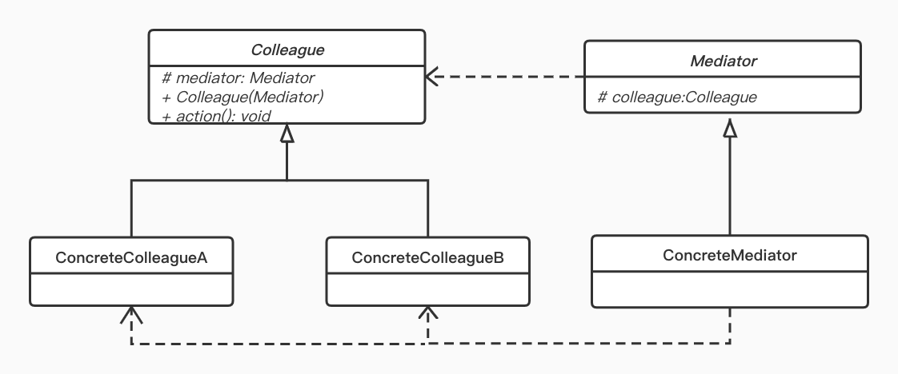

> 近来长租公寓频频暴雷，租房中这些暴雷的扮演的是租房者与房东之间的中介者。不过在单纯的代码世界，中介者模式不但不会暴雷，而且还很好用。

## 定义

中介者模式（ Mediator Pattern）属于行为型模式；中介者包装了一系列对象相互作用的方式，使得这些对象不必显式的相互作用，从而使它们可以松散耦合，而且可以独立地改变它们之间的交互。

## 使用场景

- 对象间的交互 操作很多，且每个对象的行为操作都依赖彼此时，为了防止在修改一个对象的行为时，同时涉及修改很多其它对象的行为
- 中介者模式将对象之间的多对多关系，变成中介者与这些对象的一对多关系，降低系统复杂性，提高扩展性。
- 多个类相互耦合，形成了网状结构。使用中介者模式之后将网状结构分离为星型结构。


## UML



从生活中例子自然知道，中介者模式设计两个具体对象，一个是用户类（同事类），另一个是中介者类，根据针对接口编程原则，则需要把这两类角色进行抽象，所以中介者模式中就有了4类角色，它们分别是：

- Mediator: 抽象中介者角色
- 具体中介者角色
- 抽象同事类
- 具体同事类

中介者类是起到协调各个对象的作用，而抽象中介者角色中则需要保存各个对象的引用。

## 举例

我以生活中的租房为例，角色有租客、中介、房东。为了简便我们直接省略了抽象层：

```KOTLIN
// 租客
class Tenant(var mediator: Mediator) {
    fun renting() {
        println("租客去找中介租房子")
        mediator.renting()
    }

    fun pay() {
        println("租客付房租给中介")
    }
}

// 房东
class Landlord(var mediator: Mediator) {
    fun collection() {
        println("房东去找中介要房租")
        mediator.collection()
    }
    fun rentOut() {
        println("房东通过中介把房子租出去了")
    }
}

class Mediator {
    var landlord: Landlord? = null
    var tenant: Tenant? = null

    fun renting() {
        landlord?.rentOut()?: println("没有房东出租房子，要睡大街了~")
    }

    fun collection() {
        tenant?.pay() ?: print("房子还未出租出去，没钱收哦~")
    }
}
```

来运行一下测试代码

```kotlin
fun main() {
    // 先要有个中介
    val mediator = Mediator()
    // 来了个租客找中介
    val tenant = Tenant(mediator)
    mediator.tenant = tenant
    tenant.renting() // 还没有房东的时候租房

    val landlord = Landlord(mediator)
    mediator.landlord = landlord
    tenant.renting() // 有了房东再租房
    landlord.collection()

    println("\n租客退租啦！")
    mediator.tenant = null
    landlord.collection()
}

// 运行结果 -----
租客去找中介租房子
没有房东出租房子，要睡大街了~
租客去找中介租房子
房东通过中介把房子租出去了
房东去找中介要房租
租客付房租给中介

租客退租啦！
房东去找中介要房租
房子还未出租出去，没钱收哦~
```

和现实生活一样，租客只要找到中介就能租房子，而不用管谁有房子。

同样房东只要找中介就能出租房子；租客退租之后中介又会再找新的租客，房东只管收房租就可以了

## 安卓中的应用

Android 源码中的命名相当规范，所以我们要找中介者模式，只要在源码中搜索 **Mediator**， 其中就有一个 `KeyguardViewMediator`类

```JAVA
public class KeyguardViewMediator extends SystemUI {
    private AlarmManager mAlarmManager;
    private AudioManager mAudioManager;
    private StatusBarManager mStatusBarManager;
    ....
}
```

- KeyguardViewMediator 是锁屏业务的中介者；
- 里面的各种 XXManager 是“同事类”


## 总结

- 优点：减少多个类之间的联系，使之逻辑变清晰，松耦合
- 缺点：类太多时中介者可能太庞大（考虑拆分多个中介者）；类之间的联系本身不复杂时，加入中介者可能使逻辑结构反而变得复杂。

要写好你的“中介者”，这样你的代码才不会暴雷哦~