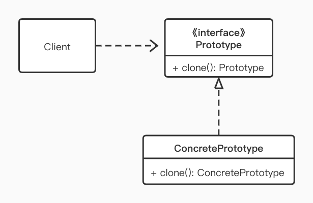
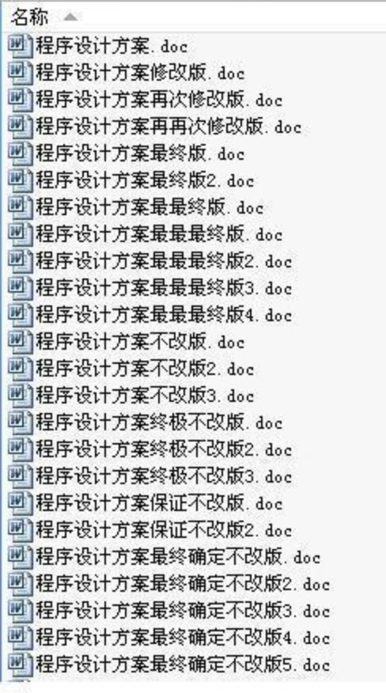

> 原型模式是一个创建型的模式，原型二字表明了该模式应该有一个样板实例，用户从这个对象中复制出一个内部属性一致的对象，俗称“克隆”，被复制的实例就是我们所称的原型。原型模式多用于创建复杂的或者构造耗时的实例，因为这种情况下，复制一个已经存在的实例可以使程序更加高效

## 定义

用原型实例指定创建对象的种类，并通过复制这些原型创建新的对象。

## 使用场景

- 类初始化需要消耗非常多的资源，包括数据 、硬件资源等，通过原型复制避免这些消耗
- 通过 new 产生一个对象需要非常繁琐的数据准备或访问权限 
- 一个对象需要提供给其它对象访问，而且各个调用者可能都需要修改其值，可以考虑用原型模式复制多个对象供调用者使用，即保护性拷贝

注意：通过实现 Cloneable 接口的原型模式在调用 clone 函数来克隆实例，并不一定比 new 操作来得快。只有当 new 构造对象较为耗时或者说成本较高时，通过  clone 才有收益。

当然 实现原型模式也不一定非要实现 Cloneable 接口，其它实现方式我们后面会具体说明。

## UML



原型模式整体比较简单，涉及的角色较少：

- Client: 客户端用户，调用方
- Prototype：抽象类或接口，声明具备 clone 的能力
- ConcretePrototype: 具体的原型类

## Code



我们以文档拷贝为例来简单演示一下原型模式，创建一个文档，经过一段时间编辑后含有大量的图文内容，但是因为各种原因需要对该文档做进一步编辑 ，可是编辑 后文档是否会审美观点采用也不确认有可能之前的版本更好。安全起见，需要将当前文档拷贝一份，然后再在文档副本上进行修改，这其实也是一种保护性的拷贝。如此这个原始的文档就是我们所说的原型。

通过 WordDocument 模拟文档中的基本元素：文字和图片

```kotlin
// Cloneable 接口代表 Prototype 角色
// WordDocument 文档，为 ConcretePrototype 角色
class WordDocument : Cloneable {

    // 文本
    var text: String = ""
    // 图片列表
    var imgs: ArrayList<String> = ArrayList()

    public override fun clone(): WordDocument {
        val doc = super.clone()
        return doc as WordDocument
    }

    fun showDocument() {
        println("-------- Word Document Start --------")
        println("Text:$text")
        println("Images:${imgs.joinToString(",")}")
        println("-------- Word Document End --------")
    }
}
```

接下来我们调用测试代码，即 Client 端调用

```KOTLIN
fun main() {
    // 新建文档
    val originDoc = WordDocument()
    // 编辑的文档
    originDoc.text = "好的开始是成功的一半"
    originDoc.imgs.add("Img 1")
    originDoc.imgs.add("Img 2")
    originDoc.imgs.add("Img 3")
    originDoc.showDocument()

    // 以原始文档为原型，拷贝出副本
    val doc2 = originDoc.clone()
    // 修改文档副本
    doc2.text = "${doc2.text}, 然而还是要修改！"
    doc2.showDocument()

    // 修改副本不会影响原始文档
    originDoc.showDocument()
}
```

输出结果 ：

```properties
-------- Word Document Start --------
Text:好的开始是成功的一半
Images:Img 1,Img 2,Img 3
-------- Word Document End --------
-------- Word Document Start --------
Text:好的开始是成功的一半, 然而还是要修改！
Images:Img 1,Img 2,Img 3
-------- Word Document End --------
-------- Word Document Start --------
Text:好的开始是成功的一半
Images:Img 1,Img 2,Img 3
-------- Word Document End --------
```

我们看到 doc2 的修改并不会影响到 originDoc 的内容，这就保证了 origin 的安全性。

不过这里需要注意的是，通过 clone 拷贝对象时并不会执行构造函数，因此，如果在构造函数中有一些特殊的需要初始化的类型，需要自己在重新的 clone 方法里补充相关逻辑。

## 浅拷贝和深拷贝

上述原型模式的实现实际上只是一个浅拷贝，也称为影子拷贝。这份拷贝实际上并不是将原始文档的所有字段都重新构造，而是将副本文档的字段 引用原始文档的字段。即 originDoc.imgs 和 doc2.imgs 指向的其实是同一个  List 对象：如果我们调用 docs.img.add("新增图片")，那么在原始文档 originDoc.imgs 也会有这个新增的图片。

既然浅拷贝有这个问题，那么我们只需要采用深拷贝，即在拷贝对象时，对引用型的字段也要采用拷贝的形式，而不是单纯引用的形式：

```kotlin
public override fun clone(): WordDocument {
    val doc = super.clone()  as WordDocument
    doc.imgs = this.imgs.clone() as ArrayList<String>
    return doc
}
```

这里我们只需要处理 imgs, 而不需要处理 text, 因为 text 是 String 类型，是不可变的，这样我们在给 text 赋新值时，是将其引用指向了新对象，而不是修改原来的 String 对象，这也是为什么浅拷贝时改 doc2.text 不会影响 originDoc.text 的原因。

现在我们来改一下测试代码：

```kotlin
 fun main() {
    // 新建文档
    val originDoc = WordDocument()
    // 编辑的文档
    originDoc.text = "好的开始是成功的一半"
    originDoc.imgs.add("Img 1")
    originDoc.imgs.add("Img 2")
    originDoc.imgs.add("Img 3")
    originDoc.showDocument()

    // 以原始文档为原型，拷贝出副本
    val doc2 = originDoc.clone()
    // 修改文档副本
    doc2.text = "${doc2.text}, 然而还是要修改！"
    doc2.imgs.add("新增图片")
    doc2.showDocument()

    // 修改副本不会影响原始文档
    originDoc.showDocument()
}
```

运行结果：

```properties
-------- Word Document Start --------
Text:好的开始是成功的一半
Images:Img 1,Img 2,Img 3
-------- Word Document End --------
-------- Word Document Start --------
Text:好的开始是成功的一半, 然而还是要修改！
Images:Img 1,Img 2,Img 3,新增图片
-------- Word Document End --------
-------- Word Document Start --------
Text:好的开始是成功的一半
Images:Img 1,Img 2,Img 3
-------- Word Document End --------
```

结果与我们预期的一致，originDoc 里并没有新增的图片。

原型模式是非常简单的一个模式，它的核心就是对原始对象进行拷贝。在这个过程中需要注意的一点就是深、浅拷贝的问题。为了减少错误，建议使用原型模式时尽可能使用深拷贝。

另外一个小技巧就是，如果字段太多，clone 方法里面需要处理每个字段，非常繁琐，而且新增字段时可能遗漏。我们可以巧妙的利用序列化，将对象序列化后再序列化回来生成新的对象（不过会牺牲性能）。

## 总结

原型模式本质上就是对象的拷贝，在 java 中就是 clone 方法的实现和调用，这里就不过多举例了。

#### 优点

- 原型模式是在内存中二进制流的拷贝，要比直接 new 一个对象性能好很多。特别是在一个循环体内产生大量对象时，原型模式可以充分的发挥其优点
- 保护性拷贝，通过返回一个新的克隆对象，防止原始对象被修改

#### 缺点

直接在内存拷贝，其构造函数不会执行，实际开发中可能有潜在问题。


