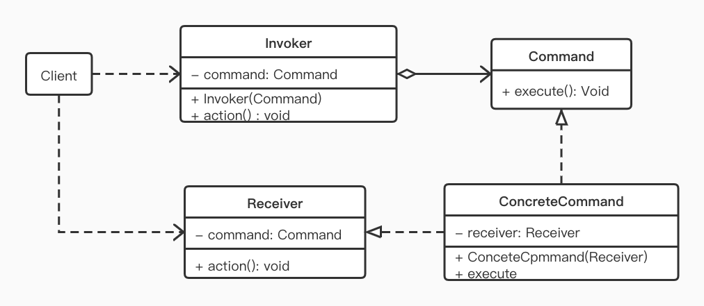

> 在操作系统中，我们点击“关机”命令，系统会执行一系列的操作，如先暂停处理事件，保存系统一些配置，然后结束程序进程，最后调用内核命令关闭计算机等。对于这一系列命令，用户不用去管，用户只需点击系统的关机按钮即可完成如上一系列的命令。而我们的命令模式（Command Pattern）,是行为型设计模式之一，其核心也大体如此

## 定义

将一个请求封装成一个对象，从而让用户使用不同的请求把客户端参数化；对请求排队或者记录请求日志，以及支持可撤销的操作。

## 使用场景

- 需要抽象出待执行的动作，然后以参数的开工提供出来。（类似回调）
- 在不同的时刻指定、排列和执行请求，一个命令对象可以有与初始请求无关的我现在期
- 需要支持取消操作
- 支持修改日志功能，当系统崩溃时，这些修改可以被重作一次
- 需要支持事务操作

## UML



- Receiver：接收者类角色
  该类负责具体实施或执行一个请求，也就执行具体逻辑的角色。以上面的“关机”为例，其实接收角色就是真正执行各项关机逻辑的底层代码。任何一个类都可以成为一个接收者，而在接收者类中封装具体操作逻辑在 action 方法中
- Command: 命令角色
  定义所有具体命令类的抽象接口
- ConcreteCommand: 具体命令角色
  该类实现了 Command 接口，在 execute 方法中调用接收者角色的相关方法，在接收者和命令执行的具体行为之间加以弱耦合。而 execute 则通常称为执行方法，如“关机”的操作实现，具体还包括很多相关的操作，如保存数据 ，关闭文件，结束进程等。如果 将这一系列具体的逻辑处理看作是接收者，那么调用这些具体逻辑的方法就可以看作是执行方法。
- Invoker: 请求者角色
  该类的职责就是调用命令对象执行具体的请求，相关的方法也是 action 方法。在“关机”例子中，关机菜单命令一般就对应一个关机方法，我们点击了关机菜单后，就由这个方法去调用具体的命令执行具体的逻辑。
- Client: 客户端角色
  具体操作命令的角色，“关机”例子中对应的就是人了。

这个类图描述了一个命令模式通用的代码：

#### 接收者类

```kotlin
package com.sam.designpatterns

// 命令模式
// 接收者类
class Receiver {
    // 真正执行具体命令逻辑的方法
    fun action() {
        print("执行具体操作")
    }
}
// 抽象命令接口
interface Command {
    // 命令接口的执行方法
    fun execute()
}

/**
 * 具体的命令类
 * receiver: 持有一个接收者对象的引用
 */
class ConcreteCommand(
        private val receiver: Receiver
) : Command {
    override fun execute() {
        receiver.action()
    }
}

// 请求者类
class Invoker(private val command: Command) {
    fun action() {
        // 调用具体命令对象，执行具体命令
        command.execute()
    }
}

class Client {
    fun main() {
        // 构造一个接收者对象
        val receiver = Receiver()
        // 根据接收者对象构造一个命令对象
        val command = ConcreteCommand(receiver)
        // 根据具体的命令构造请求者对象
        val invoker = Invoker(command)
        // 执行请求方法
        invoker.action()
    }
}
```

到这里，我们会发现，命令模式就是将行为调用者与实现者解耦。命令模式总体来说并不难，只是相对比较繁琐。

## Android 源码中的实现

Android 中关于命令模式的应用虽然不少，但是都不算典型，很多都有一定的变种。一个相对典型的例子是：Android 的事件机制中底层逻辑对事件的转发处理。Android 的每一种事件在屏幕上产生后，都会经由底层逻辑转换成一个 NotifyArgs 对象，这个 NotifyArgs 本身并无任何实现，只定义了抽象的方法体。这里我们不会过多涉及底层实现，仅用伪代码描述一下类、方法名以及相互关系。

```c++
struct NotifyArgs {
  virtual ~NotifyArgs() {}
  virtual void notify(listenter)
}
```

这就相当于是抽象命令，以具体的按键事件为例

```c++
struct NotifyKeyArgs: Public NotifyArgs {
  nsects_t eventTime;
  int32_t deviceId;
  ...
}
```

NotifyKeyArgs 或其它子类就是具体命令角色，那接下来谁是请求者的角色则是由 Android 事件机制中一个重要的角色 InputDispatcher 来承担，具体事件命令将事件转发给 InputDispatcher，并由其来封装具体的事件操作。我们还是以按键事件为例：

```c++
// frameworks/native/services/inputflinger/InputDispatcher.cpp
void InputDispatcher::notifyKey(const NotifyKeyArgs* args) {
    KeyEvent event;
    event.initialize(args->deviceId, args->source, args->action,
            flags, keyCode, args->scanCode, metaState, 0,
            args->downTime, args->eventTime);
    
    // 通过 NatvieInputManager 在 Event 入队前做一些处理
    mPolicy->interceptKeyBeforeQueueing(&event, /*byref*/ policyFlags);

    ...
    KeyEntry* newEntry = new KeyEntry(args->eventTime, args->source,
                args->action, flags, keyCode,...)
    // 事件放入队尾
    needWake = enqueueInboundEventLocked(newEntry);
}
```

事件机制对命令模式应用的逻辑还算明朗，除了上述命令角色和请求角色之外 ，接收者角色则由具体的硬件驱动承担。而关于事件机制 的更详细介绍在此不细说，有兴趣的可以阅读我们以前发过的[按下 Home 键后发生了什么](按下 Home 键后发生了什么.md)

## 总结

#### 优点

命令模式给我们带来了更弱的耦合性，更灵活的控制性以及更好的扩展性

#### 缺点

命令模式充分体现了几乎所有设计模式的通病：类的膨胀，大量的衍生类。在实际使用过程中，可以适当的简化，比如省略掉接收者等