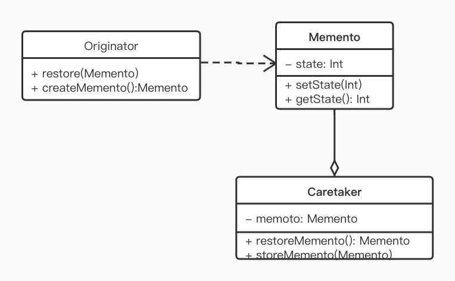

备忘录模式（Memento Pattern）是一种行为型模式，用于保存一个对象的某个状态，以便在适当的时候恢复对象到此状态。

## 定义

在不破坏封装的前提下，捕获一个对象的内部状态，并在该对象之外保存这个状态，这样以后就可将该对象恢复到原先保存的状态。

## 使用场景

需要保存一个对象在某一时刻的状态或部分状态。比如撤销重做、游戏存档

## UML



- Originator:  原始角色，负责创建备忘录，记录、恢复自身的内部状态。可以根据需要决定 Memento 存储哪些状态。
- Memento：备忘录，包含了要被恢复的对象的状态。
- Caretaker:  负责存储备忘录，不能对备忘录的内容进行操作和访问，只能将备忘录传递给其它对象。

## Demo

我们模拟实现一个游戏存档程序，简单的模拟生命值和等级两个属性：

```kotlin
// 备忘录
class Memento(
        var life: Int,// 存生命值，否则下线重新上线就满血复活了
        var level: Int // 存等级，否则一下线就白玩了
) 
```

然后是游戏的主体

```KOTLIN
// 游戏主体，是 UML 中的 Originator
class Game {
    var life = 100 //生命值
    var level = 1 //等级
    val random = Random()

    fun play() {
        println("开始打怪升级")
        life -= random.nextInt(50)
        level += random.nextInt(5)
        println("打完收工")
    }

    fun quit() {
        println("--------------------")
        println("退出游戏")
        println("退出时的属性，${toString()}")
        println("--------------------")
    }

    override fun toString(): String {
        return "生命值：$life, 等级：$level"
    }

    fun createMemento(): Memento {
        println("保存游戏属性~~~")
        return Memento(life, level)
    }
    fun restore(memento: Memento) {
        life = memento.life
        level = memento.level
        println("读取存档后的属性，${toString()}")
    }
}
```
接下来我们写备忘录存储和读取操作：

```KOTLIN
class Caretaker {
    private lateinit var memento: Memento
    fun archive(memento: Memento) {
        //存档模拟，实际上应该系列化到文件，或上传到服务端
        this.memento = memento
        println("存档完成~~~")
  }

    fun loadMemento(): Memento {
        return memento
    }
}
```

最后看客户端的测试代码：
```kotlin
fun main() {
    val game = Game()
    game.play()

    val caretaker = Caretaker()
    caretaker.archive(game.createMemento())
    game.quit()

    // 重新打开游戏。
    val newGame = Game()
    newGame.restore(caretaker.loadMemento())
}

--------- 运行结果 ---------
开始打怪升级
打完收工
保存游戏属性~~~
存档完成~~~
--------------------
退出游戏
退出时的属性，生命值：53, 等级：1
--------------------
读取存档后的属性，生命值：53, 等级：1
```

游戏存档并没有存储整个 Game 对象，而是通过 Memento 保存 Game 中的属性，再存储 Memento 对象，最终 Memento 对象的操作则是交给了 Caretaker 对象。在这个过程中，各个角色职责清晰、单一，代码也比较简单，屏蔽了外界对 Game 的直接访问，在满足功能的同时也不破坏其封装性。

## Android 源码中的使用

在 Android 中，最常接触到的备忘录模式的应用是 Activity 中状态的保存，也就是 onSaveInstanceState 和 onRestoreInstanceState 。方法的调用时机如下：


#### onSaveInstanceState 调用时机

当用户离开当前 Activity ，且这个页面有可能意外被系统回收时就会调用 onSaveInstanceState 来保存 Activity 的状态，以便后续可以恢复。那什么叫可能被系统回收？

- 可能：系统内存不足时会按优先级回收，[详见LMK](Low Memory Killer.md)
- 意外：主动调 finish，或者按系统返回键就不是意外，而是意料之中要销毁的。

综上除了主动调用 finish, 或者按返回键，其余情况离开当前 Activity ，如 Home 键、打开新 Activity 等都会调用 onSaveInstanceState 方法，将 Activity 的状态保存到一个 Bundle 对象。

#### onRestoreInstanceState 调用时机

这个的时机就比较简单了，只有当 Activity 被意外回收了（该情况下必然调用过了 onSaveInstanceState），再回到该 Activity 时，会重新创建 Activity 实例，再将之前存的 Bundle 对象传递给 Activity 的 onRestoreInstanceState() 方法以及 onCreate()  方法，我们可以选择在这两个方法中选择合适的时机还原 Activity 的状态。

#### onSaveInstanceState 存了什么

看下源码 

```JAVA
protected void onSaveInstanceState(@NonNull Bundle outState) {
    // 1. 存储当前窗口的 View 树的状态
    outState.putBundle(WINDOW_HIERARCHY_TAG, mWindow.saveHierarchyState());
    
    // 2. 存储 Fragment 的状态，会递归调用 Fragment.onSaveInstanceState
    Parcelable p = mFragments.saveAllState();
    if (p != null) {
        outState.putParcelable(FRAGMENTS_TAG, p);
    }
    if (mAutoFillResetNeeded) {
        outState.putBoolean(AUTOFILL_RESET_NEEDED, true);
        getAutofillManager().onSaveInstanceState(outState);
    }
    // 3. 如果设置了 Activity 的 ActivityLifecycleCallbacks
    // 分发调用这些 callbacks 的 onSaveInsgtanceState 方法
    dispatchActivitySaveInstanceState(outState);
}
```

当然，除了保存以上这些状态，我们往往还会重写 onSaveInstance 来保存一些其它状态。

## 小结

#### 优点

- 为用户提供了一种可以恢复状态的机制，可以比较方便地回到某个历史状态
- 实现了信息的封装，使用户不需要关心状态保存的细节

#### 缺点

- 消耗资源，每保存一次都会消耗一定的存储。（方案：仅保存最近一次）
- 状态过多时保存比较麻烦。（方案：借助 注解 AOP / JSON 自动处理）

此外我们还介绍了 Activity 的状态保存机制。

最后，大家新年快乐。


