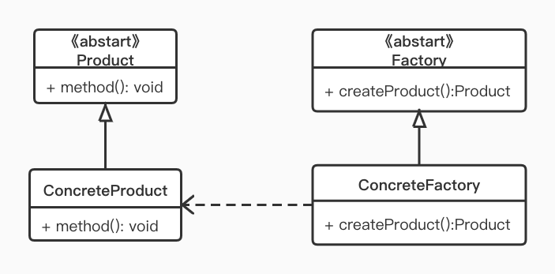

> 生活里80%的痛苦来源于打工，但是我知道，如果不打工，就会有100%的痛苦，所以在打工和没钱之间，我选择打工！

早安，打工人，今天我们来看一下打工人中应用最广泛的“工厂模式”

## 定义

工厂方法模式（ Factory Pattern）属于创建型模式，定义一个用于创建对象的接口，让子类决定实例化哪个类。

## 使用场景

- 任何需要生成复杂对象的地方
- 直接 new 可以创建的对象无需使用工厂模式

## UML



- Factory：工厂的抽象类，工厂方法模式的核心，定义创建对象方法的接口
- ConcreteFactory:  具体的工厂类，实现具体的业务逻辑
- Product: 抽象产品类
- ConcreteProduct: 具体产品类

## 举例


我是富土康3号流水线的张全蛋，英文名叫Micheal Jack，来看下俺们工厂是怎么生产：

## CODE

```KOTLIN
// 众所周知我们厂代工手机
abstract class Phone(val name: String) {
    // 省略：打电话，发短信，刚上冲浪等功能
}
//今年新出的水果 12 系列也是这边生产的呢
class IPhone12 : Phone("iPhone 12")
class IPhone12Pro: Phone("iPhone 12 pro")

// 抽象的工厂类
abstract class Factory(val name: String) {
    // 泛型相当于 java 中的 <T extends Phone>
    abstract fun <T : Phone> createPhone(cls: Class<T>):T
}

class Factory3 : Factory("富土康三号") {
    override fun <T : Phone> createPhone(cls: Class<T>): T {
        // 实现比较复杂的创建方式(比如一大堆复杂或者从各处取来的参数)
        // 这边简单的使用反射生成对象演示
        return Class.forName(cls.name).newInstance() as T
    }
}
```

来运行一下测试代码

```kotlin
fun main() {
    // 开启流水线
    val factory = Factory3()
    println("来到工厂：${factory.name}流水线")
    val iPhone12 = factory.createPhone(IPhone12::class.java)
    println("生产了一个 ${iPhone12.name}")
    val iPhone12Pro = factory.createPhone(IPhone12Pro::class.java)
    println("又生产了一个 ${iPhone12Pro.name}")
}

// 运行结果 -----
来到工厂：富土康三号流水线
生产了一个 iPhone 12
又生产了一个 iPhone 12 pro
```

当然我们也可以继续扩展 Factory 扩展一个专门生产 Pad 的工厂。这种拥有多个工厂的方式我们也称为多工厂模式。

然而，大部分的时候我们的工厂只有一个，这时候就可以把抽象类简化掉，然后把工厂方法改成静态的即可：

```kotlin
object StaticFactory {
    fun  <T : Phone> createPhone(cls: Class<T>): T {
        return Class.forName(cls.name).newInstance() as T
    }
}
   
val iPhone12 = StaticFactory.createPhone(IPhone12::class.java)
val iPhone12Pro = StaticFactory.createPhone(IPhone12Pro::class.java)
```

这种方式又称为简单工厂模式或静态工厂模式

## 安卓中的应用

- BitmapFactory 里的一系列 decodeXXX 都是静态工厂方法，会返回一个 Bitmap
- ViewModelProvider.Factory (抽象工厂类) 接口里面有一个 create 方法，返回 ViewModel；FragmentManagerViewModel, LoaderViewModel(具体工厂类)  里有具体的实现

## 总结

- 优点： 
  - 工厂方法模式完全符合设计原则，降低了对象之间的耦合。高层模块只需要知道产品的抽象类，其他的实现都不需要关心。
  - 良好的封装性，代码结构清晰。扩展性好。

- 缺点：每次我们为工厂方法模式添加新的产品时就要编写一个新的产品类。同时还要引入抽象层，这必然会导致类结构的复杂化
- 注意简单工厂或静态工厂模式都是工厂方法模式的一种简化版本，并不是直接在 23 种设计模式之中。