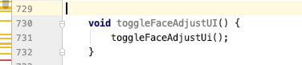

> 现在的年轻程序猿，不讲码德，来 copy，来乱打键盘，被发现了才说对不，对不起，我不懂规矩。我说你这可不是乱打的，训练有素，油备而来，就是要来把项目搞得不好维护！

以下排名不分先后

#### 奇葩命名

abcd, asdf, a1,  tmp,  shangpin, TabFragmement

其实我本人英文也不好，但是现在翻译软件这么方便，不会就翻译一下啊，而且 AS 都给你提示`Typo: In word 'XXX' ` 难道你是瞎吗？

#### 无意义的代码



截图项目中真实遇到

#### 伪装欺诈

比如方法名叫 `login()` 结果方法里根本不是去登录，而是去注册。

再比如`RelativeLayout frameLayout = findviewById(xxxx)` 你就说你这玩意到底是啥？

#### 奇葩注释

- 不写注释，自以为自己的代码精妙无比，无需注释，提测后有 bug 自己都看不懂了
- 说谎注释，注释的东西根本和代码写得不一样，当然可能不是故意的只是更新了代码没更新注释
- 废话注释，//不要问我为什么这样写，我也不知道；   i+1;//这边需要+1

#### Copy & Paste

几乎一样的代码拷得到处都是，emmmm, 公司又不是按代码量开工资，你抽取复用一下会死？

#### 大量嵌套

可以在一行代码上使用超过10层的小括号() ，或是在一个函数里使用超过20层的语句嵌套{}，把嵌套的if else 转成 [? :] 也是一件很NB的事。

地狱回调也是表现之一

#### 舍不得删代码

没调用的方法不删，注释掉的代码不删，留着当传家宝？

#### 混乱参数

同一套接口，有的时候`rawRectangle(height, width)` 有的时候 `drawRectangle(width, height)`

如果你不理解，那再举个例子，时间单位有时候用秒有时候用毫秒，而且方法名或参数名上看不出来任何差别。

项目里还遇到过有个 SDK，不同接口给的坐标系一会左上角为原点，一会左下角为原点。导致我绘制的时候总得先试试，薛定谔的原点，不绘制上去永远不知道原点在哪。

#### 借口

写烂代码从来都是说时间太赶；写 todo , never do；

#### 脑洞代码

````KOTLIN
fun sort(arr: Array<Int>) {
    for (i in arr) {
        thread {
            Thread.sleep(i.toLong())
            print("$i,")
        }.start()
    }
}
````

这个是个段子，凑下数。

#### 最后

我劝写过上述代码的人耗子尾汁，好好反思，以后不要再犯这样的聪明，小聪明！

阿，呃，猿们要以和为贵... 要讲码德，不要搞窝里斗，给我点个赞再走，谢谢朋友们！

