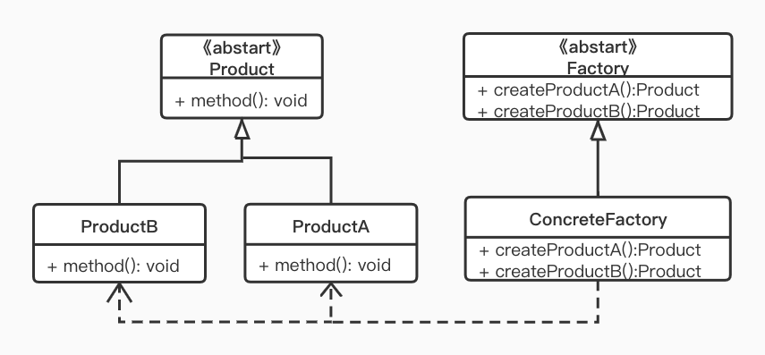

> 上次我们聊了打工人的“工厂模式”，每个工厂生产的都是具体的产品；而今天要说的抽象工厂生产出来的产品是不确定的。

## 定义

   为创建一组相关或者相互依赖的对象提供一个接口，而不需要指定它们的具体类。

## 使用场景

定义太抽象我们举个例子，苹果公司生产的 iPhone, iPad 都可以发邮件，看视频，但由于平台特性不一样，实现的效果和交互逻辑也不一样，这个时候我们就可以使用抽象工厂模式来生产。

## UML



- Factory: 抽象工厂，声明了一组创建一种产品的方法，每一个方法对应一种产品。上图中定义了两个分别用于创建产品 A 和产品 B
- ConcreteFactory: 具体工厂，它实现了在抽象工厂中定义的创建产品的方法，生成一组具体的产品。这些产品构成一个产品种类
- Product: 抽象产品类
- ProductA、ProductB: 具体产品 

## CODE

我们还是以之前工厂模式的例子，富土康流水线

```kotlin
// 众所周知我们厂代工手机
abstract class Phone(val name: String) {
    // 省略：打电话，发短信，刚上冲浪等功能
}
//今年新出的水果 12 系列也是这边生产的呢
class IPhone12 : Phone("iPhone 12")
class IPhone12Pro: Phone("iPhone 12 pro")

// 抽象的工厂类
abstract class Factory(val name: String) {
    abstract fun createIPhone(): Phone
    abstract fun createIPhonePro(): Phone
}

class Factory4 : Factory("富土康四号") {
    override fun createIPhone(): Phone {
         return IPhone12()
    }

    override fun createIPhonePro(): Phone {
        return IPhone12Pro()
    }
}
```

来运行一下测试代码

```kotlin
fun main() {
    // 开启流水线
    val factory = Factory4()
    println("来到工厂：${factory.name}流水线")
    val iPhone12 = factory.createIPhone()
    println("生产了一个 ${iPhone12.name}")
    val iPhone12Pro = factory.createIPhonePro()
    println("又生产了一个 ${iPhone12Pro.name}")
}

// 运行结果 -----
来到工厂：富土康四号流水线
生产了一个 iPhone 12
又生产了一个 iPhone 12 pro
```

## 工厂模式 vs 抽象工厂模式

都用同样的例子，我们可以看出各种工厂模式的核心区别。

- 简单工厂模式：一个工厂类使用静态方法创建不同类型的对象
- 工厂方法模式：一个具体的工厂类负责创建一个具体的对象
- 抽象工厂模式：一个具体的工厂负责创建一系列相关的对象

## 另一个示例

前面的示例很好的表示了一个具体工厂负责创建一系列相关的对象，但是对抽象工厂的是如何抽象的不是很说得很清楚，下面我们来举一个手机零件生产的例子

```kotlin
// ProductA 屏幕
interface IScreen {
    //点亮屏幕
    fun lightUp()
}
class IPhoneScreen : IScreen {
    override fun lightUp() {
        println("iPhone 小屏")
    }
}
class IPadScreen : IScreen {
    override fun lightUp() {
        println("iPad 大屏")
    }
}

// ProductB CPU
interface ICpu {
    fun compute()
}
class IPhoneCpu : ICpu {
    override fun compute() {
        println("A14")
    }
}
class IPadCpu : ICpu {
    override fun compute() {
        println("A12Z")
    }
}

//抽象工厂
interface AbstractFactory {
    fun produceScreen(): IScreen
    fun produceCpu(): ICpu
}
class IPhoneFactory : AbstractFactory {
    override fun produceScreen(): IScreen {
        return IPhoneScreen()
    }
    override fun produceCpu(): ICpu {
        return IPhoneCpu()
    }
}
class IPadFactory : AbstractFactory {
    override fun produceScreen(): IScreen {
        return IPadScreen()
    }
    override fun produceCpu(): ICpu {
        return IPadCpu()
    }
}
```

接下来运行测试代码

```kotlin
fun main() {
    println("来到 IPhone 工厂")
    var factory: AbstractFactory = IPhoneFactory()
    var screen = factory.produceScreen()
    print("生产了：")
    screen.lightUp()
    var cpu = factory.produceCpu()
    print("生产了：")
    cpu.compute()

    println("来到 IPad 工厂")
    factory = IPadFactory()
    screen = factory.produceScreen()
    print("生产了：")
    screen.lightUp()
    cpu = factory.produceCpu()
    print("生产了：")
    cpu.compute()
}

// 运行结果 
来到 IPhone 工厂
生产了：iPhone 小屏
生产了：A14
来到 IPad 工厂
生产了：iPad 大屏
生产了：A12Z
```

这个例子相对之前的复杂了一些，而抽象工厂就是定义了 iPhone 工厂和 iPad 工厂生产方法的**抽象工厂**