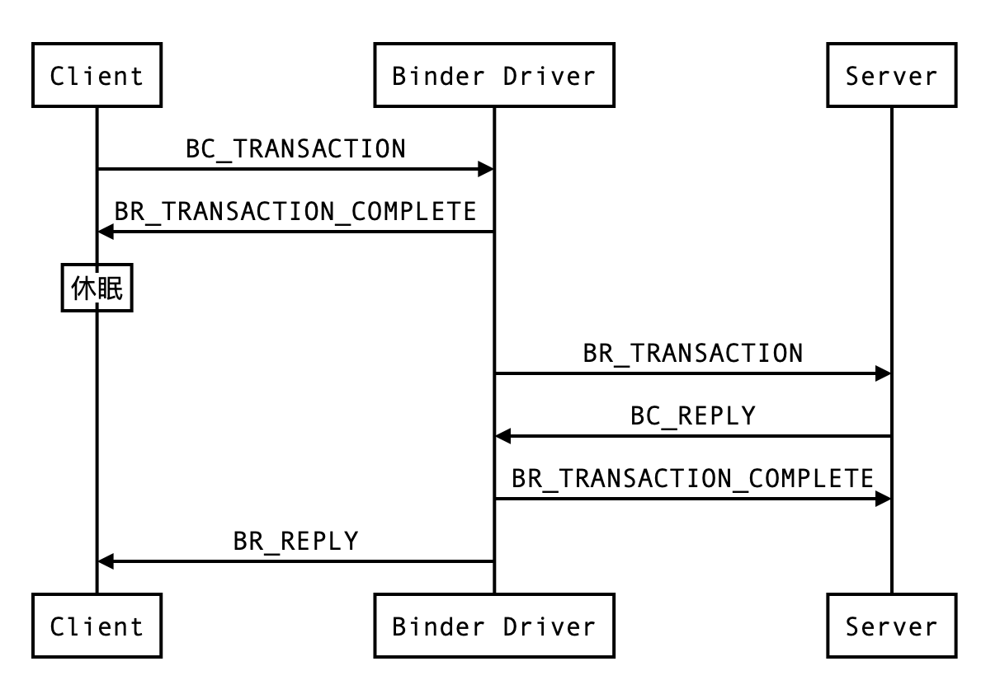

binder 是 Android 系统的进程间通信机制，是了解 Android 运行机制必须要掌握的一个知识点，更是一线企业面试必问的知识点！比如：

>1. binder 有什么优势？（字节）
>2. binder 一次拷贝原理？（腾讯）
>3. Intent 传递大数据限制？（阿里）
>4. AIDL 原理？（字节）
>5. 谈谈你对 binder 驱动的了解？（字节）

你都能回答上来吗！？

到底怎样才能彻底掌握 binder 机制、游刃有余的应对 binder 面试问题，让面试官对你刮目相看，斩获高薪 offer 呢？

没有捷径，**Read The Fucking Source Code！**，这句话绝对是至理名言。

要达到*彻底掌握*，不能死记别人对 binder 的概括描述，而是要自己深入源码去看它到底是个什么东西，有了自己的理解，才能胸有成竹的应对相关面试问题。

本文主要来分析下 binder 驱动源码中的三个关键函数，binder_open()、binder_mmap() 及 binder_ioctl()。

## 上层调用陷入内核

分析这三个关键函数前，先来看下它们是如何被上层调用的，这样对 binder 机制有整体的了解，才不至于对 binder 驱动的理解太过孤立。

binder 驱动在系统内核中，从用户空间应用程序到内核空间 binder 驱动，会经过一些 ProcessState、IPCThreadState 等中间的操作封装类，然后通过系统调用陷入系统内核。

在 [掌握 binder 机制？先搞懂这几个关键类！](https://mp.weixin.qq.com/s/gHtZ9pjMJ-jXA12rvXA4cg) 中详细分析过 ProcessState、IPCThreadState、BpBinder 以及 BinderProxy  等 binder 操作封装类源码，不了解的建议前往收藏阅读。

ProcessState 是进程单例，主要负责打开 binder 驱动设备及 mmap。 binder 驱动的 binder_open()、binder_mmap() 函数在 ProcessState 的构造函数中被调用，如下：

```objectivec
ProcessState::ProcessState()
    : mDriverFD(open_driver()) //打开 binder 设备，binder_open()
    , mVMStart(MAP_FAILED)
    ...
    , mMaxThreads(DEFAULT_MAX_binder_THREADS)
    , mThreadPoolSeq(1){
       if (mDriverFD >= 0) {
           // 将应用进程虚拟内存空间与 binder 驱动映射，binder_mmap()
           mVMStart = mmap(0, binder_VM_SIZE, PROT_READ,
                            MAP_PRIVATE | MAP_NORESERVE, mDriverFD, 0);
           if (mVMStart == MAP_FAILED) {
               close(mDriverFD);
               mDriverFD = -1;
           }
       }
}
```

IPCThreadState 为线程单例，负责与 binder 驱动进行具体的命令通信。在其 talkWithDriver() 方法中，调用了 binder 驱动的 binder_ioctl() 函数：

```objectivec
// binder_ioctl
ioctl(mProcess->mDriverFD, binder_WRITE_READ, &bwr)
```

## binder 驱动注册

binder 驱动运行在内核态，向上层提供 /dev/binder 设备节点，并不对应真实的硬件设备。binder 驱动的注册逻辑在 Binder.c 中：
```objectivec
//drivers/staging/android/Binder.c
static init __init binder_init(void){
    ...
    ret = misc_register(&binder_miscdev); //注册为 misc 驱动
}
```

binder_miscdev 即 Binder 设备描述如下：

```objectivec
static struct miscdevice binder_miscdev = {
    .minor = MISC_DYNAMIC_MINOR, //自动分配次设备号
    .name = "binder", //驱动名称
    .fops = &binder_fops //binder 驱动支持的文件操作
}
```

binder_fops 为 Binder 设备支持的操作函数，如下：

```objectivec
static const struct file_operations binder_fops = {
    .owner = THIS_MODULE,
    .poll = binder_poll,
    .unlocked_ioctl = binder_ioctl,
    .mmap = binder_mmap,
    .open = binder_open,
    .flush = binder_flush,
    .release = binder_release,
};
```

## binder_open

用户应用程序通过 Binder 通信时，需先调用 binder_open() 方法打开 binder 驱动，binder_open() 中主要做了两个工作，对应的分为两部分来看：

```objectivec
//binder.c
static int binder_open(struct inode *nodp, struct file *filp)
{
    struct binder_proc *proc;
    ...
    proc = kzalloc(sizeof(*proc), GFP_KERNEL); //创建 binder_proc
    if (proc == NULL)
        return -ENOMEM;
    get_task_struct(current);
    proc->tsk = current;
    INIT_LIST_HEAD(&proc->todo); //初始化 todo 队列
    init_waitqueue_head(&proc->wait); //初始化 todo 队列
    proc->default_priority = task_nice(current);
```

上面代码的主要工作是 **创建及初始化 binder_proc**，binder_proc 就是用来存放 binder 相关数据的结构体，每个进程独有一份。

```objectivec
    binder_lock(__func__);
    binder_stats_created(BINDER_STAT_PROC);
    hlist_add_head(&proc->proc_node, &binder_procs);
    proc->pid = current->group_leader->pid;
    INIT_LIST_HEAD(&proc->delivered_death);
    filp->private_data = proc;
    binder_unlock(__func__);
    ...
}
```
第二个主要工作是 **将 binder_proc 记录起来**，方便后续使用，如上代码所示，通过 hlist_add_head() 方法将 binder_proc 记录到了内核的 binder_procs 表中，另外还将 binder_proc 存放在 filp 的 private_data 域，以便于在后续调用 mmap、ioctl 等方法时获取。

## binder_mmap
对于 binder 驱动来说，上层应用调用的 mmap() 最终会执行到 binder_mmap() 方法，binder_mmap() 的主要工作是**将上层应用的虚拟内存块和 Binder 申请的物理内存块建立映射**，应用程序和 Binder 就拥有了共享的内存空间，这样不同的应用程序之间可以通过 Binder 实现数据共享。

- Binder 中有一物理内存块 P；B 进程中有一内存块 b
- 将 P 分别与 b 建立映射，这样 P、b 就可以看作同一块内存
- 若 A 进程想要发送数据给 B 进程，只需将数据拷贝到 P 内存，B 进程就能直接读取到了

所以 Binder 只需一次拷贝，binder_mmap() 要做的就是将 P 与 b 建立映射，该方法代码较长，分段看关键部分代码：

```objectivec
static int binder_mmap(struct file *filp, struct vm_area_struct *vma){
    struct vm_struct *area;
    struct binder_proc *proc = filp->private_data;
    const char *failure_string;
    struct binder_buffer *buffer;
    //映射空间至多 4M
    if ((vma->vm_end - vma->vm_start) > SZ_4M)
          vma->vm_end = vma->vm_start + SZ_4M;
    //检查 vma 是否被禁用
    if (vma->vm_flags & FORBIDDEN_MMAP_FLAGS) {
          ret = -EPERM;
          failure_string = "bad vm_flags";
          goto err_bad_arg;
    }
```
- vma(vm_area_struct) 是**用户态虚拟内存地址空间**，也就是 b
- area(vm_struct) 是**内核态虚拟地址空间**，指向 P
- proc(binder_proc) 即 binder_open() 中创建的、存放 binder 相关数据的结构体
- 另外还做了限制映射空间至多 4M 等映射规则的检查和处理

```objectivec
     mutex_lock(&binder_mmap_lock);
    //检查是否已执行过 binder_mmap 映射过
    if (proc->buffer) {
          ret = -EBUSY;
          failure_string = "already mapped";
          goto err_already_mapped;
    }
    //申请内核虚拟内存地址空间
    area = get_vm_area(vma->vm_end - vma->vm_start, VM_IOREMAP);
    if (area == NULL) {
          ret = -ENOMEM;
          failure_string = "get_vm_area";
          goto err_get_vm_area_failed;
    }
    //将内核虚拟内存地址记录在 proc 中
    proc->buffer = area->addr;
    //记录用户态虚拟内存地址和内核态虚拟内存地址的偏移量
    proc->user_buffer_offset = vma->vm_start - (uintptr_t)proc->buffer;
    mutex_unlock(&binder_mmap_lock);
```
- proc->buffer 用于存储最终映射的内核态虚拟地址，并通过此变量控制只能映射一次
- get_vm_area() 方法申请了与用户态空间大小一致的内核态虚拟地址空间，注意此时还没分配实际的物理内存
- proc->user_buffer_offset 记录了用户态虚拟内存和内核态虚拟内存地址的偏移量，这样后续方便获取用户态虚拟内存地址

```objectivec
    //分配存放物理页地址的数组
    proc->pages = kzalloc(sizeof(proc->pages[0]) * ((vma->vm_end - vma->vm_start) / PAGE_SIZE), GFP_KERNEL);
    proc->buffer_size = vma->vm_end - vma->vm_start;
    //申请一页物理内存
    if (binder_update_page_range(proc, 1, proc->buffer, proc->buffer + PAGE_SIZE, vma)) {
          ret = -ENOMEM;
          failure_string = "alloc small buf";
          goto err_alloc_small_buf_failed;
    }
    //最后的收尾工作：将内存记录到相应链表中，设置状态等
    INIT_LIST_HEAD(&proc->buffers);
    list_add(&buffer->entry, &proc->buffers);
    buffer->free = 1;
    binder_insert_free_buffer(proc, buffer);
    proc->free_async_space = proc->buffer_size / 2;
    proc->files = get_files_struct(current);
    proc->vma = vma;
```
- proc->pages 是一个二维指针，用于存放管理物理页面
- binder_update_page_range() 方法真正的申请物理页面，并分别映射到内核态和用户态的虚拟内存地址空间

至此 binder_mmap 方法执行结束，我们继续分析 **binder_update_page_range()** 方法，此方法代码非常有助于我们理解页框以及与虚拟内存地址的映射逻辑。先了解此方法的参数：

- proc：申请内存的进程所持有的 binder_proc 对象
- allocate：1 表示申请内存，0 表示释放内存
- start：虚拟内存地址起点
- end：虚拟内存地址终点
- vma：用户态虚拟内存地址空间

```objectivec
static int binder_update_page_range(struct binder_proc *proc, int allocate,
                    void *start, void *end,
                    struct vm_area_struct *vma){
    if (allocate == 0)  //区分是申请还是释放
         goto free_range;
    //依据 start、end 循环分配物理页
    for (page_addr = start; page_addr < end; page_addr += PAGE_SIZE) {
          //每次分配 1 个页框*/
         *page = **alloc_page**(GFP_KERNEL | __GFP_HIGHMEM | __GFP_ZERO);
         //将页框映射到内核态虚拟内存地址
         ret = **map_kernel_range_noflush**((unsigned long)page_addr, PAGE_SIZE, PAGE_KERNEL, page);
         //根据 binder_mmap 方法中记录的偏移量计算出用户态虚拟内存地址
         user_page_addr = (uintptr_t)page_addr + proc->user_buffer_offset;
         //将页框映射到用户态虚拟内存地址
         ret = vm_insert_page(vma, user_page_addr, page[0]);
     }
     return 0;
```
binder_mmap() 的 allocate 参数传入 1 为申请内存，执行上面的代码。若为释放则执行以下代码：
```objectivec
free_range:
    //依据 start、end 从后往前遍历
    for (page_addr = end - PAGE_SIZE; page_addr >= start; page_addr -= PAGE_SIZE) {
        page = &proc->pages[(page_addr - proc->buffer) / PAGE_SIZE];
        if (vma)
            //解除用户态虚拟地址和物理页框的映射
            zap_page_range(vma, (uintptr_t)page_addr + proc->user_buffer_offset, PAGE_SIZE, NULL);
err_vm_insert_page_failed:
        //解除内核态虚拟地址和物理页框的映射
        unmap_kernel_range((unsigned long)page_addr, PAGE_SIZE);
err_map_kernel_failed:
        //释放页框物理内存
        __free_page(*page);
        *page = NULL;
}
```

## binder_ioctl
binder 驱动并不提供常规的 read()、write() 等文件操作，全部通过 binder_ioctl() 实现，所以 binder_ioctl() 是 binder 驱动中工作量最大的一个，它承担了 binder 驱动的大部分业务。这里不深入分析源码，只列出 binder_ioctl() 支持的命令列表：

| 命令 | 说明 |
|--|--|
| BINDER_WRITE_READ | 向 binder 驱动写入或读取数据 |
| BINDER_SET_MAX_THREADS | 设置支持的最大线程数 |
| BINDER_SET_CONTEXT_MGR | Service Manager 专用的注册命令 |
| BINDER_THREAD_EXIT | 通知 binder 驱动某线程退出，释放相应资源 |
| BINDER_VERSION | 获取 Binder 版本号 |

其中 BINDER_WRITE_READ 最为关键，分为若干子命令：

| 命令 | 说明 |
|--|--|
| BC_INCREFS、BC_ACQUIRE、BC_RELEASE、BC_DECREFS | 管理 binder_ref 的引用计数 |
| BC_INCREFS_DONE、BC_ACQUIRE_NODE | 管理 binder_node 的引用计数 |
| BC_FREE_BUFFER | 释放 Binder 内存缓冲区 |
| BC_TRANSACTION | 向 binder 驱动发送通信数据(主动调用)  |
| BC_REPLY | 向 binder 驱动发送通信数据(返回结果)  |
| BC_REGISTER_LOOPER、BC_ENTER_LOOPER、BC_EXIT_LOOPER | 设置 Binder looper 状态  |
| BC_REQUEST_DEATH_NOTIFICATION | 注册 Binder 死亡通知  |
| BC_CLEAR_DEATH_NOTIFICATION | 清除 Binder 死亡通知  |
| BC_DEAD_BINDER_DONE | 告知 Binder 已处理完 Binder 死亡通知  |

以上均为 binder 驱动作为接收方 binder_ioctl() 方法接收的命令，还有一些与之对应的 BR_ 开头的命令，由 binder 驱动主动发出，比如 BR_TRANSACTION、BR_REPLY，在一次 IPC 调用中是这样应用的：



## 最后

学习了 binder 源码后，要怎么运用这些知识，应对面试问题呢？贴心的 *Android 面试官* 已经为你演练过面试问答场景了：

[说说你对 binder 驱动的了解？](https://mp.weixin.qq.com/s/LH_JR5Rwh1JL4B6qQkEv9Q)
