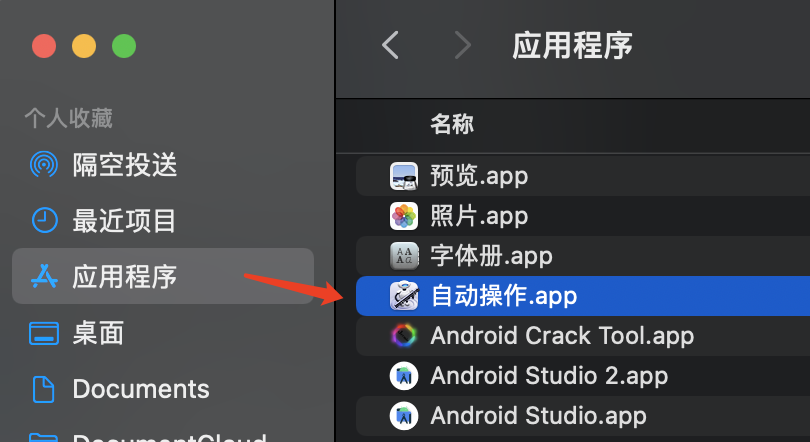
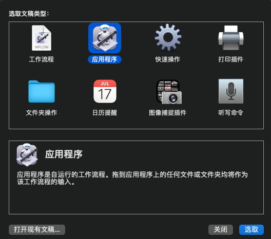
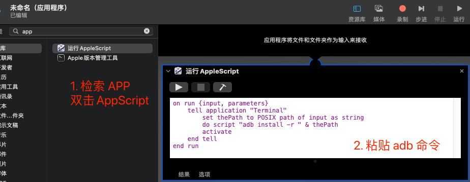
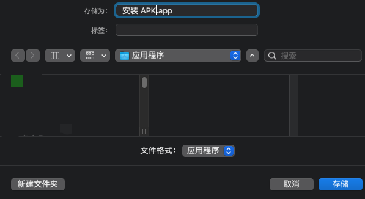
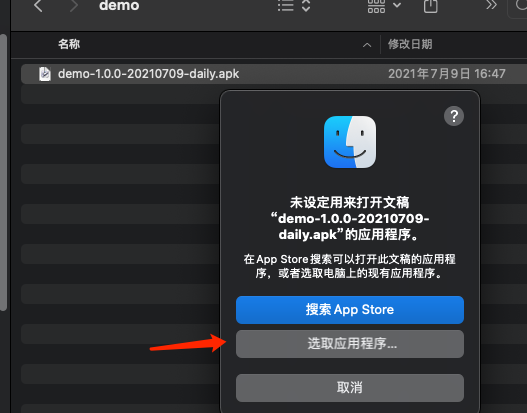
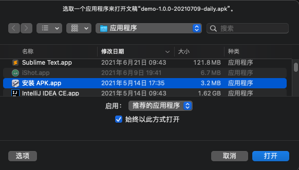

## 痛点

遇到特定版本的 BUG 时，我们需要安装相应的 APK 。这时候我们需要：

1. 打开终端
2. 输入 `adb install -r `
3. 把 apk 拖入终端 或者输入完整的 apk 文件路径
4. 回车运行


## 本方法效果

todo 录屏

## 准备

- 一台 macOS （我的版本是：11.0.1）
- 安装并配置好 adb 环境变量（终端下输入  adb devices 能看到设备）
-  (Windows 类似的找双击执行 adb 命令的方法，本文略)

其原理是通过 macOS自带`Automator`可以自定义执行`adb install`命令来实现安装 APK 

## 步骤

#### 1 . 打开应用程序里的自动操作



#### 2. 选择应用程序



#### 3. 编辑 AppleScript



```
on run {input, parameters}
	tell application "Terminal"
		set thePath to POSIX path of input as string
		do script "adb install -r " & thePath
		activate
	end tell
end run
```

填写完成后 Command+S 保存



保存结果就是一个可以运行安装命令的应用

#### 4. 更改 APK 的默认打开方式

双击 APK 文件，选取应用程序



 



勾选始终用此方式打开，点击打开按钮

#### 5. 此时已经全部配置完成，双击任何 apk 能达到一样的效果，省下来的时间帮我点个赞吧。

