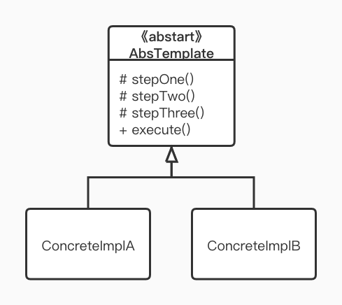

模板模式是一个关于继承的设计模式，每一个被继承的父类都是一个模板，模板中的步骤是固定的，而不固定的步骤在具体子类再实现。

## 定义

在模板模式（Template Pattern）中，一个抽象类公开定义了执行它的方法的方式/模板。它的子类可以按需要重写方法实现，但调用将以抽象类中定义的方式进行。这种类型的设计模式属于行为型模式。

## 使用场景

- 多个子类有公有的方法，并且逻辑基本相同
- 把核心的算法设计为模板方法，其它相关方法由子类实现
- 重构时，将相同的代码抽取到父类中，然后通过钩子函数约束其行为

## UML



- AbsTemplate：抽象的模板类，在调用 execute 时内部会调用 stepOne Two Three 三个方法
- ConcreteImplA, ConcreteImplB : 具体的实现类，可以对 stepOne Two Three 三个方法进行定制、重写

## 举例

刚刚过去的国庆 8 天假，想必各有各的精彩，但是更多人却是用一天为模板过 8 天，我们来看下：

## CODE

```KOTLIN
abstract class Template {
    fun todayLife() { // 模板人的一天
        stepOne()
        stepTwo()
        stepThree()
        stepFour()
    }

    private fun stepOne() {
        // 公用的方法
        print("起床，吃饭")
    }
    abstract fun stepTwo()
    abstract fun stepThree()
    abstract fun stepFour()
}

// 肥宅
class Boy : Template() {
    override fun stepTwo() {
        print(" -> 打游戏")
    }

    override fun stepThree() {
        print(" -> 玩手机")
    }

    override fun stepFour() {
        print(" -> 睡觉")
    }
}

// 爱旅游的文青
class Girl : Template() {
    override fun stepTwo() {
        print(" -> 上车睡觉")
    }

    override fun stepThree() {
        print(" -> 下车拍照")
    }

    override fun stepFour() {
        print(" -> 修图发朋友圈")
    }
}
```

来运行一下测试代码

```java
fun main() {
    print("10.1 国庆来啦！来看看宅男们都在干嘛：\n")
    Boy().todayLife()
    print("\n来瞅瞅妹子们在干嘛：\n")
    Girl().todayLife()
    print("\n10.8 国庆结束了！真想再给祖国过一次生日")
}

// 运行结果 -----

10.1 国庆来啦！来看看宅男们都在干嘛：
起床，吃饭 -> 打游戏 -> 玩手机 -> 睡觉
来瞅瞅妹子们在干嘛：
起床，吃饭 -> 上车睡觉 -> 下车拍照 -> 修图发朋友圈
10.8 国庆结束了！真想再给祖国过一次生日
```

模板既很好的共用了相同的部分，又可以实现各自不同的部分，就像我们的生活一样，都要吃饭睡觉，却也有各自的精彩，听懂的掌声。

## 安卓中的应用


AsyncTask 这个类就使用了模板模式，我们继承它，然后实现`doInBackground`方法，在里面去做一些耗时操作；当然还可以重写`onPreEcecute`, `onPostExecute` 方法。而在使用的时候，我们只需要调用其 `execute`方法即可

另一个比较常用的例子是 Activity 的生命周期，在 Activity 类里面已经定义好了相关的方法，当我们需要处理 Activity 从启动到显示的过程，我们就可以去重写 `onCreate`, `onStart`,`onResume` 等相关生命周期的方法

## 优缺点

#### 优点：

1. 封装不可变的部分，扩展可变的部分
2. 提取公共部分代码，简洁利于维护

#### 缺点：

个人觉得没啥缺点，硬要说的话：分散代码，阅读难度增加