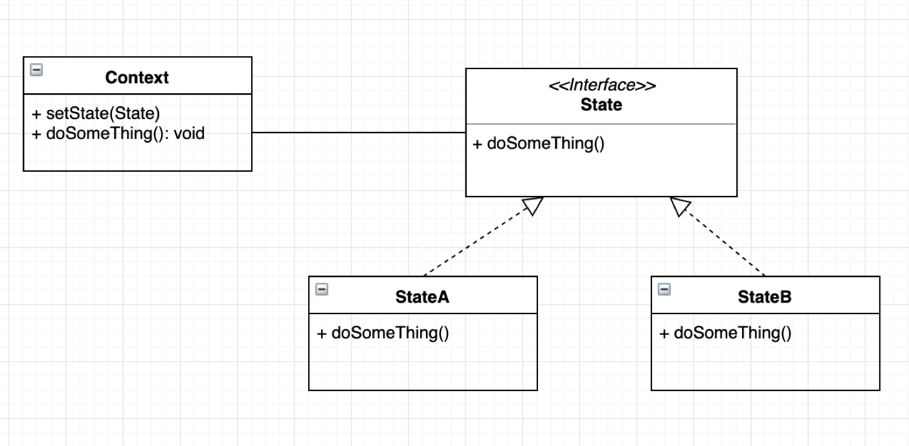
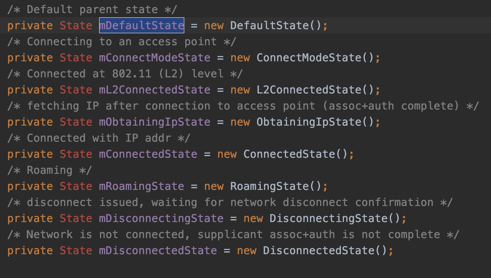
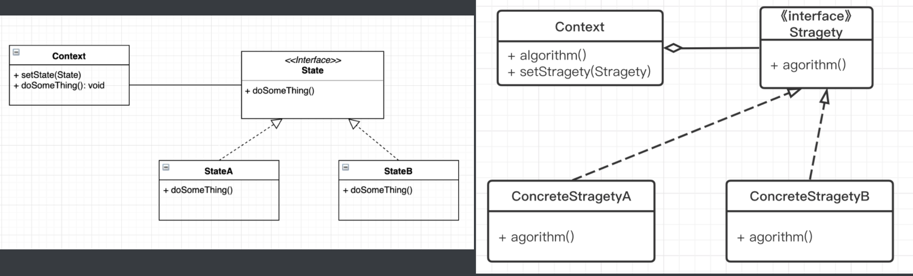

状态模式中的行为是由状态来决定的，不同的状态下有不同的行为。

## 定义

允许对象在内部状态发生改变时改变它的行为，对象看起来好像修改了它的类。

这个定义听起来有点绕，其实还是那句话，不同的状态有不同的行为，这样当状态改变时，就像变了个类一样。

## 使用场景

1. 一个对象的行为取决于它的状态，并且它在运行时根据状态改变它的行为。
2. 代码中包含大量与对象状态有关条件语句。

核心就是状态，在一堆行为中能抽象出不同的状态，自然就能适用状态模式

## UML



- Context：环境类，用来设置当前状态和执行该状态下行为
- State: 状态的接口，表示该状态下的行为
- StateA, StateB 具体的状态实现类，实现不同状态下的不同行为

## 举例

比如我们平常就有上班和下班两种状态

上班时在努力工作，上班时间过了状态就变成下班了。

下班时休息学习，下班时间结束就变成上班了

## CODE

```KOTLIN
// 状态接口，用来表示不同状态下该做什么事
interface State {
    fun doSomeThing()
}
//两个具体的状态
class WorkingState : State {
    override fun doSomeThing() {
        print("上班：认真工作")
    }
}

class OffDutySate : State {
    override fun doSomeThing() {
        print("下班：关注 Android 面试官，学习")
    }
}

// 环境类 人，有不同的状态
class Man {
    private var state: State = OffDutySate()

    fun startWork() {
        state = WorkingState()
    }

    fun offDuty() {
        state = OffDutySate()
    }

    fun doSomeThing() {
        state.doSomeThing()
    }
}
 
```

来运行一下测试代码

```java
fun main() {
    val man = Man()
    println("打卡上班，这时候做点什么呢")
    man.startWork()
    man.doSomeThing()

    println("到点下班，这时候做点什么呢")
    man.offDuty()
    man.doSomeThing()
}

// 运行结果 -----

打卡上班，这时候做点什么呢
上班：认真工作，积累福报
到点下班，这时候做点什么呢
下班：关注 Android 面试官，学习
```

不出所料，人在处理上班和下班两种状态时，行为完全不同，就像换了个人似的。（换了个类似的）

这便是最简单的状态模式了。

## 安卓中的应用

WIFI 管理里的各种状态 

com.android.server.wifi.WifiStateMachine



这些状态都继承自 com.android.internal.util.State; 不同状态下，行为也不一样

```java
public class State implements IState {
    @Override
    public void enter() { 
      // 进入该状态做的一些事
    }

    @Override
    public void exit() {
      // 退出该状态做的一些事
    }

    @Override
    public boolean processMessage(Message msg) {
       // 在该状态下处理各种消息事件
        return false;
    }
}
```

## 优缺点

#### 优点：

1. 封装了转换规则。 
2. 枚举可能的状态，在枚举状态之前需要确定状态种类。 
3. 将所有与某个状态有关的行为放到一个类中，并且可以方便地增加新的状态，只需要改变对象状态即可改变对象的行为。 
4. 允许状态转换逻辑与状态对象合成一体，而不是某一个巨大的条件语句块。 
5. 可以让多个环境对象共享一个状态对象，从而减少系统中对象的个数。

#### 缺点：

1. 状态模式的使用必然会增加系统类和对象的个数。 
2. 状态模式的结构与实现都较为复杂，如果使用不当将导致程序结构和代码的混乱。 
3. 状态模式对"开闭原则"的支持并不太好，对于可以切换状态的状态模式，增加新的状态类需要修改那些负责状态转换的源代码，否则无法切换到新增状态，而且修改某个状态类的行为也需修改对应类的源代码。

## 状态模式 VS 策略模式

如果看过之前 [策略模式](http://mp.weixin.qq.com/s?__biz=MzIzOTkwMDY5Nw==&mid=2247485061&idx=1&sn=accab42132923ed3e0ae0baa649315ce&chksm=e92247f3de55cee53a5f0c8eaf6a1f12ee6a376f215eb0ea3c821eeb91735743ef3b2ca3254f#rd) 文章，应该会发现两者非常相似，简直是亲兄弟，我们先看看两者的通用类图：



**状态模式（左） 策略模式（右）**

可以看出状态模式和策略模式的类结构是一致的。不过在模式应用上有着本质的不同。

策略模式重在整个算法的替换：如之前文章中举例的，冒泡排序、快速排序都可以作为一个单独的排序算法进行替换应用。

而状态模式则是通过状态来改变形为，其不同状态组合起来是共同的整体。就像大部分人都有着上班下班两种状态，只是时间长短可能不一样而已。


