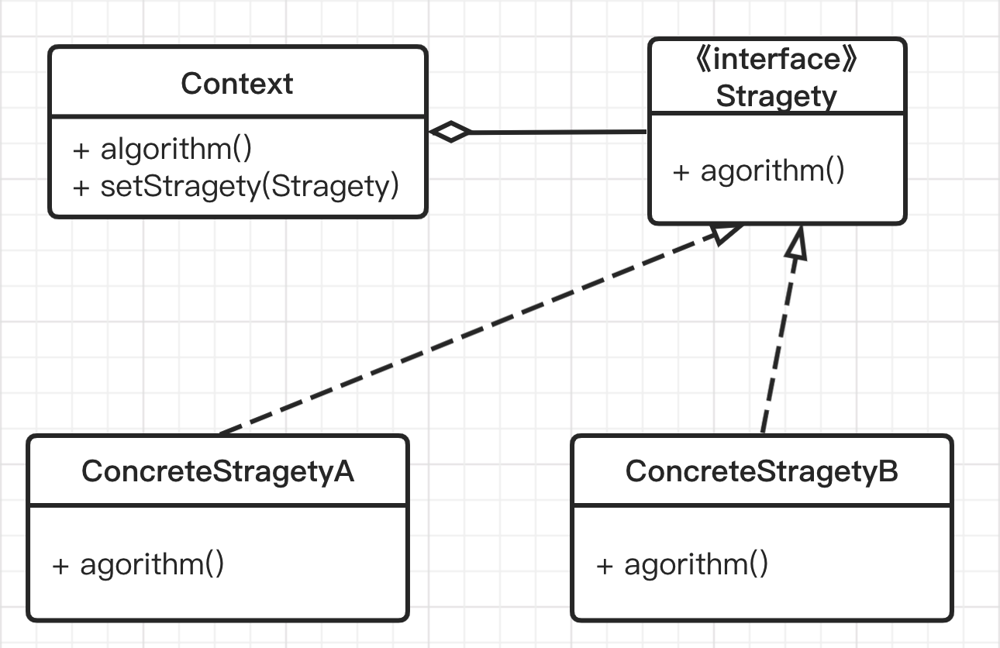
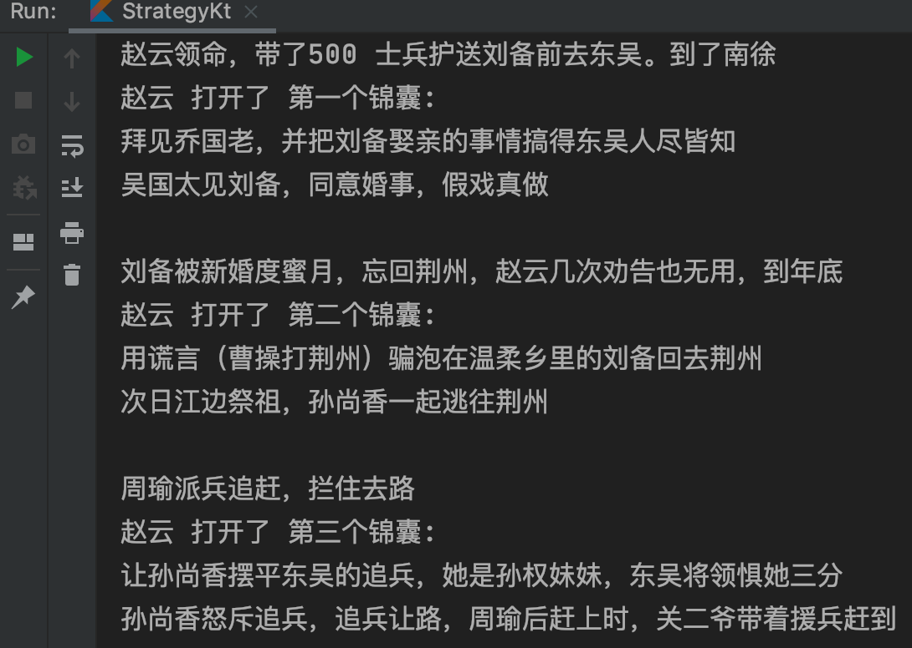

思考一下：实现某一功能可以有多种算法或策略，我需要根据条件选择相应的算法或策略来完成该功能。如：排序算法，可以使用冒泡排序、归并排序、快速排序等。要怎么实现呢？

很多同学想，写个类，每个方法是一种排序算法，然后再封装一个方法写 if...else... 来判断要用哪个算法，从而调用对应的方法。显然这样写会使这个类很臃肿，而且如果我要增加一个算法比如堆排序，就必须往里面加一个方法，然后在 if...else... 后面再加一个 else if. 这就明显违反了开闭原则和单一职责原则。

今天我们介绍的策略模式，就能优雅的实现这一需求。

## 定义

策略模式定义了一系列的算法，并将每一个算法封装起来，使他们可以相互替换。策略模式让算法独立于使用它的客户而独立变化。

## 使用场景

* 针对同一类型问题的多种处理方式，仅仅是具体行为有差异
* 需要安全地封装多种同一类型的操作时
* 出现同一抽象类有多个子类（或接口的实现有多个），而又需要用 if-else 或 switch-case 来选择具体的实现时

## UML



- Context 用来操作策略的上下文环境
- Stragety 策略的抽象
- ConcreteStragetyA、ConcreteStragetyB 具体策略的实现

## 实现

1. 将需要的算法或代码块抽象成接口或抽象类
2. 在原类中增加该算法接口的成员变量和 setter
3. 通过多种方式实现该算法接口
4. 把需要用到的算法实现通过 setter 注入到原类中，这样运行时会使用该方法


话说东汉末年分三国，烽火连天不休<BR>周瑜想用美人钓来刘备，押住好换荆州<BR>诸葛亮让赵云护送，并带着三个锦囊应对

显然这三个锦囊就是用来应对的策略，而为什么要用锦囊装着不告诉赵云（策略执行者），那是因为诸葛亮作为一个资深程序员，深知**迪米特法则**（aka 最少知识法则）。赵云只要在合适的时机打开锦囊并执行就可以了。

## Shut up and show me the code

锦囊接口 - 策略抽象

```KOTLIN
interface Strategy {
    fun name(): String

    // 算法策略方法
    fun algorithm()
}
```

三个锦囊 - 具体策略

```JAVA
class StrategyFirst : Strategy {
    override fun name(): String {
        return "第一个锦囊"
    }

    override fun algorithm() {
        println("拜见乔国老，并把刘备娶亲的事情搞得东吴人尽皆知")
    }
}

class StrategySecond : Strategy {
    override fun name(): String {
        return "第二个锦囊"
    }

    override fun algorithm() {
        println("用谎言（曹操打荆州）骗泡在温柔乡里的刘备回去荆州")
    }
}

class StrategyThird : Strategy {
    override fun name(): String {
        return "第三个锦囊"
    }

    override fun algorithm() {
        println("让孙尚香摆平东吴的追兵，她是孙权妹妹，东吴将领惧她三分")
    }
}
```

长山赵子龙 - 策略执行者

```kotlin
class Context(val name: String) {
    var strategy: Strategy? = null

    fun doStrategy() {
        println("$name 打开了 ${strategy?.name()}:")
        strategy?.algorithm()
    }
}
```

Action !  导演开拍，诸葛亮是编剧

```kotLin
fun main() {
    val childDragon = Context("赵云")
    // 到东吴打开第一个锦囊
    println("赵云领命，带了500 士兵护送刘备前去东吴。到了南徐")

    childDragon.strategy = StrategyFirst()
    childDragon.doStrategy()
    println("吴国太见刘备，同意婚事，假戏真做\n")

    // 到年底打开第二个锦囊
    println("刘备新婚度蜜月，忘回荆州，赵云几次劝告也无用，到年底")
    childDragon.strategy = StrategySecond()
    childDragon.doStrategy()
    println("次日江边祭祖，孙尚香一起逃往荆州\n")

    // 有追兵无路可走时打开第三个锦囊
    println("周瑜派兵追赶，拦住去路")
    childDragon.strategy = StrategyThird()
    childDragon.doStrategy()
    println("孙尚香怒斥追兵，追兵让路，周瑜后赶上时，关二爷带着援兵赶到\n")
}
```

最后我们来看戏



## 在安卓源码中应用

时间插值器 TimeInterpolator ，根据时间流逝的百分比来计算当前属性值的百分比。系统提供：
- 线性插值器 LinearInterpolator
- 加速减速插值器 AccelerateDecelerateInterpolator
- 减速插值器 DecelerateInterpolator 。
即可以将不同的插值策略运行到属性动画中

## 最后

用好策略模式，你就是程序员中的“再世诸葛”。