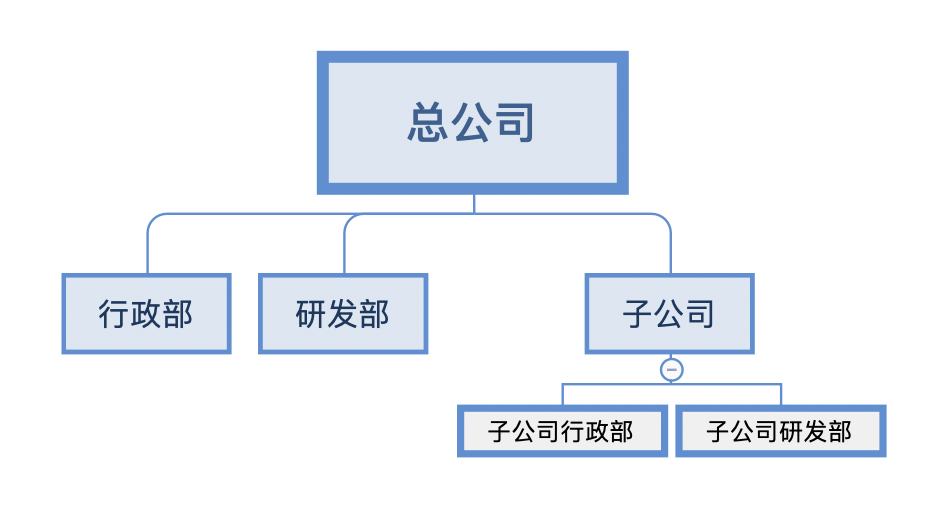
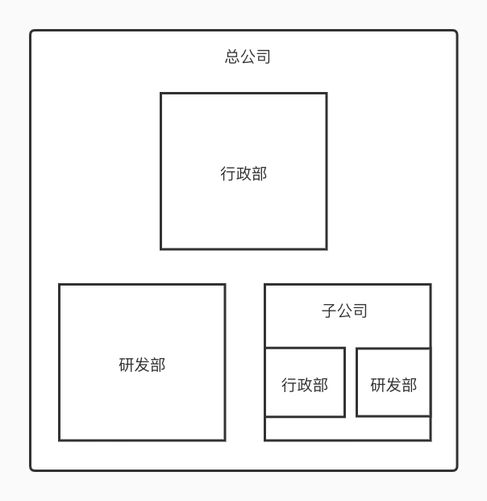
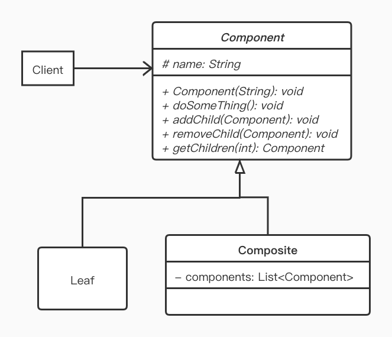
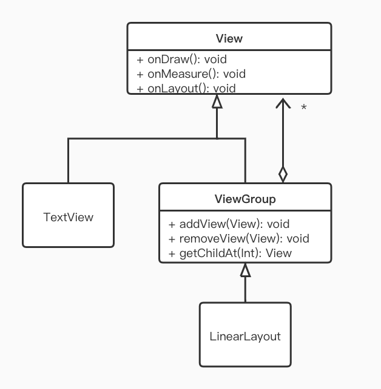

> 组合模式（Composite Pattern）也称为部分整体模式（Part-Whole Pattern）结构型设计模式之一

它将一组对象看作是一个对象处理，并根据一个树状结构来组合对象，然后提供统一的方法去访问相应对象，以此忽略掉对象与对象集合之间的差别。

举个例子，公司的组织结构，总公司下面有行政部与研发部，而且总公司下面还有一个子公司。这个子公司也有独立的行政部和研发部。用树状图表示如下：



虽然子公司也包含行政部与研发部，但是从总公司的角度来看子公司就是一个独立的个体，与总公司的行政部和研发部平级，我们用一个盒子的形式来表达会更加直观 ：



可以看到，虽然总公司和子公司的本质不一样，但是它在我们的组织结构 中是一样的，我们可以把它们看作是一个抽象的公司。这样的一个结构 就是组合模式的雏形。

## 定义

将对象组合树形结构，以表示“部分-整体”的层次结构，使得用户对单个对象和组合对象的使用具有一致性。

## 使用场景

- 表示对象的部分-整体层次结构时
- 从一个整体中能够独立出部分模块或功能的场景

## UML



- Component: 抽象节点，为组合中的对象声明接口。实现所有类共有的接口的缺省行为
- Composite:  定义有子节点的那些枝干节点的行为，存储子节点
- Leaf: 在组合中表示叶子节点对象，叶子节点没有子节点
- Client: 通过 Component 接口，操纵组合节点的对象

## Demo

将这个 UML 的翻译成代码如下：

抽象节点

```KOTLIN
abstract class Component(protected val name: String) {
    // 具体逻辑方法由子类实现
    abstract fun doSomeThing()
    // 添加子节点
    abstract fun addChild(child: Component)
    // 移除子节点
    abstract fun removeChild(child: Component)
    // 获取对应下标的子节点
    abstract fun getChild(index: Int): Component
}
```

枝干节点：

```kotlin
class Composite(name: String) : Component(name) {
    private val components = mutableListOf<Component>() 
    override fun doSomeThing() {
        println(name)
        for (component in components) {
            component.doSomeThing()
        }
    }

    override fun addChild(child: Component) {
        components.add(child)
    }

    override fun removeChild(child: Component) {
        components.remove(child)
    }

    override fun getChild(index: Int): Component {
        return components[index]
    }
}
```

叶子节点，则更加简单：

```
class Leaf(name: String) : Component(name) {
    override fun doSomeThing() {
        println(name)
    }

    override fun addChild(child: Component) {
        throw UnsupportedOperationException("叶子节点没有子节点")
    }

    override fun removeChild(child: Component) {
        throw UnsupportedOperationException("叶子节点没有子节点")
    }

    override fun getChild(index: Int): Component {
        throw UnsupportedOperationException("叶子节点没有子节点")
    }
}
```

最后是客户端调用的测试代码

```kotlin
fun main() {
    // 构造一个根节点
    val root = Composite("Root")

    // 构造两个枝干节点
    val branch1 = Composite("Branch1")
    val branch2 = Composite("Branch2")

    // 构造两个叶子节点
    val leaf1 = Leaf("Leaf1")
    val leaf2 = Leaf("Leaf2")

    // 将叶子节点添加至枝干节点中
    branch1.addChild(leaf1)
    branch2.addChild(leaf2)

    // 将枝干节点添加于根节点中
    root.addChild(branch1)
    root.addChild(branch2)

    // 执行方法
    root.doSomeThing()
}
```

很明显，这就是一个树的实现，而最后的执行代码就是树的“先序遍历”。执行的结果如下：

```properties
Root
Branch1
Leaf1
Branch2
Leaf2
```

这个例子可能还是有点抽象

那试想下另一个例子：把文件夹与子文件夹还有具体的文件代入到上述的组件中。如此一看文件系统也是一种典型的组合模式的例子。

## Android 源码中的应用

在 Android 源码中，几乎每天都会用到的  View , ViewGroup 的嵌套组合便是经典的组合模式。简单的画一下类图：



在 Android 中，容器一定是 ViewGroup, 只有 ViewGroup 才能包含其它的 View。比如 LinearLayout 里面可以包含其它 TextView, FrameLayout 等。但是反过来，TextView 是不能包含其它 View 的，因为 TextView 继承于 View, 不是一个容器（ViewGroup）。

这种 View 的视图层级 中使用到的是安全的组合模式。

对应的，上面 demo 里将组合所使用的方法全定义在抽象节点类中的方式称为透明的组合模式。

## 小结

平常在 Android 开发中组合模式的应用不多，其更适用于对一些界面 UI 的架构设计上，当然 UI 架构一般相应的如 AWT,  Android, iOS  各自的 FrameWork 又都会提供，开发者并不需要自己去实现。

#### 优点

- 可以清楚的定义分层次的复杂对象，表示对象的部分或全部层次；它让高层模块忽略了层次的差异，方便对整个结构进行控制
- 高层模块可以一致的使用一个组合结构 或其中单个对象，简化了高层模块的代码
- 增加桂构件和叶子构件都很方便，无需理发现有类库，符合“开闭原则”

#### 缺点

- 新增构件时不好对枝干中的构件类型进行限制 ，不能依赖类型系统来施加约束。因为在设计时，它们都来自于相同的抽象

## End 吹斯汀

三个程序员被要求穿过一片田地，到达另一侧的房子。
菜鸟程序员目测了一下之间很短的距离，说：“不远！我只要十分钟。”
资深程序员看了一眼田地，想了一会，说：“我应该能在一天内过去。”菜鸟程序员很惊讶。
大神程序员看了一眼田地，说：“看起来要十分钟，但我觉得十五分钟应该够了。” 资深程序员冷笑了一声。
菜鸟程序员出发了，但只过了一会，地雷爆炸了，炸出了巨大的洞。这下他必须偏移预定的路线，原路返回，反复尝试穿过田地。最后他花了两天到达目的地，到的时候颤颤发抖，还受了伤。
资深程序员一出发就匍匐前进，仔细地拍打地面，寻找地雷，只有在安全的时候才前进。他在一天的时间内小心谨慎地缓慢爬过了这片地，只触发了几个地雷。
大神程序员出发之后径直穿过了田地，十分果断。他只用了十分钟就到了另一边。
“你是怎么做到的？”另外两个人问道，“那些地雷怎么没有伤到你？”
“很简单，”他回答道，“我最初就没有埋地雷。”