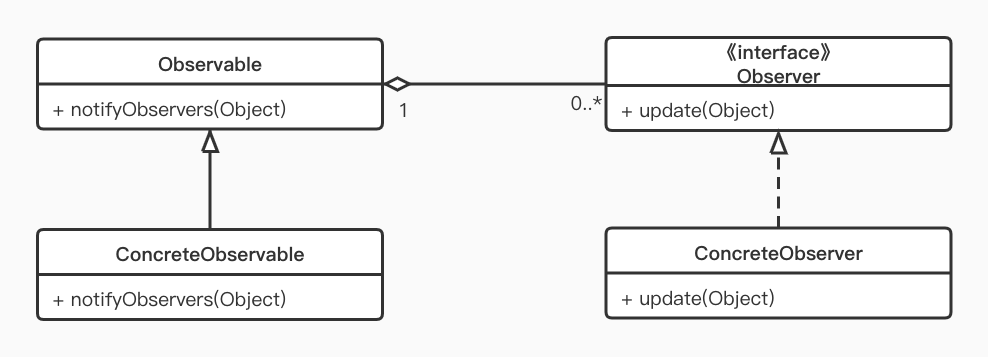
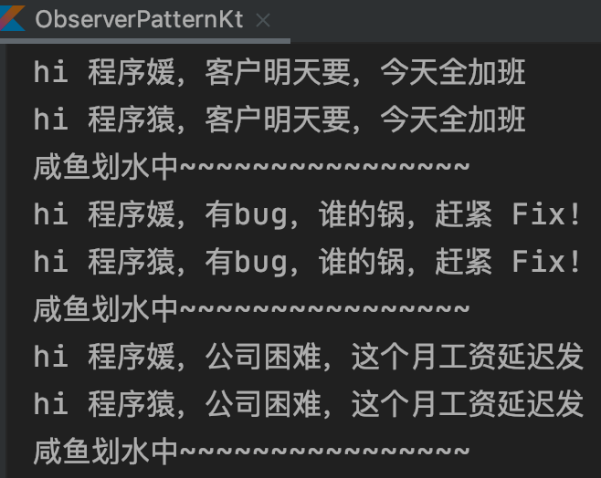

- ## 观察者模式

  >定义对象间的一种一对多的依赖关系，使得当每一个对象改变状态时，所有依赖于它的对象都会得到通知。

  观察者模式想必大家都非常熟悉，这个模式最重要的作用就是解耦，将观察者和被观察者解耦，使得它们之前的依赖变小甚至毫无依赖。

  ## UML

  

  被观察者：Observable

  观察者：Observer

  具体实现类或子类：ConcreteObservable、ConcreteObserver

  ## 简单实现

  ```kotlin
  /**
   * 观察者：努力搬砖的程序员
   */
  class Coder(var name: String) : Observer {
      override fun update(o: Observable, arg: Any) {
          println("hi $name，$arg")
      }
  }
  
  /**
   * 观察者：没有梦想的咸鱼
   */
  class Fish: Observer {
      override fun update(o: Observable, arg: Any) {
          println("咸鱼划水中~~~~~~~~~~~~~~~~")
      }
  }
  
  /**
   * 被观察者：老板
   */
  class Boss : Observable() {
      fun postMsg(msg: String?) {
          setChanged() //标记数据改变
          notifyObservers(msg) //通知
      }
  }
  
  fun main() {// 场景：老板通知程序员
      val boss = Boss()
      val fish = Fish()
      val coder1 = Coder("程序猿")
      val coder2 = Coder("程序媛")
  
      boss.addObserver(fish)
      boss.addObserver(coder1)
      boss.addObserver(coder2)
  
      boss.postMsg("客户明天要，今天全加班")
      boss.postMsg("有bug，谁的锅，赶紧 Fix!")
      boss.postMsg("公司困难，这个月工资延迟发")
  }
  ```

  

  ## 总结 

  - 优点：观察者与被观察者解耦，应对业务变化；增强系统灵活性、可扩展性
  - 缺点：java 中消息通知默认是顺序执行，一个观察者卡顿可能影响整体效率（采用异步可解）
  - 观察者模式简单易用，在 Android 源码中也应用广泛：Adapter 的 notifyDataSetChange ； OnClickListener 等事件监听；LiveData 等等太多了