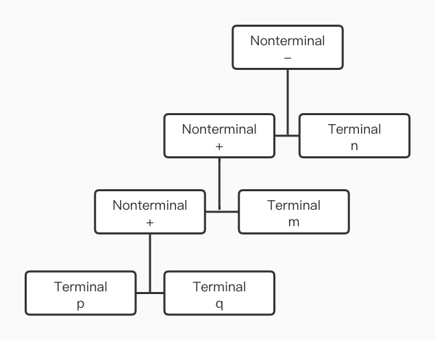
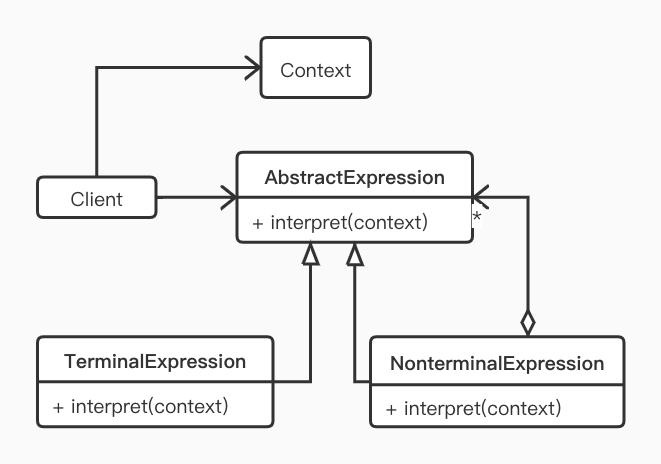

> 解释器模式（Interpreter Pattern）是一种用得比较少的行为模式，其提供了一种解释语言的语法或表达式的方式，该模式定义了一个表达式接口，通过该接口解释一个特定的上下文。常用的设计模式大部分人都会，这种冷知识才是装逼利器，接下来我们一起来学习吧。

## 定义

给定一个语言，定义它的文法的一种表示，并定义一个解释器，该解释器使用该表示来解释语言中的句子。

可能很多读者根本看不懂这句话的意思，我们来举个例子。
给定一个语言（正则表达式），定义它的文法的一种表示（如 \d+）,并定义一个解释器，该解释器用来解释语言中的句子（解释器也可以简单的理解为翻译机）。\d+ 翻译成自然语言就是一个或多个的数字（如 1，2，12358）。这样一来你是否对解释器模式的定义有了更进一步的理解了。

## 使用场景

#### 如果某个简单的语言需要解释执行而且可以将该语言中的语句表示为一个抽象语法树时，可以考虑使用

举个例子：一个简单含有加减运算的数学表达式：p+q+m-n, 像这样的表达式其构成只有两种：一是以 p, q, m, n 这类的具体参数表示的符号，其无法再被推导，也称为终结符号。另一种则是以"+" 和 "-"构成的算术运算符，在运算符的两边总能找到有意义的具体计算参数，我们也称其为非终结符。p+q+m-n 我们也可以将其表示为一棵抽象语法树，如下图：



#### 在某些特定的领域出现不断重复的问题时，可以将该领域的问题转化为一种语法规则下的语句，然后构建解释器来解释该语句

这个就比较好理解了，比如将阿拉伯数字转换成中文数字；再比如将小写英文单词转换为全大写的。这些其实就是一个不断重复的问题，就可以尝试使用解释器模式

## UML




- AbstractExpression: 抽象表达式
  声明一个抽象的解释操作父类，并定义一个抽象的解释方法。其具体实现在各个具体的子类
- TerminalExpression: 终结符表达式
  实现文法中与终结符有关的解释操作。文法中每个终结符都有一个具体的表达式与之对应
- NonterminalExpression: 非终结符表达式
  实现方文法中与非终结符有关的解释操作
- Context: 上下文环境类，包含解释器之外的全局信息
- Client: 客户类。解析表达式，构建抽象语法树，执行具体的解释操作等

## 简单实现

我们来实现前文提到的例子（p + q + m - n），用解释器模式对算术表达式进行解释

我们先来定义需要用的解释器：

```kotlin
abstract class ArithmeticExpression {
    /**
     * 抽象的解析方法
     * 具体的解析逻辑同具体的子类实现
     * @return 解析得到具体的值
     */
    abstract fun interpret(): Int
}

// 数字解释器，仅仅是为了解释数字
class NumberExpression(val value: Int) : ArithmeticExpression() {
    override fun interpret(): Int {
        return value
    }
}

// 运算符号抽象解释器
abstract class OperatorExpression(
        // 存储运算符两边的数字
        val exp1: ArithmeticExpression,
        val exp2: ArithmeticExpression
) : ArithmeticExpression()

// 加法运算解释器
class AdditionExpression(exp1: ArithmeticExpression, exp2: ArithmeticExpression)
    : OperatorExpression(exp1, exp2) {
    override fun interpret(): Int {
        return exp1.interpret() + exp2.interpret()
    }
}

// 减法运算解释器
class SubtractionExpression(exp1: ArithmeticExpression, exp2: ArithmeticExpression)
    : OperatorExpression(exp1, exp2) {
    override fun interpret(): Int {
        return exp1.interpret() - exp2.interpret()
    }
}
```

除了解释器之外 ，我们创建一个 Calculator 来处理计算的相关业务

```KOTLIN
class Calculator {

    // 计算表达式如 calc("1 + 1")
    fun calc(expression: String) :Int{
        // 存储并操作所有相关的解释器
        val stack = Stack<ArithmeticExpression>()
        val elements = expression.split(" ")
        var i = 0
        while (i <= elements.lastIndex) {
            val element = elements[i]
            when (element) {
                "+", "-" -> { // 是符号
                    // 栈顶的解释器作为计算式左边的一个数字解释器
                    val exp1 = stack.pop()
                    // 数组下一个元素为计算式右边的数字解释器
                    val exp2 = NumberExpression(elements[++i].toInt())
                    val operatorExpression = if (element == "+") {
                        AdditionExpression(exp1, exp2)
                    } else {
                        SubtractionExpression(exp1, exp2)
                    }
                    stack.push(operatorExpression)
                }
                else -> { // 是数字
                    stack.push(NumberExpression(element.toInt()))
                }
            }
            i++
        }

        return stack.pop().interpret()
    }
}
```

这里要注意的是，为了简化问题，我们约定表达式字符串的每个元素之间必须使用空格隔开。如"1 + 1"的表达式是合法的，而"1 +1"则不合法.

最后我们运行一下测试代码：

```kotlin
fun main() {
    val calculator = Calculator()
    val express = "2021 + 3 + 1 - 1359"
    print("$express = ${calculator.calc(express)}")
}

// 输出结果：
2021 + 3 + 1 - 1359 = 666
```

## Android 源码中的实现

对 Android 来说，解释器模式的应用并不多见，我们也很难在系统源码中找到其经典实现，但是，我们依然可以在一些地方看到对解释器模式的应用。

所有的 Android 开发应该者对 AndroidManifest 很熟悉，这是应用的配置文件。如果说 App 是一本书的话，这个配置文件就相当于书的目录，其中包含了四大组件，权限等的声明定义。那么在 Android 中，是如何读取这个配置文件的呢？答案就在 PackageParser 这个类里。该类为 AndroidManifest 里的每一个组件标签创建了相应的类用于存储相关信息。

```java
package android.content.pm;
public class PackageParser {
// 以下其实是 public final static class，省略
    class Activity extends Component<ActivityIntentInfo>{}
    class Permission extends Component<IntentInfo>{}
    class PermissionGroup extends Component<IntentInfo>{}
    class Provider extends Component<ProviderIntentInfo> {}
    class Service extends Component<ServiceIntentInfo>{}
    ...
}
```

如上所示，PackageParser 为 Activity, Service, Provider 等构件在其内部以内部类的方式创建了对应的类。按照解释器模式的定义，这些类对应 AndroidManifest.xml 里的一个标签，也就是一条文法。在对该配置文件的解释时充分去用了解释器模式分离实现，解释执行的特性。涉及到的方法如下，不做过深入的分析：

```java
PackageManagerService.scanPackageLI(...)
PackageParser.parsePackage(...)
PackageParser.parseActivity(...)
PackageParser.parseProvider(...)
...  
```

在 Android 中，解析某个 Apk 文件会调用到 PMS 的 scanPackageLI 方法，解析后的信息再保存回 PMS。而 PMS 会通过调用 PackageParser 类的相关方法去解析 AndroidManifest 里的各个节点信息。

## 小结

#### 优点

灵活的扩展性，当我们想对文法规则进行扩展延伸时，只需要增加相应的非终结符解释器，并在构建 抽象语法树时，使用到新增的解释器对象进行具体的解释即可。

#### 缺点

第一条文法对应至少一个解释器，会生成大量类，增加维护难度；同时过于复杂的文法，构建其抽象语法树会显得异常烦琐，甚至有可能需要构建多棵抽象语法树，因此对于过复杂文法并不推荐使用解释器模式。

