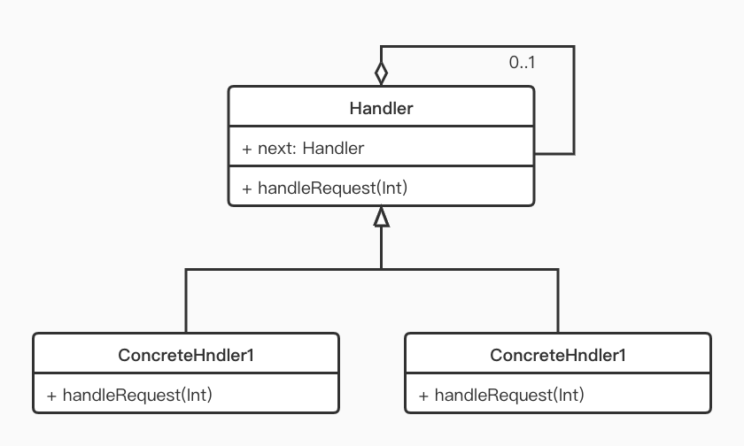

> 前面讲到面试必问的事件分发，那有的同学就说了，好不容易弄懂了，要是刚好碰上不问的面试官呢？别急，有招。
> 我们知道，事件分发的 dispatchTouchEvent 递归，其实是典型的责任链模式，那么当面试官问到你用过或者熟悉哪些设计模式就可以说说责任链模式。这不就引过来了嘛。

## 责任链模式

Chain of Responsibility Pattern ，顾名思义，就是用来处理相关事务责任的一条执行链，链上的每个节点都有机会（条件匹配）处理请求事务，如果某个节点处理完了就可以根据实际业务需求传递给下一个节点继续处理或者返回处理完毕。

## 使用场景

* 多个对象可以处理同一请求，具体哪个对象处理是在运行时动态决定的。
  比如：找对象（请求），一个个相亲（相亲对象是处理者），相到两边都觉得合适的就可以完成请求了，当然了，也有可能所有相亲对象都没看上你（人艰不拆）。
* 需要动态指定一组对象处理请求。
  再比如：找到对象了要结婚（请求），需要很多人（处理者）同意，老丈人检查一下人品形象不错同意了，丈母娘检查一下有房有车同意了，~~老天爷检查一下八字匹配同意了~~，民政局检查一下双方未婚同意了，请求成功。其中有一个中断就请求失败了。

我真是个比喻鬼才。
这种链式结构，每个节点都可以拆开再连接，可以很方便的调整处理的节点数、优先级等。

## UML 类图



* Handler：抽象处理者，声明一个处理请求的方法，并在其中持有下一个处理者的引用
* ConcreteHandler: 具体处理者，对请求进行处理，如果不能处理则将该请求转发给下一个处理者
* 说明下这边的请求，简化成一个 int 表示，在实际场景可以封装请求抽象类，再扩展出不同的请求类型。

## shut up and show me the code

由于前面的鬼才比喻太过复杂，写成代码完全不现实。我们还是来说请假的情况吧，示例代码使用 kotlin ，没学过 kotlin 的也能看懂。

假条就是请求:

```kotlin
data class Request(
        val leaveDay: Float, //请假时长
        val msg: String //请假原因
)
```

各领导就是处理者:

```kotlin
open class Handler(
        val name: String, //处理者名字
        val leaveLimit: Float //能审批的最长时间
){
    var next: Handler? = null

    open fun handRequest(request: Request) {
        if (request.leaveDay <= leaveLimit) {
            println("${request.msg} -> 请假，$name 准了")
        } else {
            println("$name：超过${leaveLimit}天，让领导处理")
            next?.handRequest(request)
        }
    }
}

//可以根据需求扩展 Handler
class FinalHandler(name: String) : Handler(name, Float.MAX_VALUE) {
    override fun handRequest(request: Request) {
        println("$name：${request.msg} -> 找财务领下工资，不用来了！")
    }
}

```

然后处理者组成责任链，向第一个节点开始发送请求

```kotlin
fun main() {
    val leader = Handler("直接上级", 1f)
    val manager = Handler("经理", 30f)
    val generalManager = Handler("总经理", 365f)
    val boss = FinalHandler("老板")

    //组链
    leader.next = manager
    manager.next = generalManager
    generalManager.next = boss

    leader.handRequest(Request(1f, "头疼脑热")) //脑热得隔离观察哈
    println("-------------")
    leader.handRequest(Request(14f, "老婆生娃"))
    println("-------------")
    leader.handRequest(Request(365f, "世界辣么大，我想去看看"))
    println("-------------")
    leader.handRequest(Request(3650f, "不想上班"))
}
```

大功告成，运行看下结果:

```
头疼脑热 -> 请假，直接上级 准了
-------------
直接上级：超过1.0天，让领导处理
老婆生娃 -> 请假，经理 准了
-------------
直接上级：超过1.0天，让领导处理
经理：超过30.0天，让领导处理
世界辣么大，我想去看看 -> 请假，总经理 准了
-------------
直接上级：超过1.0天，让领导处理
经理：超过30.0天，让领导处理
总经理：超过365.0天，让领导处理
老板：不想上班 -> 找财务领下工资，不用来了！
```


通过责任链，每一级别都能发挥自己的责任，对请求进行处理，处理不了的就交给下一节点处理。这个链节点个数不限，就算你有再多领导也不用怕啦，反正找直接上级请假，假条会一级级传上去的。

进一步，如果不是请假，是报销呢？这时候可以扩展请求类 Request 。链还是那条链却可以处理不同的请求，是不是很灵活呢？

## 总结

世界是不完美的，责任链模式也一样。

优点显而易见：可以对请求和处理者进行解耦，提高代码灵活性。

缺点：遍历的处理太多，可能影响性能；调试麻烦需要每一级都跟进去看。


好了，说完责任链，记得告诉你的面试官事件分发就是一种责任链，把 MotionEvent (请求) 一层层分发，找到能消费它的 View (处理者) 。

>祝大家周末愉快，欢迎关注 “Android 面试官” 在公众号后台留言交流你最喜欢的设计的模式


