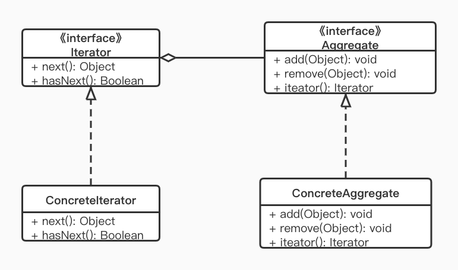
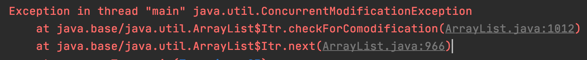
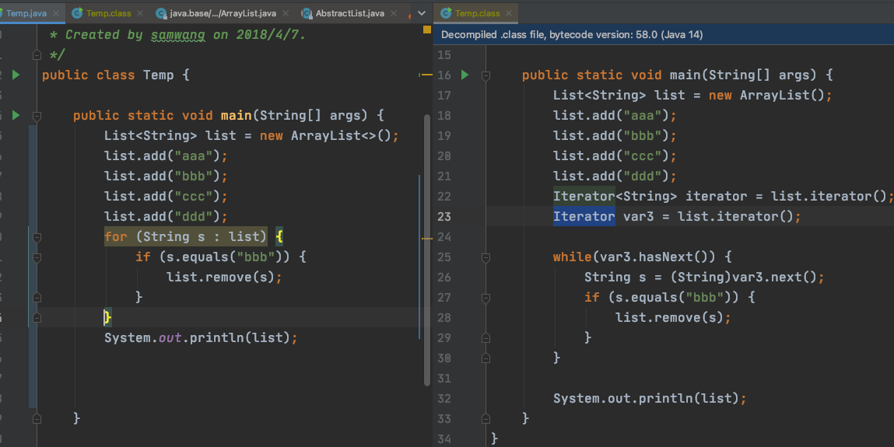

> 迭代器模式（Iterator Pattern） 又称游标（Cursor） 模式，是行为型设计模式之一。

迭代器模式源于对容器的访问，如 Java 中的 List, Map, 数组等，我们对容器内对象的访问必然涉及遍历算法。如果将遍历算法封装在容器中，那么对于容器类来说就承担了过多的功能；而如果不提供遍历方法让使用者自己去实现，又会让容器的内部细节暴露无遗。此时，迭代器模式应运而生，在客户访问类与容器体之间插入一个第三者——迭代器，很好的解决了上述的弊端。

## 定义

提供一种方法顺序访问一个容器对象中的各个元素，而又不需要暴露该对象的内部细节。

## 使用场景

- 遍历一个容器对象 
- 对外提供一个可遍历的列表

## UML



- Iterator: 迭代器接口，负责定义、访问遍历元素的接口
- ConcreteIterator: 具体的迭代器类
- Aggregate: 容器类接口
- ConcreteAggregate: 具体容器类

几乎所有的高级语言的容器类都为我们提供了相应的迭代器，而开发者也几乎不会自己去实现一个迭代器，我们直接来看下迭代器的用法：

```java
List<String> lst = new ArrayList<String>();
lst.add("aaa");
lst.add("bbb");
lst.add("ccc");
lst.add("ddd");
Iterator<String> iterator = lst.iterator();
while(iterator.hasNext()) {
    System.out.println(iterator.next());
}
```

看明白这个 UML 中迭代器的各个角色，接下来直接来看一下源码中的迭代器模式实现。

## Android 源码中的实现

Android 源码中，也有了各种数据结构体，如 List, Map 所包含的迭代器外，还有提供迭代器来遍历访问各种数据，最典型的例子就是数据库查询使用的 Cursor。当我们使用 SQLiteDatabase 的 query 方法查询数据库时，会返回一个 Cursor 游标对象，这个 Cursor 的实现就是一个典型的迭代器。

```java
package android.database;
public interface Cursor extends Closeable {
    // 将游标移到当前遍历数据的下一行位置
    boolean moveToNext();
    
    // 以及其它一系列 getXXX 方法，用于取出当前行的数据
    int getInt(int columnIndex);   
    
    //... 省略其它方法
}
```

## ConcurrentModificationException

由于迭代器本身非常简单，这边说个我们在使用 Iterator 经常会遇到的异常做为文章内容补充。

复现路径：

```java
List<String> list = new ArrayList<>();
list.add("aaa");
list.add("bbb");
list.add("ccc");
list.add("ddd");
Iterator<String> iterator = list.iterator();
while (iterator.hasNext()) {
    String s = iterator.next();
    if (s.equals("bbb")) {
        list.remove(s);
    }
}
```



可能很少人会直接写这样的代码，但是这样呢：

```java
for (String s : list) {
    if (s.equals("bbb")) {
        list.remove(s);
    }
}
```

其实这种增强的 for 循环，实际上就是 IDE 在编译出的 class 文件也是使用 Iterator 遍历，因而也会抛异常



#### 原因

在 List 的基类中有这样一个属性

```JAVA
java.util.AbstractList
public abstract class AbstractList<E> extends AbstractCollection<E> implements List<E> {
    // The number of times this list has been <i>structurally modified</i>.   
    protected transient int modCount = 0;
}
```

而 List 在生成 Iterator 的时候会把 modCount 存到 `java.util.AbstractList.Itr#expectedModCount` 里面，遍历时如果操作了 List, 即 modCount 与 Iterator 中的 expectedModCount` 对应不上的话，便主动抛出异常了。

```JAVA
java.util.AbstractList.Itr
// 这是 AbstractList 的内部类
private class Itr implements Iterator<E> {
    int expectedModCount = modCount;
    public E next() {
        checkForComodification();
        //...
    }
    final void checkForComodification() {
        if (modCount != expectedModCount)
            throw new ConcurrentModificationException();
    }
}
```

#### 解决方案

1. 单线程出线该问题处理比较简单，删除时调用` java.util.Iterator#remove`
```java
public void remove() {
    // ...
    try {
        AbstractList.this.remove(lastRet);
        if (lastRet < cursor)
            cursor--;
        lastRet = -1;
        expectedModCount = modCount;
    } catch (IndexOutOfBoundsException e) {
        throw new ConcurrentModificationException();
    }
}
```
2. 多线程遇到该问题时，则需要用线程同步，在遍历时锁住 List, 防止被操作。或直接使用 JDK 提供的 `java.util.concurrent.CopyOnWriteArrayList` 作为容器

## 小结

#### 优点

- 支持以不同的方式去遍历一个容器对象
- 对外界隐藏容器对象的实现细节

#### 缺点

- 类增加了，麻烦。

#### 另外我们今天还介绍了 ConcurrentModificationException 异常产生的原因和解决方案


