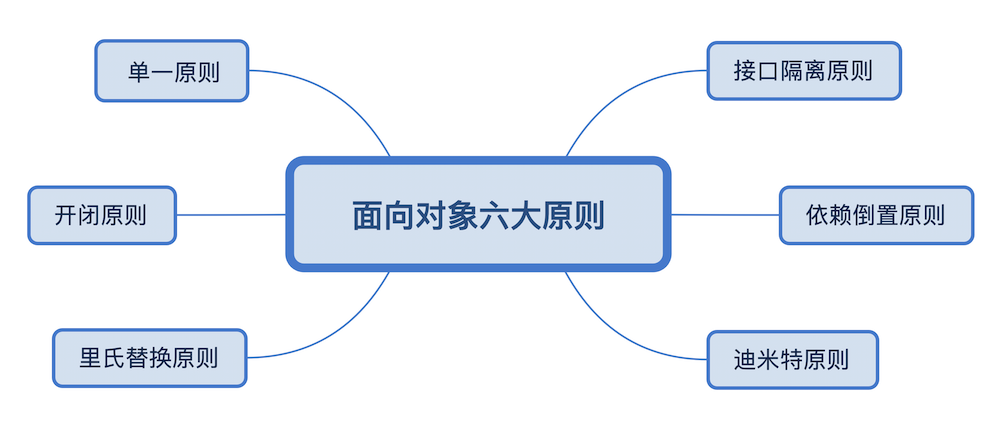
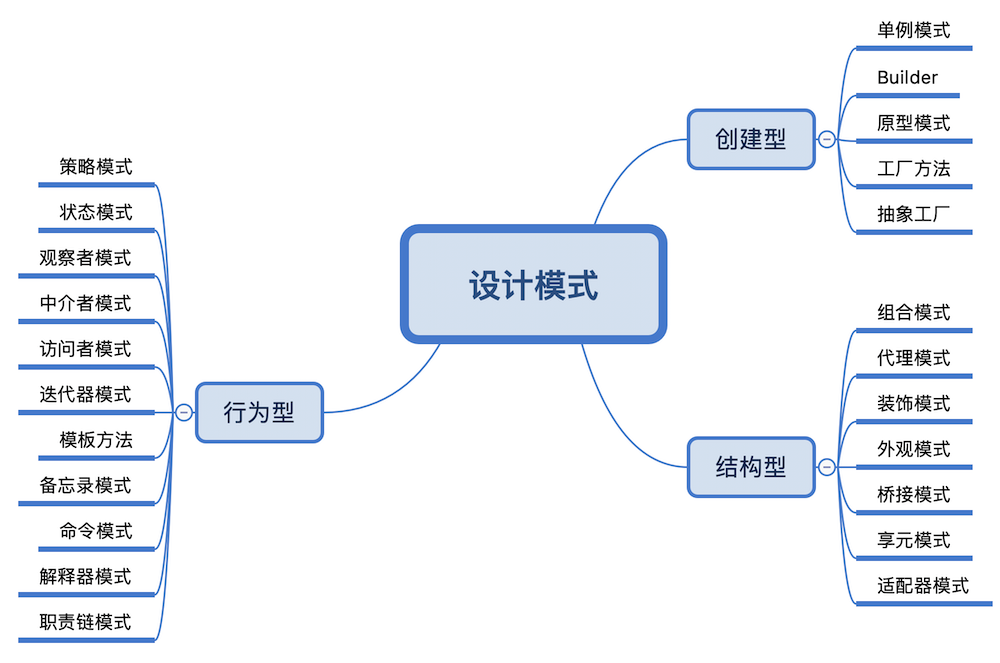

> “世上唯一不变的就是永远在变”，产品经理指着刚改的需求对我说。我一个弱小无助的程序猿又能怎样呢，吵个半天产品的需求有了，你的代码呢？所以我们在写代码的时候要为不可预料的需求变动做好准备，好在有大师们提出的非常好的 6 大设计原则以及 23 种设计模式，可以助我们“封装”变化，用风骚灵动的代码来实现变动的需求。
## 六大原则

* Single Responsibility Principle：单一职责原则
* Open Closed Principle：开闭原则
* Liskov Substitution Principle：里氏替换原则
* Law of Demeter：迪米特法则
* Interface Segregation Principle：接口隔离原则
* Dependence Inversion Principle：依赖倒置原则

取所有不重复的首字母：SOLID（solid，稳定的）

### 单一职责原则

类的职责应该单一，一个方法只做一件事。职责划分清晰了，每次改动到最小单位的方法或类。尽量做到**只有一个原因引起变化**。

如何划分一个类的或一个函数的职责，需要根据个人经验、具体的业务逻辑而定。但是它也有一些基本指导原则：

1. 两个完全不一样的功能不应该放一个类中
2. 一个类中应该是一组相关性很高的函数、数据的封装
3. 应该不断审视自己的代码，根据具体业务、功能对类进行拆分，优化代码

### 里氏替换原则

**所有引用基类的地方，必须能够使用其子类直接替换。** 这个原则与面向对象的继承特性密切相关

1. 子类必须实现父类的所有方法 （继承的特性，子类拥有父类的所有方法）
2. 子类可以有自己的个性 （重写）
3. 覆盖或实现父类的方法时，入参可以放大（如：父类的参数 HashMap , 子类参数可以为 Map); 输出可以被缩小（如父类 return Map, 子类 return HashMap

### 依赖倒置

1. 高层模块不应该依赖低层模块，两者都应该依赖其抽象. 
不可分割的原子逻辑就是低层模式，原子逻辑组装成的就是高层模块。
   
2. 抽象不应该依赖细节
 java 中，抽象 -> 接口或抽象类；细节 -> 实现类

3. 细节应该依赖抽象

精简一下就是 **面向接口编程** ，是面向对象设计的精髓之一，可以减少类间的耦合性，提高系统的稳定性，降低并行开发引起的风险, 在 java 中的表现：

- 模块间依赖通过抽象（接口）发生，实现类之间不直接依赖
- 接口或抽象类不依赖于实现类
- 实现类依赖于接口或抽象类

### 接口隔离原则

客户端不应该依赖它不需要的接口。（此处接口分为实例接口即类，类接口 interface，所以此处的接口在 java 中是类和接口的意思）    
建立单一的接口，不要建立臃肿庞大的接口，与 SRP 的区别：SRP 针对职责，从业务逻辑划分；ISP 是要求接口的方法尽量少。

1. 接口尽量小
2. 接口要高内聚
高内聚：提高接口、类、模块的处理能力，减少对外的交互，要求在接口中尽少公布 public 方法，减少对外承诺也有利于降低成本
3. 定制服务，针对不同的用户提供优良的服务，只提供访问者需要的方法。如不同权限的用户给于不同的操作接口。
4. 接口设计有限度的
接口粒度越小，越灵活，但是结构却越复杂，所以要有个度

### 迪米特法则

也称为最少知识原则（Least Knowledge Principle，LKP）：
**一个对象应该对其他对象有最少的了解。对类的低耦合提出了明确的要求**

1. 只和朋友交流。  
    例：老师叫班长清点学生，老师应该只和班长有耦合，而不应该和学生有耦合。
2. 朋友之间也是有距离的。  
    耦合的类不要把太多方法暴露给其它类，否则改动要修改的地方太多。（高内聚）
3. 自己的就是自己的   
    如果一个方法放在本类中，既不增加类间关系，也对本类不产生负面影响，那就放置在本类中。

### 开闭原则

**对扩展开放，对修改封闭**

例：商品打折，可以更改原来的商品类的 getPrice() 方法，也可以增加一个子类，重写getPrice方法，通过高层模块，在打折时使用子类。显然方法2拓展更灵活。

好处：原来的代码不用更改，而且还可以复用原来的代码

如何应用：
1. 抽象约束：通过接口或抽象类可以约束一组可能变化的行为，并且能够实现对扩展开放
    * 拓展类不应该出现接口中不存在的 public 方法
    * 参数、引用对象类型尽量使用接口或抽象类
    * 抽象层尽量保持稳定
2. 元数据（metadata）控制模块行为  
    元数据：用来描述环境和数据的数据。如：可以通过配置文件来完成业务更改。
3. 制定项目章程（制定和遵守规则）     
4. 封装变化   

将变化抽象封装到接口，这样新的变化就可以生成新的接口实例，传入到系统。23 种设计模式即是从各个不同角度对变化进行封装。

## 设计模式

模式是一个可重用的方案，可应用于软件设计中常见问题。

### 设计模式的好处

1. 模式是行之有效的解决方法：久经考验的
2. 模式可以很容易地重用
3. 模式善于表达

### 23 种设计模式

我们接下来也会在常规  Android 技术文章更新的中，穿插着对这 23 种设计模式进行详细介绍，敬请期待。等不及想学习的小伙伴，推荐书籍《设计模式之禅》、《Android 源码设计模式解析与实战》

